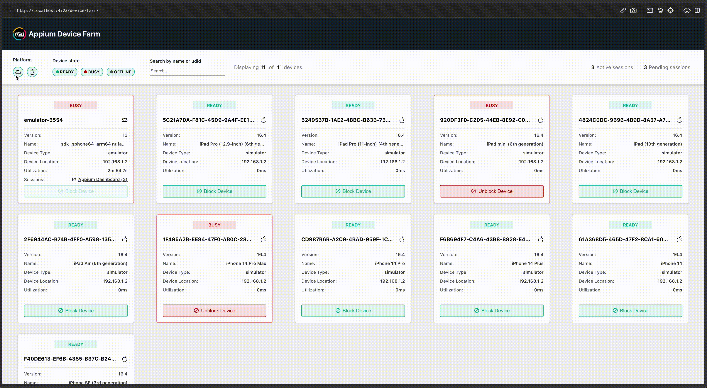

# Xenon

<h1 align="center">
	<br>
	
	<br>
	<br>
	Intelligent Mobile Infrastructure
	<br>
</h1>

<p align="center">
  <strong>Self-healing device orchestration platform for Appium</strong>
</p>

<p align="center">
  <a href="#features">Features</a> •
  <a href="#quick-start">Quick Start</a> •
  <a href="#documentation">Documentation</a> •
  <a href="#contributing">Contributing</a>
</p>

---

## ✨ What is Xenon?

**Xenon** is an intelligent Appium plugin that transforms your mobile device lab into a **self-healing, autonomous infrastructure**. Named after the noble gas known for its stability and reliability, Xenon brings enterprise-grade device orchestration to your testing pipeline.

### Why Xenon?

| Problem | Xenon Solution |
|---------|----------------|
| Tests fail due to device state | **Auto-recovery** - Devices heal themselves |
| Manual device management | **Smart allocation** - Queue, reserve, prioritize |
| Debugging is painful | **Interactive control** - Live stream, touch, shell |
| No visibility into failures | **Rich artifacts** - Video, screenshots, profiling |
| Infrastructure silos | **Unified dashboard** - One view for all devices |

---

## 🚀 Features

### Device Orchestration
- ✅ **Automatic device discovery** - Android (USB + emulators), iOS (devices + simulators)
- ✅ **Smart session allocation** - Queue management with ETA
- ✅ **Device reservation** - Manual mode for debugging
- ✅ **Team-based quotas** - Fair resource sharing

### Interactive Control
- ✅ **Live streaming** - Real-time device screen in browser
- ✅ **Touch interaction** - Tap, swipe, scroll remotely
- ✅ **App management** - Install, uninstall, clear data
- ✅ **Device information** - Battery, storage, network status

### Recording & Artifacts
- ✅ **Video recording** - Full session capture
- ✅ **Screenshot capture** - On-demand and per-command
- ✅ **Performance profiling** - CPU, memory, FPS metrics
- ✅ **Log aggregation** - Appium, device, app logs

### Intelligence (Roadmap)
- 🔲 **Flaky test detection** - Auto-identify unstable tests
- 🔲 **Error categorization** - Crash vs timeout vs element not found
- 🔲 **Self-healing locators** - AI-powered element recovery
- 🔲 **Predictive health** - USB/battery failure prediction

---

## ⚡ Quick Start

### Installation

```bash
# Install Xenon plugin
appium plugin install xenon

# Or install from source
git clone https://github.com/your-org/xenon.git
cd xenon
npm install
npm run build
appium plugin install --source=local .
```

### Running

```bash
# Start Appium with Xenon
appium server --use-plugins=xenon \
  --plugin-xenon-platform=both \
  --plugin-xenon-enable-dashboard
```

### Configuration

```bash
# Platform options: android, ios, both
--plugin-xenon-platform=both

# Enable web dashboard
--plugin-xenon-enable-dashboard

# Max concurrent sessions
--plugin-xenon-max-sessions=4
```

---

## 🎨 Dashboard

Access the dashboard at `http://localhost:4723/xenon/`

<p align="center">
  
</p>

### Views

| View | Description |
|------|-------------|
| **Devices** | Real-time device grid with status indicators |
| **Sessions** | Active and historical session management |
| **Builds** | Test runs grouped by build identifier |
| **Control** | Interactive device control interface |

---

## 📚 Documentation

The full documentation is available at:
**[https://xenon-docs.vercel.app/](https://xenon-docs.vercel.app/)**

### Quick Links
- [Installation Guide](docs/installation.md)
- [Configuration Options](docs/configuration.md)
- [API Reference](docs/api.md)
- [Troubleshooting](docs/troubleshooting.md)

---

## 🏗️ Development

```bash
# Clone and install
git clone https://github.com/your-org/xenon.git
cd xenon
npm install

# Build
npm run build

# Run tests
npm test                      # Unit tests
npm run integration-android   # Android integration
npm run integration-ios       # iOS integration

# Build web dashboard
npm run buildAndCopyWeb
```

---

## 🤝 Contributing

We welcome contributions! Please see [CONTRIBUTING.md](CONTRIBUTING.md) for guidelines.

### Contributors

<a href="https://github.com/your-org/xenon/graphs/contributors">
  
</a>

---

## 📜 License

ISC License - See [LICENSE](LICENSE) for details.

---

<p align="center">
  <strong>Xenon</strong> - Stable. Reliable. Intelligent.
  <br>
  <em>Named after Element 54 - the noble gas known for stability</em>
</p>
