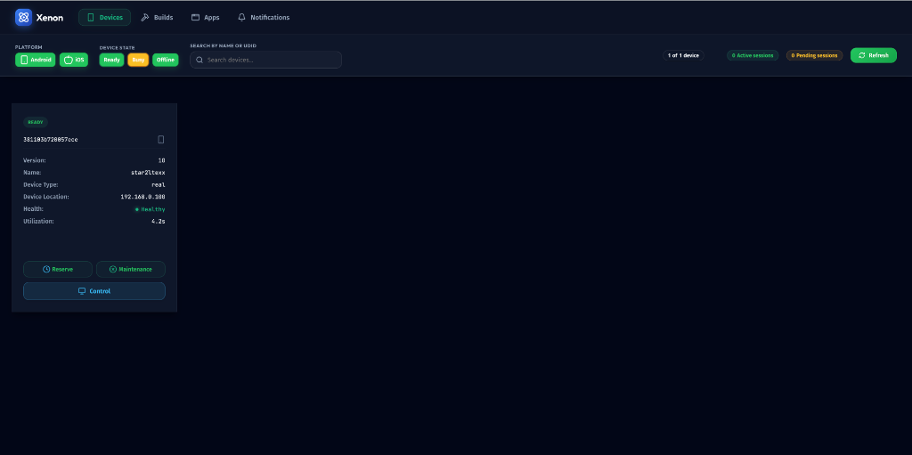

# Xenon

<h1 align="center">
	<br>
	
	<br>
	<br>
	Intelligent Mobile Infrastructure
	<br>
</h1>

<p align="center">
  <strong>Self-healing device orchestration platform for Appium</strong>
</p>

<p align="center">
  <a href="#features">Features</a> •
  <a href="#quick-start">Quick Start</a> •
  <a href="#capabilities">Capabilities</a> •
  <a href="#api-documentation">API Docs</a> •
  <a href="#documentation">Documentation</a> •
  <a href="#contributing">Contributing</a>
</p>

---

## ✨ What is Xenon?

**Xenon** is an intelligent Appium plugin that transforms your mobile device lab into a **self-healing, autonomous infrastructure**. Named after the noble gas known for its stability and reliability, Xenon brings enterprise-grade device orchestration to your testing pipeline.

### Why Xenon?

| Problem | Xenon Solution |
|---------|----------------|
| Tests fail due to device state | **Auto-recovery** - Devices heal themselves |
| Manual device management | **Smart allocation** - Queue, reserve, prioritize |
| Debugging is painful | **Interactive control** - Live stream, touch, shell |
| No visibility into failures | **Rich artifacts** - Video, screenshots, profiling |
| Infrastructure silos | **Unified dashboard** - One view for all devices |

---

## 🚀 Features

### Device Orchestration
- ✅ **Automatic device discovery** - Android (USB + emulators), iOS (devices + simulators)
- ✅ **Smart session allocation** - Queue management with ETA
- ✅ **WebSocket-First Sync** - Real-time Hub-Node-Dashboard bidirectional sync
- ✅ **Device reservation** - Manual mode for debugging
- ✅ **Team-based quotas** - Fair resource sharing

### Interactive Control
- ✅ **Live streaming** - Real-time device screen in browser
- ✅ **Touch interaction** - Tap, swipe, scroll remotely
- ✅ **App management** - Install, uninstall, clear data
- ✅ **Interactive Shell** - Execute ADB/iOS commands directly
- ✅ **Device information** - Battery, storage, network status

### 🧠 AI Self-Healing (Flagship)
- ✅ **5-Tier Healing Orchestration** - From DOM to LLM recovery
- ✅ **Signature-Based Learning** - Persistent "Etalon" signatures for high-confidence recovery
- ✅ **Multi-Modal Fallback** - Syntactic -> OCR -> Visual AI -> LLM reasoning
- ✅ **Infrastructure-Free** - Works with existing LokiJS (local) or PostgreSQL (remote)

### Recording & Artifacts
- ✅ **Video recording** - Full session capture
- ✅ **Screenshot capture** - On-demand and per-command
- ✅ **Distributed Tracing** - OpenTelemetry spans for exact command latency
- ✅ **Performance profiling** - CPU, memory, FPS metrics
- ✅ **Log aggregation** - Appium, device, app logs
- ✅ **OpenTelemetry Integration** - Standardized distributed tracing for all sessions

### Intelligence (Roadmap)
- 🔲 **Flaky test detection** - Auto-identify unstable tests
- 🔲 **Error categorization** - Crash vs timeout vs element not found
- 🔲 **Predictive health** - USB/battery failure prediction

---

## ⚡ Quick Start

### Installation

```bash
# Install Xenon plugin
appium plugin install --source=npm @xenon-device-management/xenon

# Or install from source
git clone https://github.com/xenon-platform/xenon.git
cd xenon
npm install
npm run build:all
appium plugin install --source=local .
```

### Running

```bash
# Start Appium with Xenon
appium server --use-plugins=xenon \
  --plugin-xenon-platform=both \
  --plugin-xenon-enable-dashboard
```

## 🔧 Configuration

Xenon supports configuration via CLI arguments or a configuration file (YAML/JSON). We recommend using a configuration file for production deployments.

### Using Configuration File (Recommended)

Create a `xenon-config.yaml` file:
```yaml
server:
  usePlugins: ["xenon"]
  plugin:
    xenon:
      platform: both
      maxSessions: 8
      enableDashboard: true
      enableSelfHealing: true
```

Run Appium with the config:
```bash
appium server --config xenon-config.yaml
```

### Runtime Configuration ⚡️

You can update configuration options at runtime without restarting the server using the API:

```bash
# Get current config
GET /xenon/api/config

# Update config (e.g. change max sessions)
PUT /xenon/api/config
{ "maxSessions": 10 }
```

> **Note:** Some changes (like `platform` or `hub` URL) require a server restart to take full effect. The API response will indicate if a restart is required.

### Build & Session Retention 🧹

Xenon includes an enterprise-ready cleanup job that automatically purges older builds, sessions, and associated assets (videos/screenshots) to manage disk space.

| Option | Description | Default |
|--------|-------------|---------|
| `buildCleanupDays` | Retention period in days | `30` |
| `buildCleanupMaxCount` | Maximum number of builds to keep | `100` |
| `buildCleanupSchedule` | Cron schedule for the cleanup job | `"0 0 * * *"` |
| `deleteBuildAssets` | Delete video recordings and screenshots from disk | `true` |

**Example (YAML):**
```yaml
plugin:
  xenon:
    buildCleanupDays: 14
    buildCleanupMaxCount: 50
    buildCleanupSchedule: "0 0 * * *"
    deleteBuildAssets: true
```

Detailed explanation of how the retention logic works can be found in the **[Data Retention & Maintenance Guide](docs/retention.md)**.

See [docs/server-args.md](docs/server-args.md) for all available options.

---

## 📋 Capabilities

Xenon uses the `xe:` prefix for its custom capabilities. You can also use `xenon:` as an alternative.

### Session & Build Tracking

| Capability | Description | Example |
|------------|-------------|---------|
| `xe:build` | Build name for grouping sessions | `"xe:build": "Release-v2.0"` |
| `xe:name` | Session name for identification | `"xe:name": "Login Test Suite"` |

### Recording & Screenshots

| Capability | Description | Default |
|------------|-------------|---------|
| `xe:record_video` | Enable video recording | `true` |
| `xe:screenshot_on_failure` | Capture screenshot on test failure | `true` |
| `xe:screenshot_on_every_command` | Capture screenshot after each command | `false` |
| `xe:save_device_logs` | Save device logs (logcat/syslog) | `false` |

### Device Filtering

| Capability | Description | Example |
|------------|-------------|---------|
| `appium:udids` | Comma-separated list of allowed UDIDs | `"device1,device2"` |
| `appium:minSDK` | Minimum OS version | `"15"` |
| `appium:maxSDK` | Maximum OS version | `"17"` |
| `appium:iPhoneOnly` | Use only iPhone simulators | `true` |
| `appium:iPadOnly` | Use only iPad simulators | `true` |
| `appium:filterByHost` | Filter by node IP address | `"192.168.0.100"` |

### Timeouts

| Capability | Description | Default |
|------------|-------------|---------|
| `appium:deviceAvailabilityTimeout` | Wait time for device availability (ms) | `180000` |
| `appium:deviceRetryInterval` | Polling interval for device check (ms) | `10000` |

### Example Configuration

```javascript
const capabilities = {
  platformName: 'iOS',
  'appium:automationName': 'XCUITest',
  'appium:app': '/path/to/app.ipa',
  
  // Xenon capabilities
  'xe:build': 'Sprint-42',
  'xe:name': 'Login Flow Test',
  'xe:record_video': true,
  'xe:screenshot_on_failure': true,
  'xe:save_device_logs': true,
  
  // Device filtering
  'appium:minSDK': '16',
  'appium:iPhoneOnly': true
};
```

### Custom Execute Script Commands

Xenon supports extended control and reporting via the `xenon:` execute script namespace. These commands allow you to interact with the Xenon dashboard and session management directly from your test code.

| Command | Description | Example |
|---------|-------------|---------|
| `xenon: setSessionStatus` | Mark session as passed/failed in dashboard | `{"status": "passed", "reason": "All steps OK"}` |
| `xenon: setSessionName` | Update session name at runtime | `{"name": "Step 2: Payment Verification"}` |
| `xenon: captureEvidence` | Trigger manual screenshot with custom label | `{"reason": "Checkpoint reached", "label": "success"}` |
| `xenon: addTag` | Add searchable tags to the session | `{"tag": "regression"}` |
| `xenon: debug` | Send custom debug logs to Xenon dashboard | `{"message": "API Response: 200 OK"}` |

See [docs/capabilities.md](docs/capabilities.md) for full usage details.

---

## 🧠 AI Self-Healing

Xenon features a best-in-class, 5-tier self-healing system that ensures your tests never fail due to minor UI changes. It automatically intercepts `NoSuchElementError` and attempts to recover the locator using increasingly advanced methods.

### 🛡️ The 5-Tier Strategy

| Tier | Provider | Mechanism | Stability |
|:---|:---|:---|:---|
| **1** | **Native** | Standard Appium `findElement` | Baseline |
| **2** | **Fuzzy XML**| **Weighted Signature Matching** (Dice Coefficient) | **85%+** |
| **3** | **OCR** | Local Text Recognition (Tesseract.js) | High |
| **4** | **Visual AI**| AI-powered coordinate discovery | High |
| **5** | **LLM** | Deep Reasoning (Gemini/OpenAI) | Absolute |

### ⚡ Signature-Based Learning (Etalon)

Xenon "learns" during every successful run. When an element is found, it captures a persistent **Element Signature (Etalon)**. 
- **Zero Configuration**: Learning is fully automatic and backgrounded.
- **Persistent Memory**: Signatures are stored in your database (LokiJS or PostgreSQL).
- **Extreme Precision**: Even if `id`, `text`, or `class` changes, Xenon uses anchor attributes (`content-desc`, `resource-id`) from its memory to find the match with industrial-grade confidence.

### 🎛️ Control & Transparency

Xenon provides full visibility and control over its self-healing system:

- **Global Toggle**: Enable or disable healing via CLI:
  ```bash
  appium server --use-plugins=xenon --plugin-xenon-enable-self-healing=true
  ```
- **Live Configuration**: Toggle self-healing directly from the **Xenon Dashboard Settings** at runtime without restarting the server.
- **Audit Logs**: Every healing event is recorded in the session command history. You can see:
    - **Original Selector**: The locator that failed.
    - **Recovered Selector**: The replacement locator found by Xenon.
    - **Confidence Score**: The mathematical match probability (0-1.0).
    - **Healing Tier**: Which tier (Fuzzy XML, OCR, etc.) performed the recovery.

---

## 📖 API Documentation

Xenon provides a comprehensive REST API for device management, session control, and more.

### Swagger UI

Access interactive API documentation at:
```
http://localhost:4723/xenon/api-docs
```

### OpenAPI Spec

Get the raw OpenAPI specification:
```
http://localhost:4723/xenon/api-docs.json
```

### API Categories

| Category | Base Path | Description |
|----------|-----------|-------------|
| **Devices** | `/xenon/api/devices` | Device discovery and management |
| **Sessions** | `/xenon/api/session` | Session management and logs |
| **Builds** | `/xenon/api/build` | Build and test execution tracking |
| **Control** | `/xenon/api/control` | Interactive device control |
| **Reservations** | `/xenon/api/reservation` | Device reservation for exclusive use |
| **Applications** | `/xenon/api/apps` | App repository and installation |
| **Webhooks** | `/xenon/api/webhook` | Notification webhook configuration |

### Key Endpoints

#### Devices
```bash
# Get all devices
GET /xenon/api/devices

# Get device by platform
GET /xenon/api/device/{platform}

# Block/Unblock device
POST /xenon/api/device/{udid}/block
POST /xenon/api/device/{udid}/unblock
```

#### Control API
```bash
# Take screenshot
GET /xenon/api/control/{udid}/screenshot

# Tap at coordinates
POST /xenon/api/control/{udid}/tap
{ "x": 100, "y": 200 }

# Swipe gesture
POST /xenon/api/control/{udid}/swipe
{ "x": 100, "y": 500, "endX": 100, "endY": 100, "duration": 1000 }

# Type text
POST /xenon/api/control/{udid}/text
{ "text": "Hello World" }

# Execute shell command (Android)
POST /xenon/api/control/{udid}/shell
{ "command": "pm list packages" }

# Live stream
GET /xenon/api/control/{udid}/stream
```

#### Reservations
```bash
# Reserve a device
POST /xenon/api/reservation
{ "udid": "...", "host": "...", "reservedBy": "John", "duration": "2h" }

# Release reservation
DELETE /xenon/api/reservation/{udid}/{host}

# Extend reservation
POST /xenon/api/reservation/{udid}/{host}/extend
{ "duration": "1h" }
```

---

## 🎨 Dashboard

Access the dashboard at `http://localhost:4723/xenon/`

<p align="center">
  
</p>

### Views

| View | Description |
|------|-------------|
| **Devices** | Real-time device grid with status indicators |
| **Sessions** | Active and historical session management |
| **Builds** | Test runs grouped by build identifier |
| **Control** | Interactive device control interface |

---

## 📚 Documentation

The full documentation is available at:
**[https://xenon-docs.vercel.app/](https://xenon-docs.vercel.app/)**

### Quick Links
- [Installation Guide](docs/installation.md)
- [Configuration Options](docs/configuration.md)
- [API Reference](docs/api.md)
- [Troubleshooting](docs/troubleshooting.md)

---

## 🏗️ Development

```bash
# Clone and install
git clone https://github.com/xenon-platform/xenon.git
cd xenon
npm install

# Build everything (Plugin + Dashboard)
npm run build:all

# High-velocity development loop
# (Auto-rebuilds and restarts Appium server)
npm run dev

# Run tests
npm run test:all              # Unit tests
npm run test:android          # Android integration
npm run test:ios              # iOS integration
```

---

## 🤝 Contributing

We welcome contributions! Please see [CONTRIBUTING.md](CONTRIBUTING.md) for guidelines.

### Contributors

<a href="https://github.com/xenon-platform/xenon/graphs/contributors">
  
</a>

---

## 📜 License

ISC License - See [LICENSE](LICENSE) for details.

---

<p align="center">
  <strong>Xenon</strong> - Stable. Reliable. Intelligent.
  <br>
  <em>Named after Element 54 - the noble gas known for stability</em>
</p>
