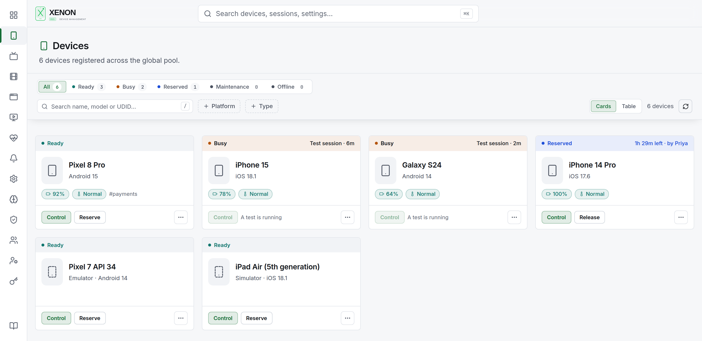

<h1 align="center">
  <picture>
    <source media="(prefers-color-scheme: dark)" srcset="assets/logo-dark.svg">
    
  </picture>
</h1>

<p align="center">
  <strong>Run your mobile device lab from one place: allocation, live control, recording and self-healing tests, as an Appium 3 plugin.</strong>
</p>

<p align="center">
  <a href="https://www.npmjs.com/package/@xenon-device-management/xenon"></a>
  <a href="https://github.com/Rabindra184/xenon/actions/workflows/npm-publish.yml"></a>
  <a href="https://appium.io"></a>
  <a href="LICENSE"></a>
</p>

<p align="center">
  <a href="#quick-start">Quick start</a> ·
  <a href="https://xenon-6e6.pages.dev">Documentation</a> ·
  <a href="#api">API reference</a> ·
  <a href="CHANGELOG.md">Changelog</a>
</p>

<p align="center">
  <picture>
    <source media="(prefers-color-scheme: dark)" srcset="assets/dashboard-dark.png">
    
  </picture>
</p>

Xenon sits inside Appium and turns a set of Android and iOS devices, real or virtual, on one machine or many, into a shared lab. Tests ask for a device with ordinary Appium capabilities. Xenon picks a free one the caller is allowed to use, records the session, heals selectors that broke, and shows everything on a live dashboard. People use the same dashboard to watch, control, record and reserve devices.

## Contents

- [Highlights](#highlights)
- [Requirements](#requirements)
- [Quick start](#quick-start)
- [Hub and nodes](#hub-and-nodes)
- [Configuration](#configuration)
- [Capabilities for your tests](#capabilities-for-your-tests)
- [Self-healing](#self-healing)
- [Security and access](#security-and-access)
- [API](#api)
- [Observability](#observability)
- [Development](#development)
- [Upgrading](#upgrading)
- [Getting help](#getting-help)
- [Contributing](#contributing)
- [License](#license)

## Highlights

**Device lab**
- Finds Android devices and emulators (adb), and iPhones and iOS simulators on a Mac, by itself.
- Allocates a free, healthy device per session, and queues requests when none is free.
- One hub, many nodes: every machine's devices form one pool, behind one URL and one set of rules.
- Teams decide who may use which device; reservations and programmatic leases hold one for a person or a pipeline.

**Live control**
- Live preview of any device in the browser (MJPEG, or hardware H.264 on Android).
- Tap, swipe, type, press keys, take screenshots, install apps and read the clipboard remotely.
- Streaming Android logs with filters; a multi-device view that records several phones side by side.

**Test evidence**
- Video, screenshots, device logs and the full command log for every session, grouped by build.
- CPU and memory charts per session, on both platforms.
- Network capture with mocks and HAR export (Android), and one-click bug report bundles.

**Self-healing**
- When `findElement` fails, six escalating strategies look for the element, from stored fingerprints to an LLM.
- The **Selector health** page lists the selectors that needed healing, with a suggested fix to copy into your test.

**Built for teams**
- Users, roles (`SUPER_ADMIN`, `ADMIN`, `MEMBER`), teams and scoped API tokens.
- Per-user rate limits, single-use tickets for streams and downloads, and a complete [OpenAPI reference](#api).

## Requirements

| Component | Needed |
|---|---|
| **Node.js** | 20.19 or later in the 20 line, 22.12 or later in the 22 line, or 24 and later: Appium 3's own range |
| **Appium** | 3.1.1 or later in the 3 line (`npm i -g appium`) |
| **Android** | The Android SDK platform tools (`adb`), with `ANDROID_HOME` set to the SDK's folder, and the UiAutomator2 driver |
| **iOS** | A Mac with Xcode and the XCUITest driver. Real iPhones also need Xenon's own copy of go-ios in `~/.cache/xenon/goIOS`, which you download once, and again after upgrading Xenon ([how](https://xenon-6e6.pages.dev/docs/installation#iphones-and-go-ios)) |
| **Database** | SQLite, built in: a file under `~/.cache/xenon`. Each server, hub or node, keeps its own. |
| **Recording** | ffmpeg, which comes with Xenon |
| **Optional** | An AI provider key (Gemini, OpenAI, Anthropic or a local Ollama) for the AI healing tiers |

[Installation and requirements](https://xenon-6e6.pages.dev/docs/installation) has the details, and where Xenon keeps its data.

## Quick start

**1. Install the plugin and a driver.**

```bash
appium plugin install --source=npm @xenon-device-management/xenon
appium driver install uiautomator2      # Android
appium driver install xcuitest          # iOS (macOS only)
```

**2. Start Appium with Xenon.** The dashboard is always served; `--plugin-xenon-enable-dashboard` records your sessions for its **Sessions** and **Selector Health** pages.

```bash
appium server --use-plugins=xenon \
  --plugin-xenon-platform=both \
  --plugin-xenon-enable-dashboard
```

For Android, export `ANDROID_HOME` (the Android SDK's folder) in that shell first: Xenon finds `adb` through it.

**3. Open the dashboard** at [http://localhost:4723/xenon/](http://localhost:4723/xenon/) and sign in as the first super admin. Unless you set `XENON_BOOTSTRAP_ADMIN_EMAIL` and `XENON_BOOTSTRAP_ADMIN_PASSWORD` before the first start, that is `admin@xenon.local` / `Admin@123`. **Change it at once** on any machine others can reach.

**4. Point a test at it.** Use your access key and an API token; both are under **Profile** in the dashboard, where you create the token:

```js
const capabilities = {
  platformName: 'Android',
  'appium:automationName': 'UiAutomator2',
  'xe:options': {
    accessKey: process.env.XENON_ACCESS_KEY,
    token: process.env.XENON_TOKEN,
  },
  'xe:build': 'nightly-2026-10-04',
  'xe:name': 'Checkout: pay by card',
};
// WebdriverIO, Appium's Java client, Python client and others all work:
// connect to http://localhost:4723 with these capabilities.
```

The session appears on the dashboard under **Sessions**, with its video and logs once it ends. The site's [Quick start](https://xenon-6e6.pages.dev/docs/quick-start) goes through the same steps in more detail.

## Hub and nodes

A **hub** is the server your tests and people talk to. A **node** is any other machine with devices attached. Every node runs Xenon too and reports its devices to the hub, so the whole lab is one pool behind the hub's URL. Sessions, live control and recordings on a node's device all go through the hub, which applies the team rules and checks access.

```bash
# On each node
export XENON_HUB_ACCESS_KEY="xen_..."   # a node user's access key, from the hub
export XENON_HUB_TOKEN="..."            # that user's token, with the devices scope
appium server --use-plugins=xenon \
  --plugin-xenon-platform=both \
  --plugin-xenon-hub=http://hub.example.com:4723
```

[Hub and nodes](https://xenon-6e6.pages.dev/docs/hub-and-nodes) covers creating the node's user, its token, and recovering a lost one.

## Configuration

Xenon reads its settings from Appium's config file or from `--plugin-xenon-*` flags. A config file suits anything beyond a quick try:

```yaml
# xenon.yaml: run with  appium server --config xenon.yaml
server:
  use-plugins: [xenon]
  plugin:
    xenon:
      platform: both          # android, ios or both
      enableDashboard: true
      maxSessions: 8          # sessions this server runs at once
      enableSelfHealing: true
      buildCleanupDays: 30    # how long builds, videos and screenshots are kept
```

Every option, with its default, is in [Configuration](https://xenon-6e6.pages.dev/docs/configuration), and [Data retention](https://xenon-6e6.pages.dev/docs/retention) explains the cleanup job. Lab-wide settings such as health checks, cleanup and the AI provider can also be changed in the dashboard's **Settings**, **AI engine** and **Maintenance** pages; changing them needs a super admin. A health-check or cleanup value saved there replaces the option the server was started with, and applies without a restart.

### Environment variables

Keep credentials in the environment, not in config files or shell history.

| Variable | What it does |
|---|---|
| `XENON_BOOTSTRAP_ADMIN_EMAIL`, `XENON_BOOTSTRAP_ADMIN_PASSWORD` | The first super admin, created on the server's first start. |
| `XENON_AI_PROVIDER` | `gemini`, `openai`, `anthropic` or `ollama`, for the AI healing tiers. |
| `XENON_GEMINI_API_KEY`, `XENON_OPENAI_API_KEY`, `XENON_ANTHROPIC_API_KEY` | The provider's key. The dashboard never stores or shows keys. |
| `XENON_AI_MODEL`, `XENON_AI_BASE_URL` | A different model, or a custom endpoint such as a local Ollama. |
| `DATABASE_URL` | Where the SQLite database lives, as `file:/path/to/xenon.db`. Defaults to a file under `~/.cache/xenon`. The published plugin stores its data in SQLite only and won't start on a PostgreSQL URL. |
| `XENON_AUTO_MIGRATE` | `true` (default) brings the database up to date at startup: `prisma migrate deploy` if it keeps a migration history that matches its tables, `prisma db push` if not. Set `false` if your pipeline does it. |
| `XENON_HUB_ACCESS_KEY`, `XENON_HUB_TOKEN` | On a node: the credentials it uses to talk to its hub. |
| `XENON_REQUIRE_SESSION_TOKEN` | Refuse sessions created without valid credentials. |
| `XENON_REQUIRE_COMMAND_AUTH` | Check credentials on every Appium command, not only when the session is created. |
| `XENON_ALLOWED_ORIGINS` | Extra origins the dashboard may be served from, for a reverse proxy on another host. |
| `XENON_PUBLIC_URL` | The address people reach this server at, such as `https://xenon.example.com` or `http://lab-mac:4723` (the dashboard's address, ending in `/xenon/`, works too). Password reset links and device dashboard links point here; without it Xenon emails no reset links. |
| `XENON_SMTP_URL`, `XENON_SMTP_FROM` | The mail server for password reset links, and the sender. Needs `XENON_PUBLIC_URL`. |
| `XENON_USER_SESSION_TTL_MS` | How long a dashboard sign-in lasts without use (default 24 hours). |
| `XENON_AUTH_DISABLED` | `true` turns sign-in off. For local development only. |
| `XENON_JSON_LOGGING` | `true` writes JSON log lines. Used only when the `enableJsonLogging` option isn't set; the option, true or false, wins. |
| `XENON_MAX_CONCURRENT_RECORDINGS`, `XENON_RECORDINGS_ASSETS_PATH` | The cap on simultaneous Live Devices recordings (default 4) and where they are stored. Used only when the `maxConcurrentRecordings` and `recordingsAssetsPath` options aren't set. |

[Environment variables](https://xenon-6e6.pages.dev/docs/environment-variables) lists every variable Xenon reads.

## Capabilities for your tests

Xenon's own capabilities use the `xe:` prefix. Credentials and other options go in `xe:options`.

| Capability | Purpose |
|---|---|
| `xe:options` | `accessKey` and `token`, or a `sessionToken`; a lease's `leaseId` and `leaseToken`; optionally a `team`. Xenon removes the credentials before the driver or any record sees them. |
| `xe:build`, `xe:name` | Group sessions into a build and name them on the dashboard. |
| `xe:record_video` | Record the session's video. On by default; `false` turns it off. |
| `xe:screenshot_on_failure`, `xe:screenshot_on_every_command` | Take a screenshot when a command fails (on by default), or after every command. |
| `appium:udids`, `appium:minSDK`, `appium:maxSDK`, `appium:tags` | Narrow which devices the session may get. |
| `appium:iPhoneOnly`, `appium:iPadOnly`, `appium:filterByHost` | Limit to iPhones (simulators and real devices), to iPads, or to one node. If both are true, you get an iPad. |
| `appium:deviceAvailabilityTimeout`, `appium:deviceRetryInterval` | How long to wait for a free device, and how often to look (ms). |

[Capabilities](https://xenon-6e6.pages.dev/docs/capabilities) has every capability Xenon reads.

From inside a test, the `xenon:` execute commands report to the dashboard:

```js
await driver.execute('xenon: setSessionStatus', { status: 'passed', reason: 'All steps OK' });
await driver.execute('xenon: captureEvidence', { reason: 'Payment confirmed' });
```

Also available: `setSessionName`, `addTag` and `debug`, and on Android with network capture on, `addMock`, `getRequests` and `exportHar`.

The five that write to the dashboard (`setSessionStatus`, `captureEvidence`, `setSessionName`, `addTag`, `debug`) answer `{ recorded: true }`, or `{ recorded: false, message }` when nothing was saved, for example on a server started without `enableDashboard`; they never fail the test. A `xenon:` command Xenon doesn't have fails with `unknown command`.

With an AI provider configured, `assertVisualState` answers `{ result, message }` with the provider's verdict on a screenshot, and fails when it couldn't check. `smartTap` finds text of several words, such as `Sign in`, and taps the right spot on iPhones too. [Execute commands](https://xenon-6e6.pages.dev/docs/execute-commands) lists them all.

For CI, a **lease** reserves a device before the test starts and hands back ready-made capabilities: `POST /xenon/api/sdk/leases`. See [Leases for CI](https://xenon-6e6.pages.dev/docs/leases).

## Self-healing

When `findElement` can't find an element, Xenon tries six strategies in turn, cheapest first, before the test sees a failure:

| Tier | Strategy | How it finds the element |
|---|---|---|
| 0 | **Resilio** | The element's path through the element tree, stored from an earlier run. In 2.14.0 it finds nothing, because that path isn't stored |
| 1 | **Native** | The original selector, retried |
| 2 | **Fuzzy XML** | The page source compared with the stored fingerprint |
| 3 | **OCR** | The element's text read from a screenshot |
| 4 | **Visual AI** | A screenshot analysed by the configured AI provider |
| 5 | **LLM** | The page source and the failed selector reasoned about by an LLM |

Before healing, an optional **autowait** retries `findElement` for a while, since most "broken" selectors are slow screens. Turn healing off with `enableSelfHealing: false` in the config file (a true-or-false flag such as `--plugin-xenon-enable-self-healing` can only turn an option on), or with the AI self-healing switch on the dashboard's **Settings** page, which applies from the next command and wins over the option. A session can limit which tiers it uses with `xe:options.healingTiers`.

The dashboard's **Selector health** page lists every selector that needed healing in a period, how often and in which sessions, with a suggested fix to copy in JavaScript, Java, Python, C# or Ruby. Mark one as fixed and Xenon watches later runs to confirm it: it moves from **To fix** to **Being verified** to **Fixed**, and back to **To fix** if it breaks again. **Muted** hides a selector you've decided to leave. [How healing works](https://xenon-6e6.pages.dev/docs/self-healing) and [Selector health](https://xenon-6e6.pages.dev/docs/selector-health) have the details.

## Security and access

Every `/xenon/api` request needs a credential:

| Credential | How to send it | Use it for |
|---|---|---|
| Dashboard session | The cookie `POST /xenon/api/auth/login` sets | People, in the browser |
| Access key and token | `x-xenon-access-key` and `x-xenon-token` headers | CI, scripts, nodes |
| Bearer token | `Authorization: Bearer <jwt>`, from `POST /xenon/api/auth/token` | SDKs, MCP tools, short-lived access |

**Roles** decide what a person may do; a token's **scopes** narrow it further, and a token can never have more than the credential that created it.

| Scope | Allows |
|---|---|
| `read` | Reading devices, sessions, builds, apps and logs |
| `sessions` | Running Appium sessions and acting on selectors |
| `devices` | Controlling devices, previews, recordings, reservations and leases |
| `admin` | Users, teams, API keys, webhooks and lab settings (with the matching role) |

**Teams** decide which devices someone can reach: a member sees their teams' devices and the shared pool, and everything else answers as if it didn't exist. [Teams](https://xenon-6e6.pages.dev/docs/teams) explains setting them up.

For a lab others can reach, we recommend:
- set your own bootstrap admin password before the first start;
- turn on `XENON_REQUIRE_SESSION_TOKEN`, so every session has an owner, and `XENON_REQUIRE_COMMAND_AUTH` on the hub when every client sends its credentials with each command (the Kotlin SDK doesn't);
- serve Xenon over HTTPS, and keep nodes on a trusted network.

[Authentication](https://xenon-6e6.pages.dev/docs/authentication), [Roles and scopes](https://xenon-6e6.pages.dev/docs/roles-and-scopes) and the [Hardening checklist](https://xenon-6e6.pages.dev/docs/hardening) have the details.

## API

Every endpoint is documented in the OpenAPI reference that each server serves:

- **Interactive reference:** `http://<your-host>:4723/xenon/api-docs`
- **Raw OpenAPI document:** `http://<your-host>:4723/xenon/api-docs.json`
- **On the site:** [xenon-6e6.pages.dev/api](https://xenon-6e6.pages.dev/api), for the current release

```bash
# List the devices you can see
curl -H "x-xenon-access-key: $XENON_ACCESS_KEY" -H "x-xenon-token: $XENON_TOKEN" \
  http://localhost:4723/xenon/api/devices

# Lease an Android device for 30 minutes
curl -X POST -H "Content-Type: application/json" \
  -H "x-xenon-access-key: $XENON_ACCESS_KEY" -H "x-xenon-token: $XENON_TOKEN" \
  -d '{"filters":{"platform":"android"},"durationMs":1800000}' \
  http://localhost:4723/xenon/api/sdk/leases
```

Errors are JSON with an `error` field. Requests are rate limited per API key or per user; a limited answer carries `X-RateLimit-*` headers, and `429` with `Retry-After` past the budget.

## Observability

Xenon can send traces, logs and metrics over OpenTelemetry, write its log as JSON, and serve metrics for Prometheus. [Observability](https://xenon-6e6.pages.dev/docs/observability) explains each, and [`examples/observability`](examples/observability) has a ready Docker Compose stack (Grafana, Tempo and Loki) to view them.

## Development

```bash
git clone https://github.com/Rabindra184/xenon.git
cd xenon
npm install
npm run build:all    # build the plugin and the dashboard, once
npm run dev          # migrate the database, build the plugin, install it and start Appium
```

| Command | Does |
|---|---|
| `npm run build:all` | Build the plugin and the dashboard |
| `npm run test:all` | Run the unit and integration tests (no devices needed) |
| `npm run test:android`, `npm run test:ios` | Run the integration tests on real devices |
| `npm run db:generate -- --name <change>` | Add a database migration after editing `prisma/schema.prisma` |

The dashboard is a React app in [`web/`](web), and the documentation site is in [`website/`](website); [its README](website/README.md) says how to build it.

## Upgrading

Read the [changelog](CHANGELOG.md) before upgrading: each release says whether it brings a database migration and what behaves differently. Then update the plugin and restart Appium:

```bash
appium plugin update xenon
```

Xenon brings its database up to date when it starts. A database that keeps Prisma's migration history (a `_prisma_migrations` table) matching its tables gets the new migrations with `prisma migrate deploy`; any other, including every database made with the default settings, is matched to the new schema with `prisma db push`. If you set `XENON_AUTO_MIGRATE=false`, do this yourself first; from a source checkout, `npm run db:migrate` does it by the same rule. [Upgrading](https://xenon-6e6.pages.dev/docs/upgrading) has the steps, for hubs and nodes too.

## Getting help

- **Questions and setup:** the [documentation](https://xenon-6e6.pages.dev), then the API reference on your own server.
- **Bugs and ideas:** [open an issue](https://github.com/Rabindra184/xenon/issues/new/choose).
- **Security problems:** report them privately, as [SECURITY.md](SECURITY.md) explains; please don't open a public issue.

## Contributing

Issues and pull requests are welcome. [CONTRIBUTING.md](CONTRIBUTING.md) covers the development setup, tests, database changes and what a pull request needs. Everyone taking part is expected to follow the [code of conduct](CODE_OF_CONDUCT.md). To refresh the screenshots above after a dashboard change, build `web/` and run `node scripts/dev/readme-screenshots.js`.

## License

Xenon is released under the [ISC License](LICENSE).
