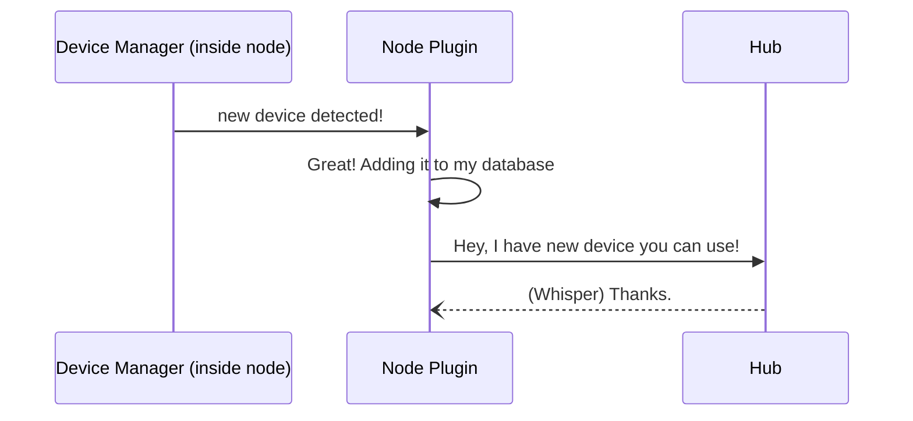
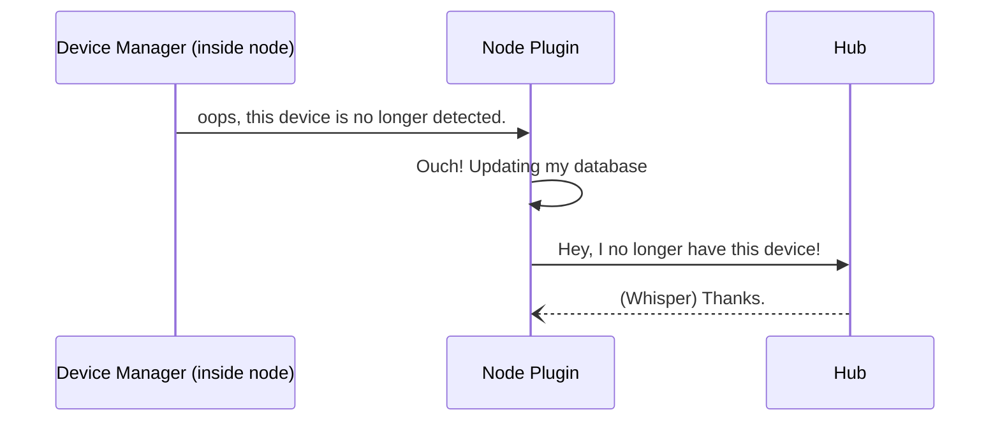
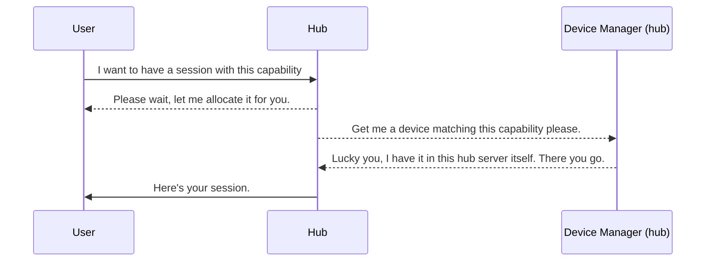
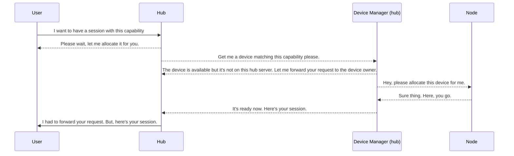
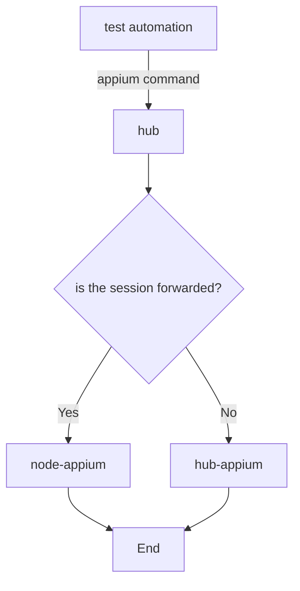

# Appium Xenon Architecture
Here are some diagram to illustrate how the plugin works.

## Device Inventory
### Device Added
When the device trackers see new device.

### Device Removed
When the device trackers see missing device.

## Session Request
The following diagrams illustrate how session is created.
### Device is on the hub
When target device is hosted on the hub.

### Device is on the node
When target device is hosted on the node.

## Device Allocation
When a session is to be created, the plugin will block the device on the hub. This will prevent subsequent request from getting the same device. Once device is blocked, hub will create a session using aforementioned device. 

When the device is hosted on a node (not the hub), session request will be forwarded. The plugin in the node will receive the session request and apply the same logic as the above.

When a device is getting allocated for a session, the device will be blocked (marked as `busy`).

## Forwarded Session
When session is allocated in the node, the hub will act as a gateway. It's keeping the record of session id and which node is serving this particular session.

## Strategic Intelligence

Xenon includes a layer of "Strategic Intelligence" to manage large-scale device farms proactively.

### Global Event Bus
A decoupled event system (`EventEmitter`) allows services to communicate without direct dependencies. Key events include `http:request`, `device:anomaly`, and `session:timed_out`.

### Predictive Failure Analysis
The `HealthMonitorService` tracks device health trends using historical data. It can detect:
- **Thermal Spikes**: A sudden jump from `Normal` to `Serious` thermal status.
- **Rapid Battery Drain**: Detection of >5% drain between health checks.
These anomalies emit `device:anomaly` events for proactive maintenance.

### Circuit Breaker
To prevent cascading failures, Xenon implements a Circuit Breaker for remote nodes. If a node fails a threshold of requests, the Hub temporarily trips the circuit, avoiding deadlocks while the node recovers.

## Virtualized Network Conditioning

Xenon can simulate real-world network conditions across all platforms:
- **Latency Injection**: The command proxy injects artificial delays (e.g., 400ms for Edge) into every WebDriver command.
- **Platform Native Control**: 
  - **Android**: Uses `adb shell svc` to toggle data/wifi.
- **iOS Simulator**: Uses `xcrun simctl network` to switch profiles.

## Intelligent Video & Asset Pipeline

To maintain high performance in high-density farms, Xenon implements a background-driven video pipeline:
- **Zero-Copy Handling**: Moving away from standard Appium base64-encoded video responses, Xenon records directly to the session's asset directory.
- **Hardware Acceleration**:
  - **macOS**: Leverages `h264_videotoolbox` for near-zero CPU impact encoding.
  - **Linux**: Optimized `libx264` for maximum compatibility and performance.
- **Fragmented MP4 (fMP4)**: Video is recorded as a series of standalone fragments. This enables **Instant Playback** in the dashboard (watching the video during the test) and ensures the file is valid even if the session crashes.

## Cellular Architecture & Database Scalability

To support horizontal scaling across multiple data centers or "cells", Xenon moves away from monolithic state management:
- **Shared State**: By migrating from SQLite to **PostgreSQL**, multiple Hubs can share the same device registry and session history.
- **Stateless Hubs**: Hubs become interchangeable processing nodes that read/write to the central authority (PostgreSQL).
- **Dynamic Provisioning**: New hubs can be spun up and immediately start managing devices as they sync with the global state.

## Strategic Intelligence: AI Root-Cause Analysis

Xenon integrates a multimodal AI pipeline to automate the "Triage" phase of test failure analysis:
- **Context Tombstone**: When a session fails, Xenon captures a "tombstone" containing the last 10 commands, last 50 lines of device logs, and the final screenshot.
- **LLM Reasoning**: This context is fed into an LLM (Google Gemini) which acts as a virtual site reliability engineer.
- **Root-Cause Mapping**: The AI differentiates between infrastructure issues (e.g., WDA crash), environment issues (e.g., system alert), and functional bugs (e.g., element not found).
- **Embedded Insights**: Analysis is stored directly in the session record and displayed in the dashboard, reducing MTTR (Mean Time To Repair).

