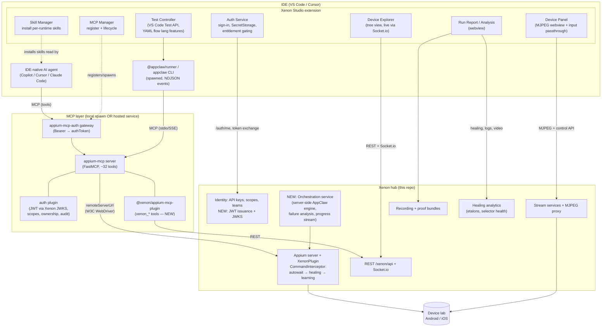
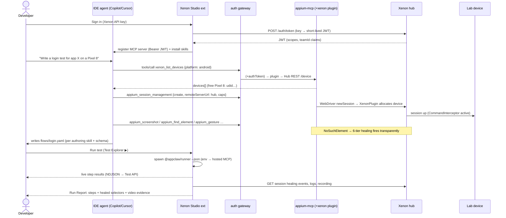

# Xenon Studio — VS Code / Cursor Extension for AI-Assisted Mobile Testing

**Status:** Draft for review
**Date:** 2026-07-17
**Author:** Rabindra Biswal (with Claude)
**Working name:** *Xenon Studio* (extension id `xenon.xenon-studio` — final naming is an open decision, §8)

---

## 0. Decisions already made (from clarifying-question round)

| Question | Decision |
|---|---|
| Extension strategy | **New extension, fresh identity**, taking heavy reference from AppClaw's existing `vscode-extension/` (`atddevs.appclaw` v0.1.6) — reuse its NDJSON bridge design, flow language providers, and device-panel patterns |
| AI surface | **IDE-native agents via MCP + skills** — Copilot / Cursor / Claude Code do the authoring; the extension owns run/debug/analyze UX; no LLM keys inside the extension |
| Xenon's role | All of: device-lab backend, self-healing & analytics surface, recording/evidence, identity provider, **and server-side AI orchestration** (plan tasks, execute tests, reason over failures, stream progress to IDE) |
| Distribution | **Public marketplace, gated features** — free core; enterprise features unlock via Xenon entitlements |
| Xenon codebase | The monolithic Appium-plugin repo (`XAenon/xenon`), **not** `xenon-orchestrator` |

---

## 1. Grounded repo findings (what the plan is built on)

### 1.1 `appium-mcp` (v1.87.5 — mature, npm-published)
- FastMCP-based MCP server, **stdio** and **httpStream** transports; ~32 tools (`appium_session_management`, `appium_find_element`, `appium_gesture`, `appium_screenshot`, `appium_app_lifecycle`, `generate_locators`, `appium_generate_tests`, …).
- Two driver modes: **embedded** (UiAutomator2/XCUITest in-process, local dev) and **remote** (`remoteServerUrl` → any Appium server — *this is the Xenon hook*: sessions created against the Xenon hub flow through `CommandInterceptor`, so healing/autowait/logging apply transparently).
- **Plugin API** (`appium-mcp/core` → `createAppiumMcpServer({ plugins })`) — third parties add tools and `beforeCall`/`afterCall` hooks without forking. `appium-mcp-auth` is built exactly this way; our Xenon tools will be too.
- Multi-session, **process-global** session store with `ownership` and `activeSessionId`; on client disconnect owned sessions are deleted unless `APPIUM_MCP_ON_CLIENT_DISCONNECT=skip`.
- OTel tracing optional, policy allowlist for hiding tools, semantic-release, real CI.

### 1.2 `appium-mcp-auth` (`@appclaw/appium-mcp-auth` v1.0.0)
- Auth **as an appium-mcp plugin** (plugins can't read HTTP headers → credential travels as a tool argument, default `authToken`), plus a **gateway reverse-proxy mode** that maps `Authorization: Bearer` headers → injected `authToken` for header-based clients (Cursor, VS Code, Claude Desktop).
- Mechanisms: hashed API keys (`ak_<id>_<secret>`), exchangeable session tokens (`auth_login` → `st_*`, 1 h TTL, in-memory), and **provider-agnostic JWT validation** via JWKS (`issuer` + `audience` + claims mapping). No OIDC discovery or login flow — the client owns that.
- AuthZ: per-tool scope maps (`appium:use`, `appium:admin`, …), roles with admin bypass, **per-subject session ownership** (multi-tenant isolation on a shared server), per-subject rate limits and session quotas, JSONL audit log.
- Caveat flagged by its own docs: ownership/rate-limit state is process-local → multi-replica deployments need a shared store (Redis).

### 1.3 `AppClaw` (v2.0.0 monorepo — `@appclaw/{cli,core,runner,agent}`)
- The **automation engine**: LLM agent loop (Perceive→Reason→Act), **deterministic YAML flows** (`schemas/flow.schema.json` — flat/phased/parallel/suite; natural-language *or* structured steps; `${variables.*}`/`${secrets.*}` interpolation), vitest-style runner with fixtures, goal→spec export, PRD→flow explorer.
- Drives devices **exclusively through appium-mcp** (stdio spawn or SSE) — never raw Appium. Tools converted dynamically to AI-SDK format.
- **Existing VS Code extension** (`vscode-extension/`, `atddevs.appclaw`): spawns the CLI with `--json`, consumes a typed NDJSON event stream (`plan`, `step`, `screen`, `flow_step`, `hitl`, `done`), tree views (Devices/Flows/History), flow CodeLens + completion, MJPEG device panel, ~30 settings, SecretStorage for secrets. This is our reference implementation.
- `@appclaw/core` exposes an `agent-runtime` export — deterministic device primitives (open/snapshot/press/fill) that bypass the LLM. Useful for server-side orchestration.

### 1.4 `appclaw-agent-skill`
- One canonical `SKILL.md` (`use-appclaw-agent-cli`) published to **three agent runtimes** (Claude Code plugin, Codex, Gemini extension) via a **generate-from-canonical sync script** with a CI drift guard. This is the template for our skill distribution: one source of truth, per-runtime wrappers generated.
- Encodes hard-won behavioral rules (press-not-tap, scroll-not-swipe, *visual* assertions only) — rules we must carry forward.

### 1.5 `xenon` (this repo)
- Appium 3.x plugin: `CommandInterceptor` chokepoint, **6-tier self-healing** (Resilio → fuzzy XML → OCR → visual AI → LLM), autowait, device managers (ADB / go-ios+WDA), **MJPEG streaming** with `UniversalMjpegProxy` fan-out, **recording subsystem** with proof bundles, hub-node topology, SQLite/Prisma store.
- **Identity already exists**: API keys with `{ id, scopes, teamId, rateLimit }`, `scopeGuard`/`mutationScopeGuard`, dashboard-session cookie exchange, `GET /xenon/api/auth/me`, manual device locks (`manual_<actorId>_<udid>`).
- Real-time surface: REST under `/xenon/api` + Socket.io broadcasts via `EventManager`.
- AI Engine (`AICommandService`) and healing analytics (etalons, selector learning) are the raw material for the failure-analysis surface.
- None of the other four repos reference Xenon → **all Xenon integration is new, additive work**, cleanly layered on existing APIs.

---

## 2. Target architecture

### 2.1 Component diagram



**Two operating modes, one extension:**

- **Local mode (free tier):** the extension spawns `appium-mcp` over stdio with embedded drivers. Zero backend required. The IDE agent drives a local emulator/simulator/USB device. This is the public-marketplace on-ramp.
- **Lab mode (enterprise, gated):** the extension points the IDE agent at a **hosted** appium-mcp behind the auth gateway; sessions are created with `remoteServerUrl` → the Xenon hub's Appium endpoint, so every command gains healing, autowait, selector learning, logging, and recording. Device discovery, locks, streams, analytics, and evidence come from Xenon REST/Socket.io.

### 2.2 Sequence — "author and run a login test on a lab device"



### 2.3 Unit boundaries (isolation & clarity)

| Unit | One purpose | Interface | Depends on |
|---|---|---|---|
| Extension core | activation, host detection (VS Code vs Cursor), DI of services | VS Code API | — |
| MCP Manager | register/spawn/stop MCP servers per mode | `McpServerDefinitionProvider` (VS Code) / `.cursor/mcp.json` writer (Cursor) | Auth Service |
| Skill Manager | install/update canonical skills into per-agent formats | filesystem writes + drift check | bundled `skills/` assets |
| Auth Service | token acquisition, refresh, SecretStorage, entitlements | `getToken()`, `getEntitlements()`, `onDidChangeAuth` | Xenon `/auth/*` |
| Device Explorer / Panel | lab visibility + manual control | Xenon REST + Socket.io + MJPEG | Auth Service |
| Test Controller | discover/run/debug flows & specs | VS Code Test API ↔ NDJSON bridge | AppClaw CLI/runner |
| Run Report | post-run analysis view | Xenon REST (healing/logs/recordings) | Auth Service |
| `@xenon/appium-mcp-plugin` (new pkg) | expose Xenon to agents as MCP tools | appium-mcp Plugin API | Xenon REST |
| Xenon token service (new, in this repo) | API key → JWT, JWKS | `POST /auth/token`, `GET /.well-known/jwks.json` | existing key store |
| Xenon orchestration service (new, in this repo) | server-side runs + failure analysis | `POST /orchestrations`, Socket.io progress | `@appclaw/core` agent-runtime |

---

## 3. Repo-by-repo integration analysis

| Repo | Role in solution | Changes needed |
|---|---|---|
| **`appium-mcp`** | The MCP runtime, consumed as an npm dependency in both modes. | **None to core** (hard rule inherited from appium-mcp-auth: never fork). We consume the Plugin API. Config: `APPIUM_MCP_ON_CLIENT_DISCONNECT=skip` for reconnect resilience; `REMOTE_SERVER_URL_ALLOW_REGEX` pinned to lab hosts; OTel enabled in hosted mode. |
| **`appium-mcp-auth`** | AuthN/Z for the hosted MCP. Gateway mode fronts header-based IDE clients; JWT validation pointed at **Xenon as issuer** (`issuer: hub URL`, `jwksUri: hub /.well-known/jwks.json`, claims: `sub`, `scopes`, `roles`, `teamId`). | Minor: a `teamId`/custom-claim passthrough into `Identity` if we want team-scoped tool behavior (or encode team into scopes). Later: Redis-backed ownership/rate-limit store for multi-replica (upstream already flags this). |
| **`AppClaw`** | (a) `@appclaw/runner` + CLI = the local execution engine the Test Controller spawns; (b) `flow.schema.json` + `generate-appclaw-flow` SKILL.md = the authoring grammar; (c) `@appclaw/core` `agent-runtime` = the engine for Xenon's server-side orchestration; (d) `vscode-extension/` = reference code (NDJSON bridge, flow providers, device panel) for the new extension. | New: a `--mcp-url`/env path is already there (`MCP_TRANSPORT/URL`) — verify SSE-to-gateway with Bearer works; possibly add header support to its MCP client. Nothing structural. |
| **`appclaw-agent-skill`** | Pattern donor: canonical `SKILL.md` → generated per-runtime wrappers + CI drift guard. Its behavioral rules (visual asserts, press/scroll verbs) migrate into the new skill set. | Superseded for this product by a new `xenon-skills` package (§4); the repo itself stays as-is for standalone CLI users. |
| **`xenon` (this repo)** | The enterprise backend: devices, healing, streaming, recording, analytics, identity, and the new orchestration brain. | **New, additive:** (1) token service — `POST /xenon/api/auth/token` exchanging an API key for a short-lived RS256 JWT + `GET /.well-known/jwks.json`; (2) orchestration service + REST/Socket.io surface running `@appclaw/core` server-side; (3) failure-analysis endpoint composing healing events + logs + screenshots through the existing AI Engine; (4) (optional) CORS/scope additions for IDE origins. No changes to interception/healing internals. |
| **New repo: `xenon-studio`** | The extension + `@xenon/appium-mcp-plugin` + `xenon-skills` (canonical skills + generators) — a small monorepo. | Greenfield, referencing `AppClaw/vscode-extension` heavily. |

---

## 4. Skill contract + MCP tool schema design

### 4.1 The three-layer contract

```
Skills (prose, per-agent)  →  MCP tools (typed, versioned)  →  Xenon REST (internal)
```

Skills never encode REST endpoints or auth details — they reference **tool names and argument shapes only**. The MCP layer is the sole public, versioned contract; Xenon REST stays free to evolve behind it.

**Compatibility rules:**
- The MCP server's `instructions` string advertises `contractVersion` (semver) and the tool families present.
- Each skill's frontmatter declares `requires: appium-mcp>=1.87, xenon-plugin>=1.0`. Skills instruct the agent to degrade gracefully (tell the user what to install/upgrade) when a required tool is absent from discovery.
- Tool schemas are **append-only within a major version**: new optional params OK; renames/removals require a major bump of the plugin and a paired skill release. CI runs a contract snapshot test (recorded `tools/list` output diffed on every build).

### 4.2 New MCP tools — `@xenon/appium-mcp-plugin`

All tools follow appium-mcp conventions (zod schemas, optional `sessionId`, `authToken` credential arg handled by the auth plugin). Scope requirements shown per tool.

| Tool | Params (zod shape) | Returns | Scope |
|---|---|---|---|
| `xenon_list_devices` | `platform?: 'android'\|'ios'`, `status?: 'free'\|'busy'\|'offline'`, `name?: string` | device[] `{udid, name, platform, os, busy, lockedBy?, teamId}` | `xenon:devices:read` |
| `xenon_acquire_device` | `udid: string` | lock `{udid, lockId}` (manual lock as `manual_<subject>_<udid>`) | `xenon:devices:lock` |
| `xenon_release_device` | `udid: string` | `{released: boolean}` | `xenon:devices:lock` |
| `xenon_create_lab_session` | `udid?: string`, `deviceQuery?: {platform, name?}`, `capabilities?: string(JSON)` | delegates to `appium_session_management` with `remoteServerUrl` + Xenon caps injected → `{sessionId}` | `appium:use` |
| `xenon_selector_health` | `appId?: string`, `selector?: string`, `limit?: number` | health records `{selector, strategy, failRate, lastHealedBy, etalonAge}` | `xenon:analytics:read` |
| `xenon_healing_events` | `sessionId: string` | events `{selector, tierTried[], tierSucceeded, healedSelector?, durationMs}` | `xenon:analytics:read` |
| `xenon_start_recording` / `xenon_stop_recording` | `udids: string[]` / `groupId: string` | `{groupId}` / `{proofBundleUrl}` | `xenon:recordings` |
| `xenon_analyze_failure` | `sessionId: string`, `failureContext?: string` | structured analysis `{probableCause, evidence[], suggestedFix, healingSummary}` (server-side AI) | `xenon:analyze` |
| `xenon_run_flow` | `flowYaml?: string`, `flowPath?: string`, `deviceQuery: {...}`, `count?: number` | `{orchestrationId}` (async, server-side run) | `xenon:orchestrate` |
| `xenon_orchestration_status` | `orchestrationId: string` | `{state, steps[], progress, reportUrl?}` | `xenon:orchestrate` |

Scope vocabulary extends Xenon's existing scopes; the auth plugin's `TOOL_SCOPES` map is generated from this table (single source in the plugin package, exported as JSON).

### 4.3 Skill set (`xenon-skills`, canonical → generated)

One canonical `skills/<name>/SKILL.md` tree; a build step (evolution of `sync-gemini.sh`) emits: Claude Code plugin (`.claude-plugin/` + skills), Cursor rules (`.cursor/rules/*.mdc`), Copilot instruction/prompt files (`.github/instructions/*.instructions.md`, `.github/prompts/*.prompt.md`), Gemini extension. The extension's Skill Manager installs the right format into the workspace (with a diff/consent prompt) and keeps them updated.

| Skill | Trigger | Instructs the agent to… |
|---|---|---|
| `author-mobile-flow` | "write/create a test for…" | Explore the app live via MCP (session → screenshots → `generate_locators`), then write an AppClaw YAML flow against `flow.schema.json`; prefer stable selectors; structured steps over NL steps for CI determinism. (Derived from `generate-appclaw-flow`.) |
| `interactive-device-control` | one-off "tap/open/check…" | Use MCP tools directly (`xenon_list_devices` → session → `appium_gesture`/`appium_set_value`); **visual assertions only** (screenshot + read image); re-snapshot after state changes. (Derived from `use-appclaw-agent-cli`, CLI swapped for MCP tools.) |
| `run-mobile-tests` | "run this flow/suite" | Local: use the extension's Test Explorer or `appclaw --flow --json`. Lab/scale: `xenon_run_flow` + poll `xenon_orchestration_status`; interpret NDJSON/report results. |
| `analyze-test-failure` | "why did this fail?" | Pull `xenon_healing_events` + `xenon_selector_health` + session screenshots; call `xenon_analyze_failure`; propose selector or flow fixes; never guess without visual evidence. |

Behavioral invariants carried from `appclaw-agent-skill` into every skill: visual verification for asserts, no swipe-verb ambiguity, re-inspect after each state-changing action, close/release sessions and device locks when done.

---

## 5. Phased delivery plan

### Phase 0 — Foundations & contract (≈ 2 weeks)
- Scaffold `xenon-studio` monorepo (extension, `@xenon/appium-mcp-plugin`, `xenon-skills`), esbuild bundling, CI, semantic-release.
- Host detection + MCP registration: VS Code `McpServerDefinitionProvider`; Cursor `.cursor/mcp.json` writer/deeplink (with consent prompt).
- Local mode: spawn `appium-mcp` stdio (Node ≥22 runtime discovery — see risk R6), first two skills installed by Skill Manager.
- **Milestone M0:** Copilot agent (VS Code) and Cursor agent each drive a local emulator through our registered MCP server using the authoring skill.

### Phase 1 — MVP: Xenon lab from the IDE (≈ 4–5 weeks)
- Auth Service: API-key sign-in → Xenon; `/auth/me` entitlements; SecretStorage; feature gating skeleton.
- Xenon: `POST /auth/token` (JWT) + JWKS endpoint (new, additive).
- Device Explorer (REST + Socket.io live status, acquire/release locks) + Device Panel (MJPEG + tap/swipe/key passthrough via control API — port from mosaic patterns).
- Lab sessions: agent creates sessions via `remoteServerUrl` → hub (healing/autowait live end-to-end).
- Flow authoring UX: YAML schema association, completion, CodeLens (ported/reworked from `atddevs.appclaw` providers).
- Test Controller: VS Code Test API ↔ `@appclaw/runner`/CLI NDJSON bridge; basic run report.
- **Milestone M1:** full author → run → debug loop on lab devices, both IDEs, single user.

### Phase 2 — Hosted MCP, enterprise auth, analytics (≈ 4–5 weeks)
- Deploy hosted appium-mcp + auth gateway + `@xenon/appium-mcp-plugin` (Docker; one service per lab).
- JWT validation via Xenon JWKS; scopes → tool map; ownership isolation; audit JSONL shipped to Xenon.
- Xenon plugin tools GA: devices, locks, selector health, healing events, recordings.
- Run Report v2: healing timeline per step, selector-health drilldown, recording/proof-bundle attachment.
- RBAC-gated UI (entitlements from `/auth/me` decide which views/tools light up).
- Contract snapshot tests + skill/tool version handshake.
- **Milestone M2:** multi-user shared lab through one hosted MCP with per-subject isolation, audit, and evidence.

### Phase 3 — Orchestration, SSO, GA hardening (≈ 5–6 weeks)
- Xenon orchestration service: `xenon_run_flow` server-side execution using `@appclaw/core` (agent-runtime + flow runner), Socket.io progress streamed into the IDE Test Explorer; `xenon_analyze_failure` via the AI Engine.
- OIDC SSO: extension runs auth-code + PKCE (via `vscode.authentication`/UriHandler); Xenon federates or the gateway validates IdP JWTs directly (provider-agnostic — Okta/Entra/Google all work).
- Telemetry pipeline end-to-end (see §7.3), rate limits & quotas tuned, Redis store for auth plugin state if multi-replica.
- Marketplace launch: VS Code Marketplace + Open VSX listings, pre-release channel, docs site, sample repo.
- **Milestone M3 (GA):** public listing; enterprise features gated by Xenon entitlements; airgapped VSIX channel documented.

Rough total: **15–18 weeks** to GA with one focused engineer + review support; phases 1–2 parallelize across two people (extension vs backend) to compress ~30%.

---

## 6. Packaging, signing & distribution

- **One codebase, one VSIX.** esbuild single-bundle (extension host code), assets (skills, schemas) packaged in. No native modules in the extension itself (SecretStorage covers keychain needs) — keeps the VSIX platform-neutral.
- **Engines:** pin `engines.vscode` to the *lowest* API baseline Cursor's current fork supports (verify at Phase 0; Cursor tracks VS Code within a few minor versions). Avoid proposed APIs; feature-detect `vscode.lm`/MCP APIs at runtime since Cursor lags there.
- **Channels:**
  - **VS Code Marketplace** — `vsce publish` under a verified publisher; Marketplace performs extension signing automatically; enable pre-release channel for early adopters.
  - **Open VSX** — same VSIX, `ovsx publish` (namespace + token). This is the channel Cursor/VSCodium users pull from.
  - **GitHub Releases** — VSIX + SHA-256 checksums for airgapped/enterprise `code --install-extension` installs; optionally an internal private Open VSX for customers who mandate a private registry.
- **Gating, not forking:** a single public build; enterprise features activate from Xenon entitlements returned by `/auth/me` (scopes/plan claims). No secret bits ship in the VSIX — everything gated is server-enforced too (UI gating is convenience, authZ lives in the gateway/Xenon).
- **Server-side artifacts:** hosted appium-mcp+gateway+plugin ships as a Docker image (versioned in lockstep with the plugin's major); Xenon endpoints ride the existing repo's release train.
- **Versioning:** semantic-release everywhere (already standard across all four repos); the MCP contract version (§4.1) is the compatibility keystone between independently-released extension, skills, plugin, and server.

---

## 7. Security, testing & observability

### 7.1 Security
- **Credential flow:** API key or OIDC token lives only in VS Code **SecretStorage** (OS keychain). The extension exchanges it for a short-lived Xenon JWT; the JWT rides as `Authorization: Bearer` to the gateway, which injects `authToken` upstream. Nothing sensitive in `settings.json`, workspace files, or logs (Xenon and appium-mcp both already redact; auth plugin never audits credentials).
- **Test secrets:** AppClaw's `.appclaw/env/*.yaml` model — `secrets:` values are `${SHELL_ENV}` placeholders, redacted as `***` in logs and reports. The extension surfaces a lint warning for literal secrets in flow files.
- **Server hardening:** `REMOTE_SERVER_URL_ALLOW_REGEX` pinned to lab hosts (prevents SSRF-style pivoting via the session tool); appium-mcp policy allowlist hides unneeded tools in hosted mode; TLS everywhere; per-subject rate limits + session quotas; ownership enforcement isolates tenants on the shared MCP.
- **RBAC:** Xenon scopes/teams → JWT claims → gateway `TOOL_SCOPES` (generated from the §4.2 table) → per-tool denial with typed codes. Admin role bypass reserved for lab operators. Device locks respect the existing `manual_<actor>_<udid>` semantics — another user's lock is only force-releasable by admin scope (already implemented in Xenon).
- **Audit:** auth-plugin JSONL (subject, tool, decision, latency) shipped to Xenon and correlated with Appium `sessionId` + healing events → answer "who did what on which device when, and what did the AI change."
- **Supply chain:** locked dependencies, provenance (`npm publish --provenance`) for the plugin/skills packages, VSIX checksums, no postinstall scripts in the extension.

### 7.2 Testing
| Layer | Approach |
|---|---|
| Extension unit | vitest on services (auth, bridge parser, skill generator) with VS Code API mocked |
| Extension integration | `@vscode/test-electron` suite (activation, MCP registration, Test API run against a stubbed runner); manual/CI smoke checklist on Cursor (no official test harness — risk R1) |
| MCP contract | boot appium-mcp + plugins, snapshot `tools/list` + zod schemas, diff in CI; catches upstream appium-mcp breaking changes and our own accidental renames |
| Auth | reuse appium-mcp-auth's `node:test` patterns for the Xenon JWT path (issuer/JWKS fixtures, expiry, scope denial) |
| E2E | nightly lane on a real Android emulator + iOS simulator: agent-less scripted MCP calls through gateway → Xenon hub → device; plus one full runner flow with an induced selector failure to assert healing fires and surfaces in the report |
| Skills | golden-task evals (skill-creator style): run each skill against a fixture app with a real agent, assert transcript reaches the goal state; drift guard that generated per-runtime skill files match canonical |
| Backend (this repo) | existing Mocha lanes extend to cover token service + orchestration endpoints |

### 7.3 Observability
- **Extension telemetry:** `@vscode/extension-telemetry`, honoring `telemetry.telemetryLevel` and a first-run consent; events limited to feature usage, error classes, latencies — never file contents, selectors, or device identifiers beyond hashes.
- **Distributed tracing:** appium-mcp's optional OTel + Xenon's OTel 1.9 with propagated trace context → one trace spans *IDE action → MCP tool call → Appium command → healing tier → device*. Export OTLP to the customer's collector.
- **Ops metrics:** gateway auth decisions, per-subject rates, MCP session counts, orchestration queue depth, device utilization (Xenon already broadcasts most of this to the dashboard — reuse).
- **Health:** `/health` on gateway + hosted MCP (auth repo's CI already smoke-tests this pattern).

---

## 8. Risks, unknowns & open decisions

| # | Risk / unknown | Impact | Mitigation |
|---|---|---|---|
| R1 | **Cursor has no stable extension API for MCP registration or agent integration** — we rely on `.cursor/mcp.json` writes/deeplinks and behavior parity with VS Code APIs it hasn't adopted. | MCP setup UX may break across Cursor releases; no automated test harness. | Feature-detect; version-pin known-good behaviors; keep a manual Cursor smoke checklist per release; deeplink fallback. |
| R2 | **Skill fidelity varies per agent** — Copilot instruction files are weaker than Claude skills; agents may ignore rules (e.g., visual-assert discipline). | Inconsistent authoring quality across IDEs. | Duplicate the critical invariants into the MCP server `instructions` (all agents read those); golden-task evals per agent runtime; keep skills short and imperative. |
| R3 | **appium-mcp session state is process-global** — a shared hosted server multiplexes all users in one process. | Noisy-neighbor and capacity limits; a crash drops everyone's sessions. | Ownership plugin isolates access (not resources); run per-team MCP replicas behind the gateway; `APPIUM_MCP_ON_CLIENT_DISCONNECT=skip` + Xenon-side session reconciliation; Redis store (Phase 3) for auth state. |
| R4 | **Xenon backend scope creep** — token service, orchestration, analysis are new subsystems in this repo. | Phase 2/3 schedule risk. | Strictly additive endpoints; orchestration reuses `@appclaw/core` rather than a new engine; failure analysis composes existing healing data + AI Engine. |
| R5 | **Two AI tiers could fight** — IDE agent (interactive) vs Xenon orchestrator (server-side) both "reason over failures." | Confusing UX, duplicated spend. | Clear boundary: IDE agent = authoring + interactive debugging; orchestrator = unattended/batch execution + post-hoc analysis surfaced *to* the IDE agent via `xenon_analyze_failure`. Skills encode this routing. |
| R6 | **Node runtime matrix** — appium-mcp requires Node ≥22 <26; the extension host's Node is whatever Electron ships and can't run it in-process. | Local mode fails on machines without Node 22+. | Spawn external runtime: detect system Node ≥22, else guide install (or optionally download a pinned Node runtime with consent, Playwright-style). Lab mode has no local Node need. |
| R7 | **Marketplace policy** — extensions that spawn external binaries/download runtimes must disclose; naming/trademark for "Xenon" is unverified. | Listing rejection or rename late in the game. | Disclose in listing + first-run; run a trademark/namespace check in Phase 0 (open decision D1). |
| R8 | **Licensing of referenced code** — new extension cherry-picks from `AppClaw/vscode-extension` (Apache-2.0). | Attribution obligations. | Keep NOTICE attribution; prefer re-implementation over wholesale copying where practical. |

**Open decisions (need your call, none block Phase 0):**
- **D1 — Naming & publisher:** "Xenon Studio"? Publisher id? Trademark check.
- **D2 — Hosted MCP topology:** one shared MCP per lab vs per-team replicas (R3). Recommend starting shared, splitting by team when concurrency demands.
- **D3 — OIDC IdP:** which IdP(s) first (Okta / Entra ID / Google)? Design is provider-agnostic; pick at Phase 3 start.
- **D4 — Orchestrator engine depth:** Phase 3 server-side runs start with *deterministic* flows only (`xenon_run_flow`), or include LLM-driven goals (needs server-side LLM key management)? Recommend deterministic first.
- **D5 — Free-tier boundary:** exactly which features are public (local mode + authoring + skills?) vs gated (lab, analytics, recordings, orchestration). Current assumption: everything touching the Xenon hub is gated.

**Explicit assumptions made:**
- A1: The new extension repo lives outside this repo (small monorepo `xenon-studio`); Xenon backend additions land here via normal PR flow.
- A2: Lab mode's Appium endpoint is the existing Xenon-hub Appium server (plugin active); no new Appium deployment shape is introduced.
- A3: Cursor consumption happens via Open VSX; we do not build a Cursor-specific fork.
- A4: `appium-mcp` and `appium-mcp-auth` stay unforked; all Xenon behavior arrives via the documented Plugin API.
- A5: AppClaw YAML flows are the canonical test format (vitest specs remain supported for power users); no new DSL is invented.
