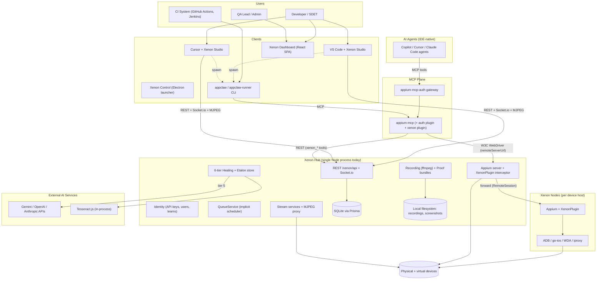
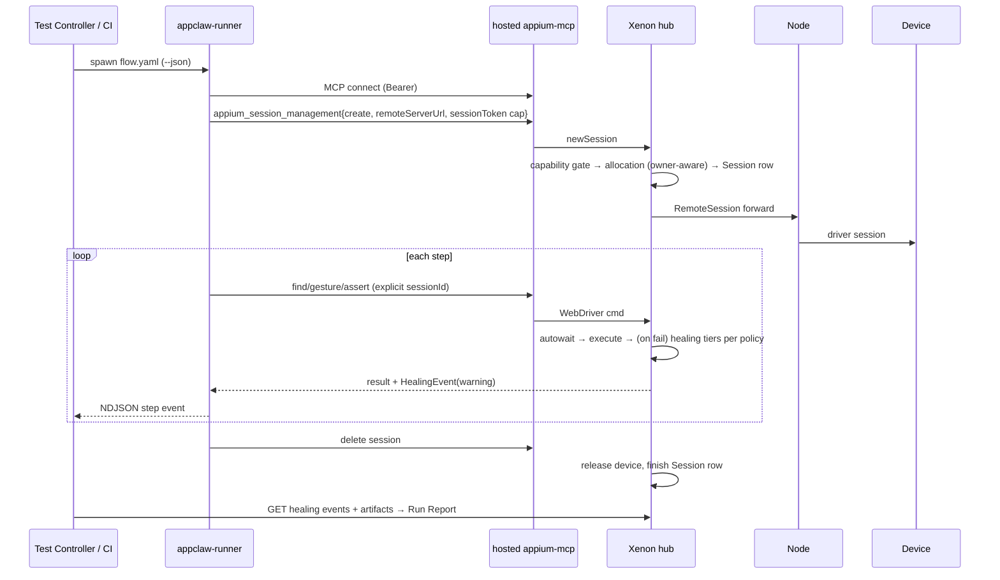
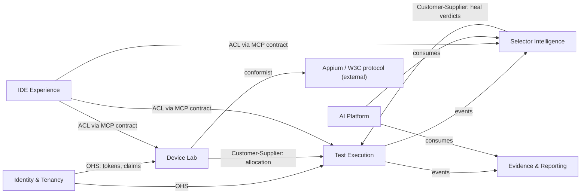

# Xenon Platform — Enterprise Architecture Review Board Assessment

**Scope:** Xenon (device-lab plugin), Xenon Studio (IDE extension, spec v5.1), appium-mcp, appium-mcp-auth, AppClaw — evaluated as a candidate 10-year platform for millions of developers and enterprise customers.
**Date:** 2026-07-17 · **Basis:** code-level reverse engineering of all five repositories plus the v5.1 design spec (five review passes deep).

---

## Framing — the one thing this review must say first

The v5.1 spec is an **excellent product architecture and a non-architecture for a platform — by its own admission.** Its R13 declares the extension "Xenon's adoption wedge, not a standalone business"; its R14 re-scoped GA to fit a 1–2 person team. Judged against its stated goal, it is among the better-engineered small-team specs this board has seen: five adversarial review passes, code-verified findings, explicit failure boundaries, lease/reaper contracts, typed error taxonomies.

Judged against a 10-year, millions-of-developers horizon — the question this board was convened to answer — it is a **monolith with a good product attached**. That is not a criticism of the team; it is the correct starting point. The review below therefore does two things: (1) grades honestly against the platform bar, and (2) designs the graduation path so that nothing shipped in the wedge phase *forecloses* the platform phase. The most expensive architectural mistakes are not missing services — they are wedge-phase decisions that make future decomposition impossible. Those are flagged as **Foreclosure Risks** throughout.

---

# PHASE 1 — REVERSE-ENGINEERED ARCHITECTURE

## 1. System Context



**Communication inventory:** W3C WebDriver over HTTP (MCP→Appium, hub→node), MCP protocol (stdio + streamable HTTP), REST + Socket.io (all clients→hub; node registration), MJPEG over HTTP (streams), NDJSON over stdio (extension↔CLI), LLM provider HTTPS (healing tier 5, OmniVision, post-GA analyzer). **No durable messaging exists anywhere** — every event is fire-and-forget Socket.io.

## 2. Component Model

| Component | Responsibility | Depends on | In / Out | API | Owner | Lifetime |
|---|---|---|---|---|---|---|
| Xenon Studio extension | IDE UX: auth, device explorer, panel, test controller, reports, skill/MCP install | Xenon REST/Socket.io, CLI, SecretStorage | user actions / views, spawned runs | VS Code API | xenon-studio repo | per IDE window |
| Skill Manager | canonical skills → per-agent formats | bundled assets | skill defs / workspace files | filesystem | xenon-studio | install-time |
| appium-mcp | MCP tool surface over Appium | Appium drivers, `webdriver` client | MCP calls / driver commands | ~32 MCP tools | upstream (Appium org) | process |
| appium-mcp-auth | authN/Z plugin + Bearer gateway | appium-mcp plugin API, jose | credentials / allow-deny + audit | plugin hooks, `/health` | upstream (@appclaw), de-facto co-owned | process |
| @xenon/appium-mcp-plugin | `xenon_*` tools; sessionId guard | Xenon REST | MCP calls / REST calls | 7 GA + 4 post-GA tools | xenon-studio | process |
| XenonPlugin + CommandInterceptor | intercept every Appium command: autowait → healing → learning → capability gate | TypeDI services | WebDriver cmds / results + events | Appium plugin hooks | xenon | process |
| HealingOrchestrator | 6-tier selector recovery | Etalon store, OCR, OmniVision, LLM | failed find / healed element + HealingEvent | internal | xenon | per-failure |
| Device managers (Android/iOS) | discovery, control, WDA/ADB lifecycle | adb, go-ios, simctl | hardware state / device rows + events | internal + REST | xenon | process |
| Stream services + UniversalMjpegProxy | one-upstream→many-clients MJPEG, backpressure | WDA/ADB pipelines | device frames / MJPEG | `/control/:udid/stream` | xenon | per-device |
| RecordingOrchestrator | per-device + composite ffmpeg, proof bundles | streams, ffmpeg, BusyPrecheck, ConcurrencyGate | start/stop / mp4 + zip | REST | xenon | per-recording |
| Identity (ApiKeyService, UserService, authMiddleware, SocketServer auth) | keys, users, teams, scopes, sessions | Prisma | credentials / `req.auth` | REST + middleware | xenon | process |
| QueueService | FIFO wait for busy devices | DeviceStore | session requests / allocations | internal | xenon | process |
| EventManager | Socket.io broadcast hub | SocketServer | domain changes / ephemeral events | Socket.io topics | xenon | process |
| PrismaStore / DeviceStore | SQLite persistence + in-memory device cache | Prisma, SQLite | all state | internal | xenon | process |
| AppClaw core/runner/CLI | agent loop, YAML flows, vitest runner, reports | appium-mcp (MCP client), AI SDK | flows+goals / NDJSON, reports | SDK + CLI | upstream (ATD) | per-run |

**Hidden components — implied but undocumented (each is a future service in disguise):**

1. **Scheduler** — QueueService is strictly arrival-ordered (`sort` by `createdAt`, verified) with no priority classes, quotas, preemption, or bin-packing. Credit where due: it computes queue position and an ETA from a rolling average of the last 20 session durations — real UX engineering. But arrival order alone cannot serve interactive-vs-CI workloads; the platform's most important future component currently has no notion of *who should go first*.
2. **Artifact store** — recordings, screenshots, proof bundles, HAR exports live on the hub's local filesystem with ad-hoc paths. This is an object-storage service pretending to be a directory. **Foreclosure risk:** every new artifact written with path-assumptions makes S3-migration harder.
3. **Event bus** — EventManager is a pub-sub with no durability, no replay, no schema, no tenancy. Analytics, audit, notifications, and the AI learning loop all need what it isn't.
4. **Knowledge store** — Etalons + selector-health + AppClaw's App Guides are three disconnected fragments of one asset: a **UI-stability knowledge graph**. Nobody owns it; it is the company's most defensible data.
5. **Secret store** — flow secrets resolve from env/`.appclaw/env`; the spec adds a "Xenon-managed secret store" in one clause with no design.
6. **Notification service** — healing digests (`sendHealingDigest`) and webhooks exist as scattered endpoints; enterprises will demand Slack/Teams/email/webhook fan-out with routing rules.
7. **Config/entitlement service** — plan gating is "claims from `/auth/me`"; there is no entitlement model (plans, limits, feature flags per tenant).
8. **Tenant** — `teamId` columns are row-level filters, not a tenancy model. There is no Organization aggregate, no per-tenant quotas, no isolation tiers.

## 3. Runtime Architecture

**IDE startup:** extension activates → host detection → Auth Service loads key from SecretStorage → `POST /auth/token` (JWT) → `GET /auth/me` (entitlements) → MCP registration (provider or `~/.cursor/mcp.json`) → Socket.io connect (header pair) → Device Explorer hydrates → skill drift-check. Failure at any auth step degrades to local-mode-only with explicit UI state.

**Authentication:** key → JWT (12–24 h MCP audience; short REST audience) → Bearer → gateway injects `authToken` → auth plugin validates via Xenon JWKS → scopes → per-tool authorization → audit line. REST path re-validates live (instant revocation); MCP path coasts to TTL.

**Device discovery:** device managers poll/subscribe (adb track-devices, go-ios), write DeviceStore + SQLite, broadcast `device_connected` via Socket.io; nodes register over socket pair-auth and stream their inventory to the hub.

**Test execution (lab):**



**Recording:** BusyPrecheck (atomic multi-udid) → ConcurrencyGate → per-device ffmpeg (+ composite for ≥2) → fragmented mp4 to local disk → stop → proof-bundle zip streamed on demand. `recoverOnBoot` marks orphans FAILED.

**AI request (healing, today's only server AI):** find fails → tier 0 etalon → 1 native retry → 2 fuzzy XML → 3 OCR → 4 visual → 5 LLM (page source + prompt to external provider) → coordinate or selector → interceptor resolves → HealingEvent persisted + broadcast. Latency budget: unbounded (gap — see SLOs).

**Report generation:** extension composes runner NDJSON + `GET` healing/logs/recording URLs. There is no server-side report object — reports are a client-side join (gap: CI and web need the same report; it belongs server-side).

**Session termination:** explicit delete, idle reaper (`lastCmdExecutedAt`), lease expiry for locks, `recoverOnBoot` reconciliation, `ON_CLIENT_DISCONNECT=skip` on the MCP side. (v5.1 fixed this domain; it is now among the spec's strongest parts.)

## 4. Deployment Topology

| Mode | What runs where | Status |
|---|---|---|
| **Local developer** | Extension + spawned appium-mcp (stdio, embedded drivers) on laptop; no backend | Designed (GA) |
| **Enterprise self-hosted (GA target)** | Hub (Appium+API+SQLite) on a Mac host; nodes per device host; hosted MCP+gateway container beside hub; TLS at a reverse proxy; everything in one lab subnet | Designed, single-instance only |
| **SaaS** | **Not designed.** Requires: multi-tenant control plane, per-tenant or pooled device planes, regional cells, billing/metering, tenant-isolated artifact storage, DDoS/edge. This is the Phase-3+ platform build | Missing |
| **Air-gapped** | VSIX from GitHub Releases + private registry for pinned appium-mcp + offline skills: designed for the client. Hub side needs an offline LLM story for tier-5 healing (local model or tier-capped healing) — undesigned | Partial |
| **HA** | **Not designed.** Hub is a stateful singleton (SQLite + in-memory DeviceStore + ffmpeg children). HA requires: Postgres, externalized artifact store, hub as stateless API layer + elected device-coordinator, or per-cell single-writer with fast restart (acceptable interim: restart-based HA with recoverOnBoot, RTO < 60 s) | Missing |
| **Multi-region** | Devices are physical → labs are inherently regional. Correct shape: **cell-based** — each region/lab is a cell (hub+nodes+MCP+artifacts); a thin global control plane owns identity, entitlements, knowledge graph, and cross-cell analytics. Streams never cross regions; metadata does | Missing (natural fit, undesigned) |

---

# PHASE 2 — ARCHITECTURE REVIEW

## 5. Domain Architecture (DDD)

**Domain classification:**

| Type | Domain | Why |
|---|---|---|
| **Core** | Selector Intelligence (healing, etalons, selector health, app guides) | The defensible asset. Nobody else has cross-run, cross-device UI-stability data with human acceptance labels |
| **Core** | Device Lab Orchestration (discovery, claims, allocation, streaming) | The physical moat; hard to replicate, high switching cost |
| **Core** | Test Execution & Evidence (runs, artifacts, proof bundles) | The workflow that monetizes the other two |
| Supporting | Identity & Tenancy; Recording/Streaming pipelines; Analytics; IDE experience | Necessary, not differentiating |
| Generic | Notifications, storage, billing/metering, docs | Buy or copy patterns |

**Bounded contexts + context map:**



The MCP tool contract is correctly an **anti-corruption layer** between agents and the domain — v5.1's three-layer rule ("skills → tools → REST") got this right. Xenon conforms to the W3C protocol (unavoidable, and fine).

**Aggregates / entities / VOs (target model):**

| Aggregate | Entities | Value objects | Key invariant |
|---|---|---|---|
| **Device** | Device, **DeviceClaim** (lock \| session \| reservation as one polymorphic claim) | Udid, Capability set, HealthScore | one active claim per device; claims carry owner + lease |
| **TestRun** | Run, Step, HealingOccurrence | RunPolicy (healing tiers, budgets), StepResult | run state machine; steps append-only |
| **HealingCase** | Case, TierAttempt, Verdict | Selector, Etalon signature, Confidence | accepted verdict must update source or etalon, never both silently |
| **Recording** | RecordingGroup, DeviceTrack | ArtifactRef (content-addressed) | group is atomic (BusyPrecheck already enforces) |
| **Project** *(missing)* | Project, FlowRef, Environment | SecretRef, Config | tenancy + quota boundary; everything belongs to a project |
| **Tenant** *(missing)* | Organization, Team, Membership, Entitlement | Plan, Quota | isolation boundary |

**Domain events (catalog seed):** `DeviceDiscovered/Claimed/Released/Quarantined`, `RunQueued/Started/StepCompleted/Completed/Cancelled`, `HealingAttempted/Suggested/Accepted/Rejected`, `RecordingStarted/Finished`, `ArtifactStored`, `TokenIssued/Revoked`, `ProjectCreated`, `QuotaExceeded`.

**Overloaded concepts (the smell list):**
- **"Session"** — five meanings; v5.1's glossary treats the symptom. The disease is that *DeviceClaim doesn't exist*: manual locks live in a `session_id` string field, which caused the verified allocation deadlock. The domain fix is the claim aggregate, not string parsing (`inspectManualLock` is an ACL over a mis-modeled field).
- **"Healing"** conflates *recovery* (runtime), *suggestion* (authoring), and *learning* (knowledge write-back). §2.7 separates policy; the domain model should separate the concepts.
- **"busy"** — a boolean encoding what is really claim-type + health-state.
- **Missing concepts:** Project/Workspace (the platform has no container between team and device — GitHub has repos, k8s has namespaces; Xenon has nothing to attach flows, runs, secrets, and quotas to), Reservation-as-calendar, Environment (dev/staging app builds), Suite.

## 6. Platform Architecture — decomposition

**Verdict: correctly a monolith today; must decompose along the seams above, in this order, triggered by scale — not by fashion.** The internal TypeDI service decomposition is genuinely good news: the seams already exist in code. The k8s lesson applies: separate **control plane** (API, identity, scheduler, catalog, knowledge) from **data plane** (device hosts running sessions, streams, recordings) — Xenon's hub-node topology is the embryo of exactly this.

Target service map (with extraction triggers):

| Service | Extract when | Notes |
|---|---|---|
| Identity & Entitlement | first SaaS tenant / SSO demand | keys, OIDC federation, plans, quotas; today's `authMiddleware` + token service is the seed |
| Device Lab (data plane agents + lab coordinator) | >1 hub instance needed | node agent already exists; promote to first-class with local autonomy (survive control-plane outage) |
| Scheduler | queue wait times visible / priorities needed | see §7; extract early — it's small and high-leverage |
| Execution / Run service | CI volume arrives | owns Run aggregate + report object (server-side reports) |
| Evidence/Artifact service | first S3 need (≈100 users) | content-addressed store, lifecycle, signed URLs |
| Selector Intelligence / Knowledge | immediately as a *module boundary*, service later | the moat; must accrete data from day one behind one API |
| AI Platform | post-GA orchestrator (already separate process per v5.1) | §10 |
| Event backbone | with first analytics/audit consumer | outbox now, broker later (§8) |
| Notification | enterprise pilots | webhooks exist; add routing + channels |
| Marketplace / Plugin framework | ecosystem phase | §14 |
| Workflow engine | **deliberately deferred** — the execution DAG (§7) covers test workflows through Phase 3; a general engine earns existence in Phase 4+ only if customers chain non-test steps (build → deploy → test → notify). Until then it's a feature of the Run service, not a service | decision, not omission |

**Coupling review:** worst coupling today is *everything-through-one-process + one-SQLite* (shared DB = shared fate); second-worst is artifacts-as-local-paths; third is Socket.io-as-only-events. None is hard to fix now; all are catastrophic to fix at 10k users. **Foreclosure guards for the wedge phase:** repository interfaces already exist (PrismaStore) — keep them clean of SQLite-isms (spec has this); introduce an `ArtifactStore` interface *now* even if backed by filesystem; introduce an outbox table *now* even if the only consumer is Socket.io.

## 7. Execution Architecture

```
Request → Admission → Plan → Queue → Schedule → Allocate → Execute → Evidence → Analyze → Report → Notify
```

- **Admission:** authenticate, resolve project, check entitlements/quotas (tenant + per-user), assign **idempotency key** (client-supplied `runKey`; duplicate submission returns the existing run — CI retries must not double-run).
- **Plan:** flow → DAG of device-bound jobs (suite → parallel jobs; `parallel: N` → N jobs). Static for deterministic flows; AI planner only post-GA.
- **Queue:** durable (DB-backed) per-pool queues with **priority classes**: `interactive` (IDE authoring — preempts nothing but jumps queues) > `ci` > `batch/soak`. Today's FIFO QueueService is replaced, not extended.
- **Schedule:** two-level. Global: tenant fair-share + quota (weighted DRF is sufficient). Pool-level: capability match (platform/os/tags) → scoring: device health, **etalon locality** (device that ran this app before heals faster — a genuinely novel scheduling signal this platform uniquely has), utilization spread.
- **Allocate:** atomic claim (owner-aware, lease-backed — v5.1 §2.4 is the right foundation; add CAS on claim, not row lock).
- **Execute:** node agent runs the session; step results streamed as events; **retries at step level only** (bounded, healing-budgeted); run-level retry is a *new run* linked by `retryOf` (idempotent, auditable). Cancellation = first-class state, propagated as claim revocation + driver delete; always safe because steps are at-least-once with recorded outcomes.
- **Evidence:** every artifact content-addressed, event-announced (`ArtifactStored`), collected asynchronously — a run can complete before its video finishes uploading (report links resolve lazily).
- **Analyze:** healing summary + failure classification (rule-based at GA; AI post-GA) emitted as events.
- **Report:** server-side Run Report object (composed from events — same object serves IDE, web, CI, API).
- **Notify:** subscription rules (project/severity/channel) on the event bus.
- **Failure recovery:** every stage resumable from the event log + state machines (§9); scheduler is stateless over durable queues; executor crash → lease expiry → job requeued with `attempt+1`.
- **Distributed/parallel:** jobs are independent by construction (device-bound); composite artifacts (multi-device recordings) are join nodes in the DAG.

## 8. Event Architecture

Today: ephemeral Socket.io broadcast. Target: **durable event backbone with a graduation path.**

- **Now (wedge):** transactional **outbox table** in the same DB write as the state change; a dispatcher fans out to Socket.io (existing consumers unchanged) and appends to an event log table. Cost: days. Buys: replay, audit, analytics, and the AI learning loop — without a broker.
- **Later (≥1k users):** NATS JetStream (fits: lightweight, per-subject retention, works in single-lab installs) or Kafka at SaaS scale. Same envelope, same topics.
- **Envelope:** `{eventId (UUIDv7 — time-ordered, so the event log is range-scannable by time without a secondary index; Node's native `randomUUID` is v4, so this needs a small dep), type, schemaVersion, tenantId, projectId, correlationId (runId/sessionId), causationId, occurredAt, actor, payload}`. At-least-once delivery; consumers dedupe on eventId.
- **Topics:** `device.*`, `run.*`, `healing.*`, `recording.*`, `artifact.*`, `identity.*`, `ai.*`, `tenant.*` — tenant-scoped subjects (`tenant.<id>.run.completed`) so isolation is structural.
- **Catalog (normative, versioned in-repo):** the §5 event list, each with owner, schema, producers, consumers. Example rows:

| Event | Producer | Consumers |
|---|---|---|
| `DeviceQuarantined` | lab coordinator | scheduler (exclude), notifier, dashboard |
| `RunCompleted` | run service | report builder, analytics, notifier, AI evaluator |
| `HealingAccepted` | IDE via API | **knowledge store (label!)**, analytics, KPI-3 |
| `ArtifactStored` | evidence service | report builder, retention manager |
| `AIRequestCompleted` | AI platform | cost metering, evaluator, audit |

**Rule:** subsystems integrate through events + owned APIs only; no cross-service DB reads. The dashboard becomes an event consumer like everything else.

## 9. State Machine Architecture

| Machine | States (happy path bold) | Key rules |
|---|---|---|
| **Device** | offline → discovered → preparing → **ready** → claimed → in-session → cleanup → ready; any → **quarantined** → (manual/auto-probation) → ready; any → retired | quarantine is the missing state today: N consecutive failures or health-probe fail ⇒ auto-quarantine + event; scheduler never sees quarantined devices. cleanup (uninstall app, clear data, reset settings) is mandatory between tenants — today it doesn't exist as a state, which is a **tenant-isolation hole on shared devices** |
| **Test Run** | queued → scheduled → allocating → **running** → collecting → **completed(pass/pass-with-warnings/fail)**; queued/running → cancelled; running → aborted(infra) → requeued(attempt<max) | pass-with-warnings is a first-class outcome (healing policy §2.7); infra-abort ≠ test-fail — never conflate |
| **Recording** | requested → precheck → **recording** → finalizing → **stored**; recording → failed(server_restart) | exists today largely correct; add `finalizing` (ffmpeg flush ≠ stored) |
| **Evidence/Artifact** | announced → uploading → **stored** → archived → purged | content hash assigned at announce; report links valid from `stored` |
| **HealingCase** | detected → attempting(tier n) → **healed(runtime)** → suggested → accepted \| rejected; accepted → **learned** (etalon/flow updated); attempting → exhausted → failed | `rejected` must also write back (negative label) — that datum is as valuable as acceptance |
| **Project** | created → **active** → archived → purged(retention) | archival freezes quotas, retains evidence per policy |
| **Session (Appium)** | requested → allocated → **running** → finishing → finished; running → expired(idle reaper) → finished(reason) | v5.1 lifecycle + lease; add `finishing` (cleanup hooks) |
| **AI Task** | submitted → context-building → **executing** → verifying → **completed**; executing → budget-exceeded \| cancelled; verifying → rejected → (retry ≤ budget) | every AI task carries token/cost budget + verifier gate — no unverified AI output enters domain state |

Invalid-transition handling: state machines are enforced in the aggregate (reject + event), not in callers; recovery paths are the §2.5 restart matrix generalized: every machine has a reconciler that walks non-terminal states on boot (the `recoverOnBoot` pattern, made universal).

## 10. AI Architecture — from selector-fixer to test engineer

Today's AI: healing tiers 3–5, OmniVision, IDE-native agents (external), post-GA analyzer. Adequate for GA; not a platform. The board's key observation: **v5.1 accidentally designed a data flywheel and doesn't know it.** KPI-3 ("accept healed selector") produces *human-labeled selector-repair data*; HealingEvents produce failure traces; etalons produce UI-stability time series; AppClaw's App Guides produce navigational priors. Deliberately assembled, this is a proprietary training/eval corpus no competitor has. That is the 10-year moat — the AI architecture must be designed around **collecting, owning, and compounding it.**

Target subsystem (post-GA, phased):

```
            ┌────────────── AI Platform (separate service, Node ≥22) ──────────────┐
Request →   │ Planner → Context Builder → Tool Router → Execution → Verifier → Out │
            │              ↑                    ↑            ↓          ↓          │
            │        Knowledge Retrieval   Prompt Mgr    Trace log   Evaluator     │
            │              ↑                                            ↓          │
            │      Knowledge Store (etalons, app graphs, guides)  Learning Loop    │
            └──────────────────────────────────────────────────────────────────────┘
```

- **Planner:** goal → step DAG; deterministic flows bypass it entirely (v5.1's D4 discipline stays).
- **Context Builder:** the cost center — assembles trimmed UI state (AppClaw's dom-trimmer lineage), screenshot at policy resolution, relevant etalons, app guide, last-N step outcomes. Owns **context compression**: rolling summarization of step history; UI trees as diffs, not snapshots.
- **Knowledge Retrieval:** app-scoped RAG over the knowledge store — *"how does login usually work in this app; which selectors survived the last 10 versions."*
- **Prompt Manager:** versioned, evaluated prompts (prompts are artifacts with CI, not string literals — the healing tier-5 prompt today is a literal).
- **Tool Router:** MCP is the universal tool bus — server agents consume the *same* tool contract as IDE agents. One contract, two planes.
- **Verifier:** the visual-assertion invariant promoted from skill prose to a service: claimed outcomes are checked against screenshots before entering domain state. No unverified AI write-back, ever.
- **Evaluator + Learning Loop:** every heal/analysis scored against later human action (accept/reject/revert). Nightly evals over a frozen task suite gate prompt/model changes. Acceptance data periodically distills into: better tier-2 fuzzy weights, fine-tuned heal rankers, app-specific selector priors.
- **Memory:** episodic (per-project trajectories — AppClaw has the seed), semantic (knowledge store), working (conversation/context — IDE-side today, mirrored server-side for orchestrated runs).
- **Agent coordination:** IDE agent (interactive, human-paced) and server agents (batch) share state via the Run/Evidence aggregates and events — never direct agent-to-agent chatter; the domain is the blackboard.

**Five-year evolution:** Y1 heal+analyze (assist) → Y2 authoring copilot grounded in knowledge store (suggest flows from app graph + PRDs) → Y3 autonomous maintenance (app update ⇒ agents re-run suites, propose selector/flow patches as PRs) → Y4 fleet intelligence (cross-tenant anonymized stability models: "this component pattern breaks 40% of tests on Android 17") → Y5 self-maintaining test estates (humans review PRs, agents own the treadmill). Each step is gated by the Verifier/Evaluator discipline established in Y1 — skip it and Y3+ is liability, not product.

## 11. Extension / Client Architecture

**Rule for the client/server split:** *if a second client would need it, it is server-side.* Grading v5.1 against that rule:

| Capability | Today (v5.1) | Verdict |
|---|---|---|
| Report composition | client-side join in extension | **Move server-side** (Run Report object) — CI, web, JetBrains all need it |
| Test discovery/run mapping | extension Test Controller | keep client-thin; run *submission* becomes API (`POST /runs`) so CLI/CI share it |
| Device explorer/panel | client over REST/Socket.io/MJPEG | correct |
| Skill install | client | correct (workspace is client territory) |
| MCP registration | client | correct (IDE-specific by nature) |
| Auth/token dance | client | correct; JetBrains repeats it via a shared spec, not shared code |
| Flow language features | client (YAML schema, CodeLens) | correct; schema served from the hub (`/capabilities`) so language features version with the lab |

**Client portfolio:** VS Code + Cursor (one codebase — now), **CLI (`xenon run`) — missing and urgent**: the moment a flow is authored, CI needs to run it; today that's "spawn appclaw-runner with env" folklore. A thin CLI over `POST /runs` + event stream is the highest-leverage missing client and the natural third consumer that keeps the server honest. (This board elevates it to a GA condition — §19, roadmap Phase 1.) JetBrains (Y2 — after the API is proven thin), Web (already exists as dashboard; grows report/analytics surface), Desktop (Xenon Control stays a launcher; resist feature creep).

## 12. Device Lab Architecture

Current strengths: real discovery, MJPEG fan-out with backpressure, atomic group precheck, manual-lock semantics, hub-node forwarding. Enterprise gaps and target design:

- **Pools:** named device pools (by team/project/capability) with quotas and overflow rules; scheduler targets pools, not raw devices.
- **Reservation:** calendar reservations (the `reservedBy` field exists; the aggregate doesn't) — book a device fleet for release-week regression; reservations are claims with future leases.
- **Health:** continuous scoring (session success rate, WDA start latency, battery/temp via adb/ios) → auto-**quarantine** + probation probes (§9). Today an unhealthy device just fails allocations repeatedly.
- **Cleanup-between-tenants:** mandatory `cleanup` state (uninstall, clear accounts, reset proxies) — without it, shared pools leak tenant data device-to-device. **This is the largest unaddressed enterprise gap in the lab domain.**
- **Elasticity:** real devices are static; emulators/simulators are elastic — an **emulator autoscaler** (k8s-hosted Android emulators, Mac-mini pools for iOS sims) absorbs CI bursts so real devices serve interactive + final verification. This changes the economics of the lab and is the standard industry pattern (Firebase Test Lab, Device Farm).
- **Connectivity:** wireless ADB + USB-hub topology maps (which hub port = which device — operational gold during incidents); go-ios tunnel supervision with automatic re-establishment (exists, harden).
- **Remote execution:** node agents get *local autonomy*: an in-flight session survives hub restart (node completes + reconciles) — today the node is a thin forward target; promoting it is the data-plane maturation.

## 13. Security Architecture

v5.1's security story is genuinely strong for its scope (JWT+JWKS, capability gate, stream tickets, least-scope, prompt-injection model, audit). Enterprise-grade additions:

- **Tenancy isolation tiers:** row-level (today) → schema-per-tenant (Postgres) → dedicated-cell (regulated customers). Isolation must also be *physical* where it matters: device pools pinned per tenant; the cleanup state machine; per-tenant artifact buckets/prefixes with per-tenant KMS keys.
- **AuthZ evolution:** scopes (RBAC) now → **ABAC** for lab reality: policies over attributes (device.pool, device.platform, project, time-window, claim.owner) — "team A may claim pool=android-eu weekdays 8–20". A small policy engine (Cedar/OPA) behind the existing `scopeGuard` seam.
- **Zero trust:** every hop authenticated (v5.1 closed the Appium-port hole; keep going: node↔hub mTLS, artifact URLs signed, no ambient trust inside the lab subnet — subnets get breached).
- **Secrets:** a real secret service (Vault/KMS-backed) behind the "Xenon-managed secret store" clause: app-scoped, audited reads, rotation, never in flow files (lint exists) or logs (redaction exists).
- **Compliance program:** SOC 2 Type II is table stakes for enterprise sales — audit-log completeness (the event log doubles as evidence), retention policies, access reviews, data residency (cells make this tractable), DPA-ready data inventory (screenshots/recordings can contain PII from test data — classify and retain accordingly; **nobody has thought about PII in screen recordings yet**).
- **Supply chain:** signed VSIX (marketplace) + signed server images + SBOM + provenance (spec has npm provenance; extend to containers); plugin marketplace (Phase 4+) requires plugin signing + permission manifests from day one.

## 14. Data Architecture

| Concern | Now | Target |
|---|---|---|
| OLTP | SQLite (single-writer) | Postgres at ≥100 users; Prisma keeps migration mechanical *if* the no-SQLite-isms rule holds (spec has it) |
| Artifacts | hub filesystem | S3-compatible object store behind `ArtifactStore` interface (introduce interface **now**); content-addressed; signed URLs; lifecycle: hot 30 d → cold 12 mo → purge (per-tenant policy); recordings dominate cost — tiering is the cost model |
| Events | none | outbox + log table → NATS/Kafka; log is the audit + analytics + AI-training source of truth |
| Analytics | queries on OLTP | event-fed OLAP (DuckDB/ClickHouse) at ≥1k users; dashboards never touch OLTP |
| Knowledge store | etalons in SQLite rows | versioned per app-version graph store (start relational; graph semantics matter more than graph DB); this data is **never** purged — it appreciates |
| Caching | in-memory DeviceStore | fine per-cell; Redis only when auth-plugin replicas demand it (spec already gates this) |
| Backups/DR | none stated | per-cell: continuous WAL archiving (Postgres), artifact-store versioning; RPO 5 min / RTO 1 h per cell; knowledge store replicated cross-cell (it's the crown jewel) |
| Versioning | Prisma migrations | plus event-schema registry + API versioning policy (missing, see §17) |

## 15. Observability

- **Golden signals + SLOs (per cell):** session-create p95 < 8 s; allocation wait p95 < 30 s (interactive class); stream start p95 < 4 s; healing added-latency budget: tiers 0–2 < 500 ms, tier 5 < 15 s (and *counted*, because healing latency is invisible test-time inflation); MCP tool round-trip p95 < 1.5 s (excl. device time); event-delivery lag p99 < 5 s.
- **Error budgets** gate release cadence per service once decomposed; until then, per-domain budgets inside the monolith (they also generate the decomposition evidence: which domain burns budget → extract it first).
- **Tracing:** OTel end-to-end (IDE action → MCP → hub → node → device → healing tier) — spec has the spine; add span links from `RunId`/`correlationId` so a CI failure resolves to a trace in one click.
- **Logging:** structured, tenant-tagged, redacted (exists); ship per-cell, aggregate centrally.
- **Audit:** the event log *is* the audit log (append-only, tenant-scoped, exportable) — one system, not two.
- **Health:** deep health per component (device manager can enumerate adb? WDA reachable? ffmpeg spawnable? JWKS fresh?) surfaced as the lab-health state the extension already plans to show.
- **Dashboards:** ops (RED/USE per service), product (KPIs 1–4), tenant-facing (utilization, healing trends — this one is *sellable*).

## 16. Scalability Review

| Scale | What breaks | What must change |
|---|---|---|
| **10 users** | nothing — current architecture is *correct* here | ship the wedge; install foreclosure guards (outbox, ArtifactStore interface, no SQLite-isms, claim aggregate) |
| **100 users** | SQLite write contention (audit+events+locks); hub filesystem fills; single hosted-MCP event loop saturates on screenshot fan-out | Postgres; object store; MCP per-team replicas (spec's cap from the P2 load test); outbox → broker optional |
| **1,000 users** | FIFO queue starves interactive users behind CI; dashboards on OLTP; Socket.io fan-out limits; ops toil | real Scheduler (priority classes, quotas); OLAP split; event broker; extract Identity + Evidence services; emulator autoscaler absorbs CI |
| **10,000 users** | single hub per lab = control-plane bottleneck; report/analytics volume; org-level tenancy demands | control/data-plane split completes (lab coordinator + autonomous node agents); Run service; cell-per-lab formalized; schema-per-tenant; SSO/SCIM |
| **100,000 users** | anything global and shared: identity, knowledge store, scheduling fairness across cells; blast-radius | **cell-based architecture** (the AWS lesson): regional cells own everything stateful except identity/entitlements/knowledge, which live in a thin global control plane with regional read replicas; cross-cell knowledge federation (anonymized) is where the moat compounds |

The physical nature of devices makes this platform *naturally cellular* — labs are already regional and stateful. That is an architectural gift: Xenon never needs a single global data plane, only a global brain.

### 16.1 Product evolution — what should Xenon become?

Answering the identity question directly, one candidate at a time:

| Candidate identity | Verdict | Why |
|---|---|---|
| **Device platform** | **Yes — first** (Y1–2) | The wedge and the physical moat; everything else attaches to it |
| **AI platform** | **Yes — second** (Y2–4) | The knowledge flywheel (§10) is the appreciating asset; devices generate the data, AI compounds it |
| **Developer ecosystem** | **Yes — third** (Y4+) | Plugin SDK + marketplace + shared flows; defensibility once the first two exist |
| Marketplace | Feature, not identity | A distribution surface of the ecosystem phase — never the center of gravity |
| Workflow engine | Feature, not identity | The execution DAG serves test workflows; generalize only on demonstrated demand (§6) |
| Cloud platform | **No** | Competing on generic compute/storage is a losing war against hyperscalers; Xenon *consumes* cloud primitives |
| Operating system | **No** | There is no coherent sense in which a device lab becomes an OS; the ambition would dilute the moat |

The natural evolution, in one sentence: **devices → intelligence → ecosystem** — the same arc as GitHub (repos → Actions/Copilot → marketplace), with the knowledge graph playing the role Copilot's training corpus played for GitHub. Each identity funds the next: the lab sells today, the intelligence retains tomorrow, the ecosystem defends in year five.

## 17. Missing Architecture (documents that must exist)

| # | Document | Why it matters | Priority |
|---|---|---|---|
| 1 | Domain model & context map (formalize §5) | shared language; prevents the next "session" | P0 |
| 2 | Event catalog + schema registry | integration seam for everything | P0 |
| 3 | API guidelines & versioning policy (REST + MCP + events) | third client (CLI) forces it | P0 |
| 4 | Artifact/storage strategy | foreclosure guard | P0 |
| 5 | Multi-tenancy & isolation tiers | first enterprise conversation asks | P1 |
| 6 | Scheduler design | replaces QueueService | P1 |
| 7 | CLI / CI integration spec | adoption blocker if missing | P1 |
| 8 | Server-side Run Report spec | one report, all clients | P1 |
| 9 | Device cleanup & tenant-hygiene spec | isolation hole | P1 |
| 10 | Knowledge-store / data-flywheel design | the moat, currently accidental | P1 |
| 11 | SLOs & error budgets | ops discipline | P1 |
| 12 | Disaster recovery & backup runbook | first paying tenant asks | P1 |
| 13 | Capacity & cost model (devices, storage, LLM spend per run) | pricing depends on it | P2 |
| 14 | AI platform design (verifier/evaluator/learning loop) | pre-req for Y2+ AI | P2 |
| 15 | Security compliance roadmap (SOC 2, pen-test cadence, PII-in-recordings) | enterprise sales gate | P2 |
| 16 | Deployment/HA reference architectures (incl. air-gapped LLM story) | field engineering | P2 |
| 17 | Plugin/extension SDK + marketplace governance | ecosystem phase | P3 |
| 18 | Migration strategy (SQLite→PG, FS→S3, Socket.io→broker) | each is a live-system migration | P2 |
| 19 | Release & deprecation architecture (channels, feature flags, contract sunsets) | weekly-vs-quarterly skew, formalized | P2 |
| 20 | Performance model (authoring-loop latency/token budgets → per-scale projections) | extends §4.4 to the platform | P3 |

## 18. Architecture Scorecard

Scored twice — the honest way: **[W]** as the scoped GA wedge; **[P]** as a 10-year enterprise platform.

| Dimension | W | P | Justification |
|---|---|---|---|
| Domain design | 8 | 6 | five "sessions" found & glossaried; claim aggregate + Project/Tenant still missing |
| Platform design | 7 | 3.5 | right-sized monolith with good seams; no control/data split, no tenancy, no cells |
| DDD rigor | 7 | 5 | contexts implicit but real; ACL via MCP is textbook; aggregates not formalized |
| Extensibility | 8 | 6 | plugin-not-fork discipline exemplary; no server-side plugin framework or SDK |
| Scalability | 6 | 3 | honest caps + load-test gates for GA; nothing designed past ~1k users |
| Reliability | 7 | 4 | restart matrix + leases + reapers are strong; HA/DR/multi-region absent |
| Maintainability | 8 | 6 | five review passes, typed errors, contract tests; upstream treadmill (R14) is the drag |
| Security | 8 | 5.5 | for scope: excellent (gate, tickets, injection model); missing ABAC, compliance program, tenant hygiene on devices, PII-in-recordings |
| AI readiness | 7 | 7 | healing + acceptance labels = latent flywheel; verifier/evaluator discipline not yet built — but the *data position* is rare |
| Developer experience | 8.5 | 7 | IDE-native agents + skills + doctor + author-local/execute-lab is genuinely best-in-class thinking; CLI/CI gap holds it back |
| Operational excellence | 6 | 3.5 | recoverOnBoot pattern + SLO seeds; no on-call model, DR, capacity/cost model |
| Enterprise readiness | 6 | 3.5 | auth/audit strong; no SaaS, SSO deferred, no compliance, no tenancy tiers |
| Innovation | 9 | 9 | etalon-locality scheduling, healing-as-labeled-data, cell-natural device labs — real novelty |
| **Overall (unweighted mean)** | **7.3** | **5.3** | superb wedge; platform runway must be *installed*, not assumed |

*Scoring note: overall is the unweighted mean of the 13 dimensions. A platform-weighted view (doubling Scalability, Operational Excellence, and Enterprise Readiness — the dimensions that dominate a multi-year platform bet) yields **≈4.9 [P]**: the deficits are concentrated in exactly the load-bearing dimensions, which is why the verdict is conditional rather than the mean suggesting "slightly above average."*

## 19. Final Verdict — Architecture Review Board

**Would this board approve it?** **Conditionally approved** — as the Phase-1 wedge of a platform program, with five mandated foreclosure guards installed during GA (they cost days, not weeks): (1) transactional outbox + event log; (2) `ArtifactStore` interface; (3) DeviceClaim aggregate replacing lock-in-session_id; (4) Project entity (even if 1:1 with team initially); (5) API versioning policy before the CLI ships. **Not approved** as-is for direct SaaS/enterprise scale-out — nobody should read the GA architecture as the destination.

**Would Microsoft approve it?** As a VS Code ecosystem product: yes — the extension architecture (thin client, MCP-native, skills-as-content) is idiomatic. As Azure-style platform: they would demand the control/data-plane split and tenancy tiers first.
**Google?** They would applaud the cell-natural analysis and reject the single-writer SQLite hub in the same breath; approval contingent on §16's ladder being funded.
**GitHub?** Yes to the wedge motion (it's the Actions playbook: own the workflow, then the compute); they would insist the CLI/CI story ship *at* GA, not after — this board agrees and elevates that to a condition.
**JetBrains?** Would approve the client split only after the server-side Run Report lands (they will not rebuild a client-side join).
**Docker?** Would recognize the wedge→platform motion as their own history — and warn, from that same history, that the moat must be the knowledge graph, not the format, because formats commoditize.
**AWS?** Would approve the device data plane direction, mandate cells + per-tenant isolation, and ask for the cost model before any SaaS commitment.

**Would we invest five years of engineering?** **Yes — on one thesis.** The device lab is a moat with a rental ceiling; the *UI-stability knowledge flywheel* (healing events + human acceptance labels + etalon time series + app graphs, compounding across tenants) is the asset that appreciates. Invest five years if and only if the knowledge store is promoted from accidental by-product to first-class platform (roadmap Phase 3); otherwise this becomes a well-built regional device-farm business competing on price.

### Top 20 strengths
1. MCP-native from day one — bets on the winning agent-integration standard early
2. Plugin-not-fork discipline across all upstream deps
3. Three-layer contract (skills→tools→REST) — a textbook ACL
4. Cross-tenant session leak found and closed *pre-implementation*
5. Lease/reaper resource contract (§2.4) — distributed-systems hygiene rare in specs
6. Restart matrix + typed error taxonomy for agents
7. Healing policy that names and defuses the false-pass inversion
8. Perception/token budget — AI economics treated as architecture
9. Author-local / execute-lab positioning — correct physics
10. IDE-native agents (no bundled LLM) — zero key custody, rides IDE improvements
11. Hub-node topology = embryonic control/data-plane split
12. UniversalMjpegProxy backpressure design — real streaming engineering
13. recoverOnBoot reconciliation pattern, generalizable to every aggregate
14. Identity foundation (scoped keys, teams, audit) ahead of its scale
15. Etalon store = latent knowledge graph with time-series depth
16. Healing acceptance (KPI-3) = human-labeled data flywheel, already scheduled
17. Capability gate closes the Appium-port hole most device farms ignore
18. Honest scope cuts (R13/R14) — strategic self-awareness in the document itself
19. Five recorded review passes incl. a retraction — engineering culture as artifact
20. Cell-natural physical domain — global scale without a global data plane

### Top 20 risks
1. Single-writer SQLite under multi-tenant write load
2. Artifacts on hub filesystem — silent foreclosure of SaaS/HA
3. No durable events — analytics/audit/AI all blocked on Socket.io ephemera
4. QueueService FIFO — interactive users starved by CI at ~1k users
5. Hosted MCP single event loop — screenshot fan-out ceiling (cap unmeasured until P2)
6. No device cleanup state — tenant data leaks device-to-device on shared pools
7. No HA/DR — hub is a stateful singleton with no RTO commitment
8. Upstream treadmill (appium-mcp weekly, auth lib days-old) vs 1–2 maintainers
9. Cursor API instability — no contract, no test harness
10. Copilot skill fidelity — always-on context inversion may cause uninstalls
11. Healing false-pass residue even with policy (thresholds need tuning data)
12. PII in screen recordings — unclassified, unretained-by-policy, undiscussed
13. No CLI/CI at GA — adoption stalls at "works in my IDE"
14. Knowledge store unowned — the moat accretes by accident or not at all
15. iOS WDA coexistence spike could invalidate the device-panel promise
16. Node runtime matrix (host Node 20 vs required ≥22) — first-run friction
17. Free tier ≈ upstream OSS — no moat if lab adoption stalls (R13, accepted)
18. Marketplace/trademark (D1) unresolved — rename risk post-publish
19. Second-engineer dependency for P2 — staffing as single point of failure
20. LLM dependency in air-gapped labs — tier-5 healing has no offline story

### Top 20 missing capabilities
1. CLI / CI runner (`xenon run`) · 2. Server-side Run Report · 3. Project/Workspace aggregate · 4. Organization tenancy + quotas/entitlements · 5. Durable event backbone · 6. Object/artifact store · 7. Real scheduler (priority, fair-share, preemption) · 8. Device pools + calendar reservations · 9. Device health scoring + quarantine · 10. Device cleanup state machine · 11. Emulator/simulator autoscaling · 12. Secret management service · 13. Notification routing (Slack/Teams/webhooks) · 14. SSO/OIDC + SCIM · 15. ABAC policy engine · 16. Knowledge store as a service · 17. AI verifier/evaluator + learning loop · 18. OLAP analytics separation · 19. HA/DR + backup architecture · 20. Plugin SDK + marketplace governance

### Top 20 architectural improvements (sequenced)
1. Outbox + event log (days; unlocks 5+ subsystems) · 2. `ArtifactStore` interface · 3. DeviceClaim aggregate · 4. Project entity · 5. API versioning policy · 6. Ship the CLI at GA · 7. Server-side Run Report · 8. Postgres migration · 9. S3 artifact backend · 10. Scheduler v1 (priority classes + quotas) · 11. Device health + quarantine · 12. Cleanup state machine · 13. Event broker (NATS) · 14. Identity service extraction + SSO/SCIM · 15. Knowledge store consolidation (etalons+guides+health behind one API) · 16. AI platform service (verifier/evaluator first) · 17. Node-agent autonomy (data-plane maturation) · 18. OLAP split · 19. Cell reference architecture + HA · 20. Plugin SDK + marketplace

## 20. Architecture Roadmap

**Phase 1 — Foundation (GA + guards; months 0–4).** Ship spec v5.1 P0–P2 *plus the five foreclosure guards* and the CLI. Exit: multi-user lab GA; events flowing to a durable log; artifacts behind an interface; claim aggregate live; KPIs reporting.

**Phase 2 — Enterprise Platform (months 4–12).** Postgres + S3; Scheduler v1; device pools/health/quarantine/cleanup; server-side reports; SSO/SCIM + entitlements; notification routing; SLOs + DR runbook; first HA (restart-based, RTO<60 s); SOC 2 program start. Exit: 1k-user single-cell deployments; first paying enterprise references.

**Phase 3 — AI Platform (months 9–18, overlapping).** Knowledge store consolidated and owned; AI service with verifier/evaluator/learning loop; orchestrator + `xenon_analyze_failure` (the deferred v5.1 P3); authoring copilot grounded in app graphs; healing models trained on acceptance data. Exit: measurable heal-precision lift from learned models; AI features that competitors cannot copy without the data.

**Phase 4 — Developer Ecosystem (months 15–30).** Plugin SDK (server-side extension points: healing strategies, device providers, evidence processors) + signed marketplace; JetBrains client on the proven thin API; public API/webhooks; flow/template sharing; emulator autoscaling as a product ("burst capacity"). Exit: third-party plugins in production; second IDE at feature parity.

**Phase 5 — Industry-Leading Platform (months 24–48+).** Cell-based multi-region SaaS; cross-tenant anonymized stability intelligence (opt-in, contractual); autonomous test-maintenance agents (Y3–Y5 AI arc); compliance portfolio (SOC 2 II, ISO 27001, residency); the "GitHub Actions for devices" motion completed — devices, intelligence, and workflow as one platform. Exit: the platform maintains test estates with humans reviewing PRs; the knowledge graph is the industry's reference dataset for mobile UI stability.

---

*Board disposition: **Conditionally approved** — proceed with Phase 1 including all five foreclosure guards and the CLI condition; return to the board with the Phase-2 tenancy and scheduler designs before enterprise commitments.*
