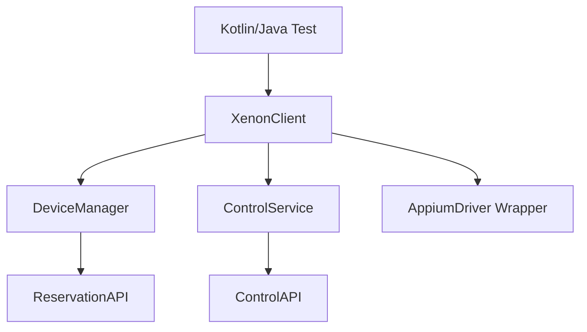

# Xenon Kotlin SDK Specifications

This document defines the comprehensive Product Requirements (PRD), Technical Requirements (TRD), and API documentation for the **Xenon Kotlin SDK**.

---

## 1. Executive Summary & Objective

The **Xenon Kotlin SDK** is a high-level client library designed for JVM-based mobile automation. It simplifies device reservation, session management, and parallel execution on the **Xenon Mobile Automation Platform**.

### Core Objectives
- Provide a "Xenon-first" experience for Kotlin/Java engineers.
- Abstract the complexity of the Xenon REST API.
- Enable resilient parallel testing across distributed device nodes.
- Expose direct device control capabilities (bypass Appium for specific tasks).

---

## 2. Product Requirements Document (PRD)

### 2.1. Functional Requirements

#### Device & Reservation Management
- **Search & Filter**: Find devices by platform (`android`, `ios`), version, and specific capabilities.
- **Smart Allocation**: Automatically reserve the first available matching device via `/api/reservation`.
- **Lease Management**: Support for extending reservations during long tests and mandatory release on completion.

#### Session Lifecycle
- **Automatic Reporting**: Link Appium sessions to Xenon builds automatically.
- **Log Retrieval**: programmatic access to device logs, debug logs, and MJPEG video streams.
- **Profiling**: Fetch performance data (CPU/Memory) tracked during the session.

#### Remote Interaction (Side-Channel)
- **Direct Interaction**: `tap`, `swipe`, `keyevent`, and `text` input via the Xenon Control API.
- **Clipboard Management**: Set and get device-level clipboard content.
- **App Management**: programmatic app installation and uninstallation.

---

## 3. Technical Requirements Document (TRD)

### 3.1. Architecture details
The SDK follows a modular architecture to ensure scalability and maintainability.



### 3.2. Implementation details
- **Transport**: `Ktor-Client` with `OkHttp` engine for connection pooling and HTTP/2 support.
- **Concurrency**: Coroutine-aware for modern Kotlin usage, but providing `ThreadLocal` wrappers for legacy TestNG/JUnit thread-based parallel execution.
- **Resiliency**: Built-in exponential backoff for hub communication and a `ShutdownHook` to prevent stale device reservations.

### 3.3. Key Design Patterns
- **Strategy Pattern**: Customizable allocation strategies (e.g., `LeastUsed`, `PriorityMatch`).
- **Proxy Pattern**: `XenonDriver` enhances standard `AppiumDriver` with Xenon-specific metadata and event tracking.

---

## 4. Data Models (Xenon Schema)

Based on the Xenon backend, the SDK utilizes the following core models:

### `Device`
Core entity for physical/virtual hardware.
- `udid`: Unique ID.
- `host`: Host node URL.
- `state`: Current state (`available`, `busy`, `offline`).
- `busy`: Boolean indicating if currently in use.
- `reservedUntil`: Expiration timestamp of current lease.

### `Session`
Represents an automation execution instance.
- `id`: Appium session ID.
- `status`: `running`, `success`, or `failed`.
- `device_udid`: The hardware used.
- `video_recording`: URL/Path to session recording.

---

## 5. Usage & Integration

### Minimal Setup
```kotlin
val xenon = XenonClient("http://xenon-hub:4723")

// Smart allocation
val device = xenon.allocator.allocate(Platform.ANDROID)

// Driver initialization
val driver = AndroidDriver(URL(device.host), device.asCapabilities())

// Direct Control (Side-Channel)
xenon.control(device.udid).tap(x = 100, y = 200)
```

### Test Framework Hooks
The SDK includes native listeners for:
- **JUnit 5**: `@ExtendWith(XenonExtension::class)`
- **TestNG**: `<listener class-name="com.xenon.sdk.XenonListener" />`

---

## 6. Comparison with ATD

| Feature | Legacy ATD Core | Xenon Kotlin SDK |
| :--- | :--- | :--- |
| **Logic** | Client-side heavy | Server-side reservation heavy |
| **Direct Control** | Minimal | Rich (Tap/Swipe/Shell) |
| **Log Storage** | Locally | Centralized in Xenon Dashboard |
| **Language** | Java | Kotlin-first (DSL support) |

---
*Document Version: 1.0.0*
