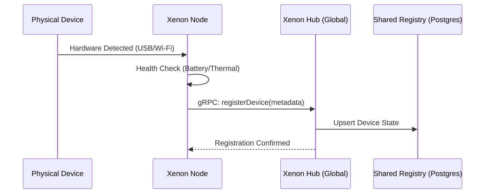
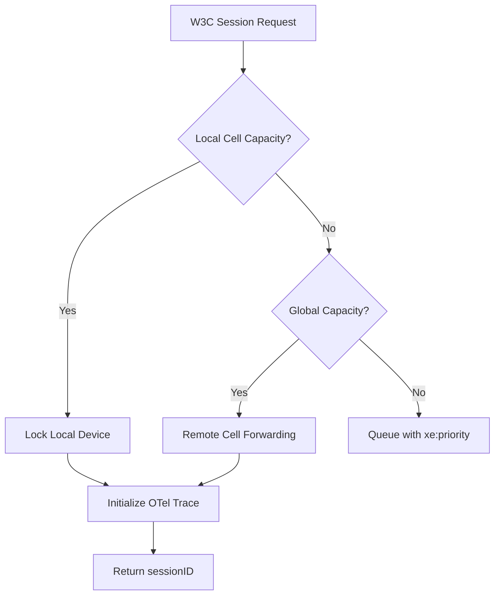
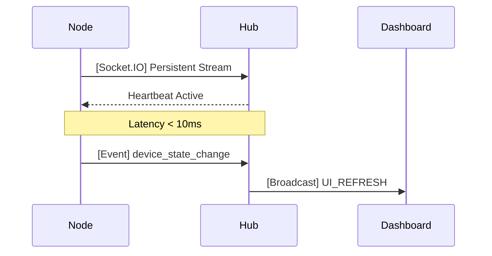
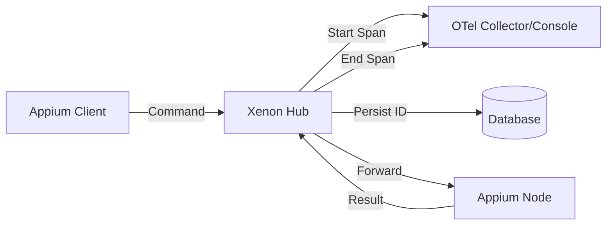

# Appium Xenon Architecture

:::info
Xenon is built on a **Cellular Architecture** designed for zero-downtime, autonomous device management. This section explores the lifecycle of devices and sessions within the distributed mesh.
:::

## Autonomous Infrastructure Lifecycle

Xenon's registry is proactive, not reactive. Devices are treated as shared resources in a global mesh, synchronized via high-speed gRPC and WebSockets.

### Device Registration & Discovery

When a hardware node detects a new mobile device, it instantly propagates this state to the nearest available Hub cell.

### Strategic Session Allocation

Xenon uses a priority-based allocation engine. If a local device isn't available, the Hub can orchestrate cross-cell allocation to ensure test continuity.

:::warning
Direct object references to devices are strictly locked during allocation. Xenon ensures that no two sessions can intersect on the same hardware UDID, even across distributed cells.
:::

## Infrastructure Synchronization

Xenon eliminates the latency of traditional Appium polling through a "WebSocket-First" real-time layer.

## Omniscient Observability (OpenTelemetry)

Xenon integrates **OpenTelemetry (OTel)** to provide industrial-grade observability across the entire automation lifecycle. This is not just logging; it's a deep-trace correlation engine.

:::tip
By assigning a unique **Trace ID** to every Appium session, Xenon allows you to visualize the entire request flow—from initial allocation to individual element interactions—in tools like Jaeger, Honeycomb, or Grafana.
:::

### Telemetry Pipeline

1. **Root Trace**: The end-to-end Appium session.
2. **Child Spans**: Individual WebDriver commands (e.g., `findElement`, `click`).
3. **Metadata Injection**: Each span is enriched with device UDID, battery level, and thermal state at the time of execution.

## Autonomous Self-Healing {#self-healing}

Xenon's self-healing engine automatically repairs broken element locators at runtime using a **5-tier cascading architecture**:

| Tier | Provider | Method |
|:----:|----------|--------|
| 1 | ResilioTree | Structural tree-diff matching |
| 2 | FuzzyXML | Attribute similarity scoring |
| 3 | OCR | Text-based visual matching |
| 4 | Visual AI | Florence-2 element detection |
| 5 | LLM | Deep reasoning with GPT/Claude/Gemini |

Successful healings are autonomously learned via the Etalon Service to prevent recurrence.

→ **[Full Self-Healing Documentation](self-healing.md)**

### Selector Lifecycle State Machine {#selector-health}

Healed selectors are tracked in a small state machine — `Active → Pending → Resolved`, with `Muted` as a side state — driven by three forces:

- **User actions** (`mark_fixed`, `mute`, `unmute`, `cancel_verification`) hit `POST /xenon/api/healing/selector/state` and update the row plus emit a Socket.IO event.
- **Verifier cron** (default 15 min) scans `Pending` rows; promotes to `Resolved` after 3 distinct clean CI builds.
- **Heal write path** flips `Pending`/`Resolved` rows back to `Active` on regression, increments `regression_count`, and emits `selector_regressed`.

→ **[Selector Health Documentation](selector-health.md)**

### Network Interceptor {#network-interceptor}

An in-process MITM proxy attached per-session for Android targets. Captures every HTTP/HTTPS request, supports inline `respondWith` / `rewriteRequest` / `rewriteResponse` mocks, host-level allow/deny filters, and TLS-handshake failure attribution. Real devices are routed via `adb reverse` over the adb transport itself, so the integration works through NAT, hotel WiFi, and CI runners without LAN setup. Captured traffic is exported as HAR 1.2 and persists past session end.

→ **[Network Interceptor Documentation](network-interceptor.md)**

## AI Root-Cause Analysis {#ai-diagnostics}

When a failure is unrecoverable, Xenon triggers a multimodal analysis pipeline using **Gemini**, **OpenAI**, **Anthropic**, or **Ollama**:

- **Failure Tombstone**: Captures screenshots, command logs, and device logs
- **Multimodal Reasoning**: AI analyzes visual + textual context to identify root cause
- **Embedded Insights**: Analysis visible directly in the session dashboard

→ **[Full AI Features Documentation](ai-features.md)**

---

## Additional Services

| Service | Description | Docs |
|---------|-------------|------|
| **Network Conditioning** | Simulate 4G, 3G, Edge, Offline conditions | [Guide](network-conditioning.md) |
| **Notifications** | Slack and HTTP webhook alerts | [Guide](notifications.md) |
| **Omni-Vision** | Florence-2 visual intelligence | [Guide](omni-vision.md) |

---

## Performance & Thermal Watchdog

The `HealthMonitorService` tracks device health trends to prevent environmental failures.

- **Thermal Throttling**: Automatically de-prioritizes devices with high thermal status.
- **USB Bus Integrity**: Monitors power consumption to prevent device disconnects on high-density hubs.
- **Battery Analytics**: Proactive maintenance alerts for devices with degrading health.
