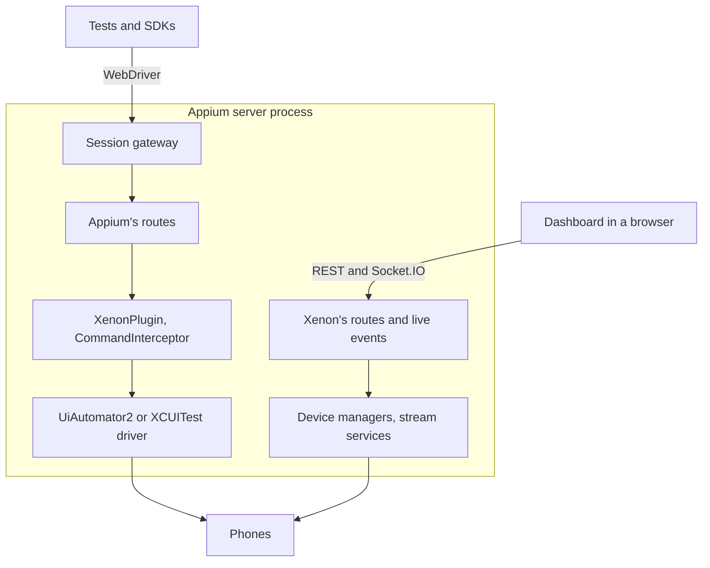
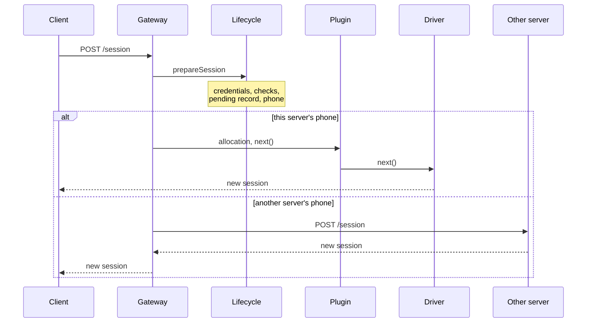
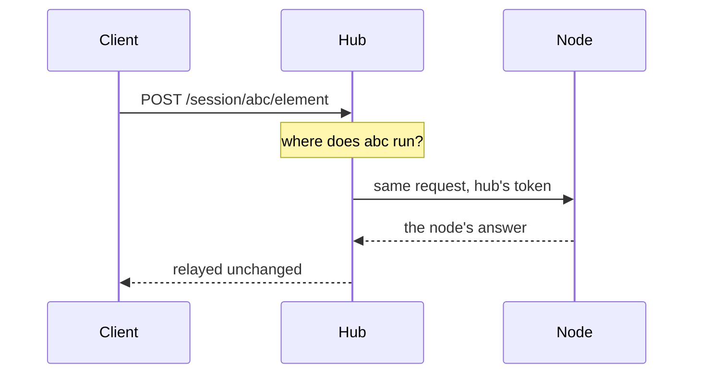

This page is for readers who want to know how Xenon works: what runs where, what happens to a session and to each command, and how a hub reaches its nodes. It names the classes and files in the repository, under `src/`, so you can follow it into the code. To use Xenon you don't need any of it.

## The pieces

Xenon is an Appium plugin. Everything runs in the Appium server's process, on Appium's port.

```mermaid
flowchart TB
    T["Tests and SDKs"]
    B["Dashboard in a browser"]
    subgraph Appium["Appium server process"]
        G["Session gateway"] --> R["Appium's routes"]
        R --> I["XenonPlugin, CommandInterceptor"]
        I --> D["UiAutomator2 or XCUITest driver"]
        API["Xenon's routes and live events"] --> M["Device managers, stream services"]
    end
    T -->|WebDriver| G
    B -->|"REST and Socket.IO"| API
    D --> P["Phones"]
    M --> P
```

- **`XenonPlugin`** (`src/plugin.ts`) extends Appium's `BasePlugin`. Appium calls its `updateServer` once at startup, `createSession` and `deleteSession` for sessions, `handle` for every other command, and `onUnexpectedShutdown` when a driver ends a session by itself, such as at Appium's new-command timeout.
- **Services are TypeDI singletons**, declared with `@Service()` and fetched with `Container.get(...)`.
- **One plugin, two roles.** A server started without the `hub` option is a hub, or a standalone server; one started with it is a node of that hub. A hub's session gateway sends the commands for a node's or a cloud provider's phone to that server: see [Hub and nodes](#hub-and-nodes) below, and [Hub and nodes](./hub-and-nodes.md) for the setup.

## Startup

`ServerManager.updateServer` (`src/services/ServerManager.ts`) sets the server up, in this order:

1. **Options.** The `authDisabled` option and `XENON_AUTH_DISABLED` are combined, the recording options are applied, and the database and AI options are copied into `config` (`src/config.ts`), which every other part reads.
2. **The database.** `assertSupportedDatabase` stops the server when the database URL isn't SQLite. `runMigrations` brings the tables up to date with `prisma db push` (or `prisma migrate deploy` when `databaseProvider` is `postgresql`, which [Troubleshooting](./troubleshooting.md) warns about), unless `XENON_AUTO_MIGRATE=false`. The rows of the server's own phones are cleared, to be listed again by discovery (a hub keeps its nodes'), the first Super admin is made on an empty database, and `JwtKeyService` loads or makes the token-signing key.
3. **go-ios.** Every go-ios process a previous run left is killed, before anything here starts one.
4. **Routes.** Xenon's router goes under `/xenon`, the session gateway goes in front of Appium's routes, and the WebSocket upgrade router goes on the HTTP server (see the next section).
5. **Emulators** listed in the `emulators` option are booted.
6. **The role.** A hub starts `SocketServer` for the dashboards, `TracingService` for OpenTelemetry, and a timer that looks for its own phones. A node starts looking for its phones and sending them to its hub, and connects to the hub's Socket.IO as a client (`SocketClient`).
7. **Background jobs.** Stale nodes, idle sessions, waiting session requests, reservations, data retention, health checks, session heartbeats, busy flags left behind and selector verification each get a timer, unless the `cloud` option is set, when none of these start.
8. **Recovery.** Sessions a hub had routed to its nodes before a restart are found again and routed as before. The timers for lease expiry and the event log's pruning start, whatever the `cloud` option says. Sessions on the server's own phones from before the restart are marked failed, and the first round of device discovery runs.

## Routes on Appium's server

Xenon adds three things to Appium's HTTP server:

- **`/xenon`**, an Express router (`src/app/index.ts`): the dashboard's files, and the REST API under `/xenon/api`. A request to the API passes the same-origin check, then sign-in (`authMiddleware`), then rate limits, then the area's router in `src/app/routers/`. Every error is answered as JSON by `apiErrorHandler`. The reference is at `/xenon/api-docs`, built from `src/app/swagger.ts` and the YAML files in `src/app/openapi/`.
- **The session gateway** (`src/gateway/`), spliced in front of Appium's own routes by `insertBeforeRoutes`, because Appium adds its routes before any plugin can. It has three layers:
  - `xenonInternalCalls` lets Xenon's own loopback calls (`<base path>/wd-internal/...`, with a secret made once per process) skip the per-command check.
  - `xenonSessionCreate` handles `POST <base path>/session`: see [Creating a session](#creating-a-session).
  - `xenonSessionGateway` handles `<base path>/session/:sessionId/...`: the per-command check when `XENON_REQUIRE_COMMAND_AUTH` is on, and, on a hub, passing a remote session's commands to its server.
- **The WebSocket upgrade router** (`src/app/ws/upgradeRouter.ts`). Xenon's WebSockets share the server with Appium's, and the router gives each upgrade exactly one handler: the H.264 preview, the live logs and Socket.IO to Xenon, everything else (BiDi, drivers' sockets) to Appium. On Node versions before 22.21 it also adds the upgrade listener Appium would have added.

## Creating a session

```mermaid
sequenceDiagram
    participant C as Client
    participant G as Gateway
    participant L as Lifecycle
    participant P as Plugin
    participant A as Driver
    participant N as Other server
    C->>G: POST /session
    G->>L: prepareSession
    Note over L: credentials, checks,<br/>pending record, phone
    alt this server's phone
        G->>P: allocation, next()
        P->>A: next()
        A-->>C: new session
    else another server's phone
        G->>N: POST /session
        N-->>G: new session
        G-->>C: new session
    end
```

Gateway is the `xenonSessionCreate` layer, Lifecycle is `SessionLifecycleService`, and Plugin is `XenonPlugin.createSession`.

- **`prepareSession`** (`src/services/SessionLifecycleService.ts`) first takes the credentials out of the capabilities (`takeSessionCredentials`), so the driver, the database and the logs never see them. It then checks them as REST does (`verifyCredential.ts`: an Active owner, and the `sessions` scope for a key or a session token), applies `XENON_REQUIRE_SESSION_TOKEN`, writes a pending-session record and allocates a phone.
- **Allocation** (`allocateDeviceForSession`, `src/device-utils.ts`) waits on one lock per platform, so requests are served in the order they came. It checks `maxSessions`, then claims one free, matching phone the caller's teams can see, in one step (`findAndLockDevice`). A session that names a lease takes its lease's phone instead and skips the queue.
- **A phone on this server:** the allocation travels to `XenonPlugin.createSession` through the request's `AsyncLocalStorage` (`createHandoff.ts`), and the plugin calls Appium's driver. If the create fails, the phone is released.
- **Another server's phone:** the hub sends the node a copy of the request with no credentials, the phone pinned by `appium:udid`, and a short-lived signed create token (`capsForNode`, `hubSessionToken.ts`). The hub sends it once, never retried, and answers the client itself, so Appium's own driver never sees the session.
- **`finalizeSession`** then starts the session's trace, applies its network profile and capture on this server's phone, and remembers the owner of a session on this server's phone. With `enableDashboard` on, it writes the session's record, starts sampling CPU and memory, starts recording an Android phone's device log for the whole session (`SessionDeviceLogs`), and sends `session_started`; a node samples the sessions its hub creates either way.

A session's record ends as `success` or `failed`. However the session ends, through `deleteSession`, Appium's new-command timeout, Xenon's idle release, a lost heartbeat or a shutdown, its phone's network settings are put back, its network capture is saved, the virtual elements it found are forgotten, and the phone is released.

## The command flow

Every command Appium hands the plugin goes to `CommandInterceptor.handle` (`src/interceptors/CommandInterceptor.ts`). The order matters, because several features act on the same commands:

1. **Bookkeeping.** The session's idle clock is reset, and the rest runs inside an `AsyncLocalStorage` frame that gives every log line its session, command and trace ids. On a hub with tracing on, a command span is started.
2. **`execute` scripts.** A script named `xenon: ...` or `xe: ...` (and the older `plugin: ...`) is answered by Xenon: autowait settings (`AutowaitService`), Omni-Vision and AI commands (`AICommandService`), network capture (`InterceptorService`), and session details such as `setSessionName`. A Xenon script the server doesn't have fails with `unknown command`. See [Execute commands](./execute-commands.md).
3. **Omni-Vision finds.** `findElement` with `-custom:ai-icon` or `-custom:ai-text` goes to `OmniVisionService`, which answers with a virtual element id (`omni_...`), or `no such element` when nothing matches. Healing doesn't run on these finds.
4. **Virtual elements.** A command on an element id that starts with `omni_`, `healed_ocr` or `healed_visual` is answered from that element's position: `click` taps it with W3C actions, `getText` gives the text OCR read, `setValue` taps it and types into the focused field, and any other command is refused. It never reaches the driver.
5. **Autowait.** When it is on, `findElement` and `findElements` are retried until their timeout before failing, and `click`, `setValue` and `clear` first wait for the element to be enabled. See [Autowait](./autowait.md).
6. **The driver.** `next()` runs the command.
7. **After the command.** With the dashboard on, the command is logged with its request, its answer and any heal, and `session_command`, a summary of it, is sent. On every server, while healing is on, a `findElement` that worked teaches Xenon its element's fingerprint, in the background.
8. **Healing.** If `findElement` or `findElements` failed with "no such element" and healing is on, `HealingOrchestrator.attemptHealing` tries its tiers. When a tier finds a position rather than an element, Xenon answers with a virtual element there, and nothing is tapped during the find. On a node, a heal of a command the hub forwarded goes back to the hub with the answer, and the hub records it.

Autowait runs before healing on purpose: most finds that fail are screens still drawing, and a retry costs less than a heal that may end with a call to an AI provider.

## Healing

`HealingOrchestrator` (`src/services/healing/`) collects the screen's page source and a screenshot once, then tries its providers in order, cheapest first, and stops at the first that finds the element:

| Tier | Class |
|---|---|
| 0, Resilio | `ResilioTreeHealingProvider` |
| 1, Native | None: the find that just failed, retried by autowait |
| 2, Fuzzy XML | `FuzzyXmlHealingProvider` |
| 3, OCR | `OcrHealingProvider`, with Omni-Vision's OCR (Tesseract.js) on the server |
| 4, Visual AI | `VisualAiHealingProvider`, through `AIService` |
| 5, LLM | `LlmHealingProvider`, through `AIService` |

`HealEtalonService` stores element fingerprints in the database, each with the element's path for Resilio, learned from finds that worked and from heals that were verified, so later heals can match without the AI tiers. `AIService` talks to Gemini, OpenAI, Anthropic or Ollama, reads the provider in force at each call, and gives each call a time limit. [Self-healing](./self-healing.md) describes the tiers from a tester's side, and [Selector health](./selector-health.md) the page that lists the selectors that needed them.

## Hub and nodes

```mermaid
sequenceDiagram
    participant C as Client
    participant H as Hub
    participant N as Node
    C->>H: POST /session/abc/element
    Note over H: where does abc run?
    H->>N: same request, hub's token
    N-->>H: the node's answer
    H-->>C: relayed unchanged
```

On the hub, `xenonSessionGateway` asks `SessionLocator` where the session runs, and forwards the command when it is another server's.

- **Each server has its own database.** A node reports its phones to its hub with `POST /xenon/api/register` (`NodeDevices`), when a phone comes or goes and on a timer. The hub keeps its own decisions about those phones, such as teams, reservations and its claims, apart from what the node reports (`src/data-service/deviceClaims.ts`).
- **Where a session runs** is `SessionLocator`: the in-memory `SessionManager` first, then the session's record and its phone's. A remote session is a `RemoteSession` (a `CloudSession` for a cloud provider), and a session on this server's own phone a `LocalSession`.
- **Forwarding** (`forwardToNode.ts`) sends a command once, under the node's own base path, without the client's credentials and cookies and with the hub's token, and streams the answer back. `DELETE` of the session also ends it on the hub.
- **The hub's tokens** are RS256 JWTs the node checks against the hub's public keys at `/xenon/api/auth/jwks.json`: one per session for commands (audience `xenon-node`), one per create (`xenon-node-create`), and one per device-control call (`xenon-node-control`).
- **Device control** of a node's phone passes the gate in `src/app/routers/nodePhoneControl.ts`: each action is sent to the node, answered on the hub, or refused with `501`. The H.264 preview and the live logs are relayed socket to socket (`src/app/ws/nodeSocketRelay.ts`), and a recording reads the node's stream through a relay on the hub (`nodeRecordingSource.ts`).
- **Health.** The hub asks each node about its sessions with `GET /xenon/api/node/sessions/<id>`, which runs no command, and collects their CPU and memory figures (`NodeMetricsCollector`).

## Devices

- **Android** (`AndroidDeviceManager`): adb, found through `ANDROID_HOME` or `ANDROID_SDK_ROOT` by `appium-adb`, and a device tracker that reacts when a phone is plugged in or out.
- **iOS** (`IOSDeviceManager`, `IOSDiscoveryService`): real iPhones through usbmuxd, with details from go-ios, which comes with Xenon; simulators through `simctl`.
- **Rows.** Phones live in the database through `DeviceStoreFactory` (`PrismaDeviceStore`). Each server files its own phones under its own hosts (`localDeviceHosts`, `isOwnDevice`), so that a hub never mistakes a node's phone, or a node on the same Mac, for its own.
- **Busy.** A phone is busy when a session claims it, a preview or recording holds it (`manual_<user id>_<udid>`), or, on a hub, its node reports it busy. An SDK lease locks a phone too, and the readers that decide who may use it ask the lease table (`src/services/lease/`).
- **Access.** Two guards stand in front of `/control`: `deviceTeamGuard`, which makes a phone outside the caller's teams look unknown, then `deviceAccessGuard`, which refuses a phone someone else holds. See [Device control](./device-control.md).
- **Health.** `HealthMonitorService` checks the server's own phones, and allocation checks that an iPhone's WebDriverAgent answers before handing it over.

## Streaming, logs and recordings

These are independent of Appium sessions: device control, the Live devices page and recordings use them with or without a test running.

- **iPhones** (`IOSStreamService`): on iOS 17 and later, a go-ios tunnel per phone (`IOSTunnels`), on a pair of ports leased from 12100 to 12199. Then WebDriverAgent started with go-ios `runwda`, `iproxy` forwarding its port and its MJPEG port 9100, and WebDriverAgent's MJPEG server switched on.
- **Android MJPEG** (`AndroidStreamService`): a screenshot per frame through adb.
- **Android H.264**, when `streaming.androidH264` is on (`AndroidH264StreamService`): scrcpy's server, which comes with Xenon (`ScrcpyServerSession`), or `adb screenrecord`. The stream is split into packets (`H264NalParser`), fanned out to viewers (`H264Multiplexer`) over a WebSocket, and decoded in the browser with WebCodecs. A browser or phone that can't falls back to MJPEG.
- **MJPEG fan-out** (`src/helpers/UniversalMjpegProxy.ts`): one stream from the phone, many viewers. A viewer that falls more than 4 MB behind is dropped.
- **Live logs:** `adb logcat` (`LogcatStreamService`), or go-ios `ostrace` for iPhones (`IOSLogStreamService`), one process per phone fanned out to its viewers over one WebSocket route.
- **Recordings** (`src/services/recording/`): `RecordingOrchestrator` runs one ffmpeg per phone, and one more that puts several phones side by side. `VideoPipelineService` encodes with `h264_videotoolbox` on a Mac and `libx264` elsewhere.
- **Processes.** Long-running children such as go-ios, WebDriverAgent, `iproxy` and ffmpeg are tracked in `ProcessRegistry`, by phone and session. When the server's process exits, a last hook kills them, and the children of the live-log and H.264 services, at once: Appium's own SIGTERM handler can end the process before Xenon's cleanup has run.

## Data

- **SQLite, through Prisma.** The schema is `prisma/schema.prisma`; the client is generated into `src/generated/client`. Each server, hub or node, has its own database file, `~/.cache/xenon/xenon.db` unless `DATABASE_URL` says otherwise. A PostgreSQL URL stops the server at startup.
- **Files** go under `~/.cache/xenon`, and stay there when `DATABASE_URL` moves the database: session videos and screenshots, recordings, uploaded apps, the network capture's certificate authority and the token-signing key. [Production deployment](./deployment.md#where-xenon-keeps-its-data) lists them, with the settings that move some of them.
- **Session logs.** `SessionLog` holds every recorded command, and is read through indexes by session, by heal and by selector.

## The dashboard and live events

- **The dashboard** is a React app in `web/`, built into the plugin's `lib/public` and served at `/xenon/`. It reads the REST API and listens to Socket.IO. It is served whatever `enableDashboard` says: that option decides whether the server records sessions, with their commands and heals.
- **Recording sessions** is `EventManager` (`src/dashboard/event-manager.ts`): it writes the session's record and each command's log, takes screenshots, and sends the session events. When a failed session ends it files the failure under a category, then leaves the AI analysis to run in the background (`failure-analysis-service.ts`).
- **Live events** go out through `SocketServer` (`src/services/SocketServer.ts`), only on a hub. An event about a phone reaches only the clients whose teams can see it. Every event is also written to the event log, except captured network requests, and a command as its summary. [Real-time events](./real-time-events.md) lists them.

## Related

- [Hub and nodes](./hub-and-nodes.md): setting a hub and nodes up.
- [Observability](./observability.md): traces, logs and metrics.
- [Real-time events](./real-time-events.md): the Socket.IO stream.
