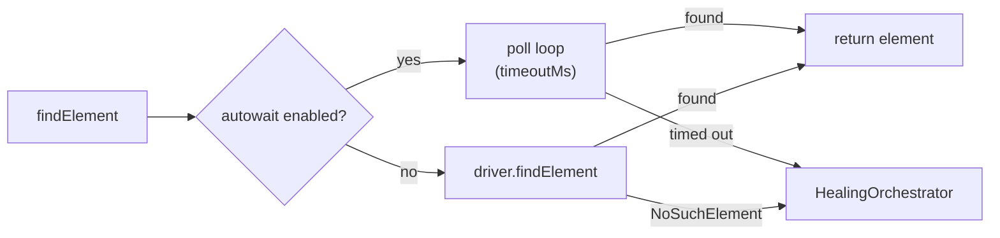

# Autowait

Autowait is Xenon's implicit-wait layer for `findElement` / `findElements` and pre-action enabled checks on `click`, `setValue`, and `clear`. It absorbs the small race conditions that make tests flaky — slow renders, transitions, late-mounting elements — by polling instead of failing on the first attempt.

It runs **before** the [Self-Healing Engine](self-healing.md). The ordering is deliberate: most "broken" `findElement` calls are slow renders, not bad selectors, so a cheap retry loop is tried first. Healing only fires once the autowait timeout expires.

:::info Inspired by `appium-wait-plugin`
Autowait is API-compatible with the older `appium-wait-plugin`. Existing tests that call `plugin: setWaitPluginProperties` keep working — see [Legacy compatibility](#legacy-compatibility).
:::

---

## Quick start

Enable autowait globally in your Appium config:

```yaml
server:
  usePlugins:
    - xenon
  plugin:
    xenon:
      autowait:
        enabled: true
        timeoutMs: 10000
        intervalBetweenAttemptsMs: 500
```

Restart the server. Every `findElement` and `findElements` call in every session now polls for up to 10 s before throwing `NoSuchElement`. `click`, `setValue`, and `clear` get a pre-action enabled poll on the same budget.

That's it. Per-session overrides via the [`xenon: setAutowaitProperties`](#runtime-overrides) execute script let individual tests tighten or loosen the timeout without restarting the server.

---

## How it works

When autowait is enabled, the [command interceptor](architecture.md) wraps two classes of Appium command before they reach the underlying driver:

### `findElement` / `findElements`

The call is wrapped in a poll loop with `intervalBetweenAttemptsMs` between attempts and a `timeoutMs` deadline. Transient `NoSuchElement` errors are treated as "not yet" and retried; non-find errors short-circuit and surface immediately.

If the deadline expires without finding the element, autowait throws `NoSuchElement` — and **only then** does the [Self-Healing Engine](self-healing.md) get a turn. This keeps healing focused on its real job (recovering from genuinely-broken locators) rather than working around slow renders.



Visual-strategy finds (`-custom:ai-icon`, `-custom:ai-text`) bypass autowait — those are routed directly to [Omni-Vision](omni-vision.md), which has its own retry semantics.

### Pre-action enabled checks for `click` / `setValue` / `clear`

Before the action runs, autowait polls `elementEnabled(elementId)` on the same `timeoutMs` / `intervalBetweenAttemptsMs` budget. If the element is still disabled when the deadline expires, the original action throws as it would have without autowait — autowait never silently swallows a real failure.

This catches the very common pattern of "button gets enabled the moment a form is valid, but my test clicks it the millisecond before". Per-command opt-out is available via [`excludeEnabledCheck`](#excludeenabledcheck).

Virtual elements managed by other Xenon subsystems (IDs prefixed with `omni_` or `healed_*`) are skipped — they don't go through standard element commands.

---

## Configuration

### Server-level defaults

```yaml
plugin:
  xenon:
    autowait:
      enabled: true
      timeoutMs: 10000
      intervalBetweenAttemptsMs: 500
      excludeEnabledCheck: ['setValue']
```

| Field | Type | Default | Purpose |
|---|---|---|---|
| `enabled` | boolean | `false` | Master switch. Off by default — opt in explicitly. |
| `timeoutMs` | number (ms) | `10000` | How long to keep retrying `findElement` / waiting for `elementEnabled` before giving up. Healing runs after this expires. |
| `intervalBetweenAttemptsMs` | number (ms) | `500` | Sleep between attempts inside the poll loop. |
| `excludeEnabledCheck` | string[] | `[]` | Action commands (`click`, `setValue`, `clear`) for which the pre-action enabled poll should be skipped. |

The same fields are accepted in JSON config. `0` is a valid timeout — autowait still guarantees one attempt, so the behavior collapses to "no retry, no enabled-check wait".

### Runtime overrides

Tests can override autowait for the lifetime of their own session via the `xenon: setAutowaitProperties` execute script. This is useful for one-off tight loops in stable code paths, or for loosening the timeout on a known-slow screen.

<details>
<summary>JavaScript / WebdriverIO</summary>

```javascript
// Tighten timeout for a fast-render flow
await driver.executeScript('xenon: setAutowaitProperties', [{
  enabled: true,
  timeoutMs: 2000,
  intervalBetweenAttemptsMs: 100,
}]);

// Loosen for a screen with long animations
await driver.executeScript('xenon: setAutowaitProperties', [{
  timeoutMs: 30000,
}]);

// Skip the pre-click enabled check for buttons that report enabled=false
// even when they're tappable (rare, but Android has corners)
await driver.executeScript('xenon: setAutowaitProperties', [{
  excludeEnabledCheck: ['click'],
}]);

// Disable autowait entirely for this session
await driver.executeScript('xenon: setAutowaitProperties', [{
  enabled: false,
}]);
```

</details>

<details>
<summary>Python</summary>

```python
driver.execute_script('xenon: setAutowaitProperties', {
    'enabled': True,
    'timeoutMs': 5000,
    'intervalBetweenAttemptsMs': 250,
})
```

</details>

<details>
<summary>Java</summary>

```java
Map<String, Object> props = Map.of(
    "enabled", true,
    "timeoutMs", 5000,
    "intervalBetweenAttemptsMs", 250
);
driver.executeScript("xenon: setAutowaitProperties", props);
```

</details>

Overrides are merged on top of server defaults — partial updates only touch the keys you supply. The merged config is also returned from the call so you can confirm what's now active.

To inspect the currently effective autowait config:

```javascript
const props = await driver.executeScript('xenon: getAutowaitProperties', []);
// { enabled: true, timeoutMs: 5000, intervalBetweenAttemptsMs: 250, excludeEnabledCheck: [] }
```

Per-session overrides live in memory and are cleared automatically when the session ends. Concurrent sessions don't see each other's overrides — each session has its own slot.

The `xe:` prefix is also accepted (`xe: setAutowaitProperties`).

### `excludeEnabledCheck`

The pre-action enabled poll is helpful for the typical case but a footgun for a few:

- **Android `Switch` / custom toggles** that report `enabled=false` while still being tappable.
- **Buttons whose `setValue` clears a disabled state** as a side effect — the wait would deadlock against the action that resolves it.
- **Elements where the test deliberately wants the failure-fast behavior**, e.g. negative-path tests asserting that a disabled button stays disabled.

Add the offending command(s) to `excludeEnabledCheck`:

```yaml
autowait:
  enabled: true
  excludeEnabledCheck: ['click', 'setValue']
```

Only `click`, `setValue`, and `clear` are valid entries — other names are silently ignored.

---

## Legacy compatibility

For projects migrating from `appium-wait-plugin`, the legacy execute scripts and field names are accepted verbatim:

```javascript
// Legacy form — still works
await driver.executeScript('plugin: setWaitPluginProperties', [{
  timeout: 10000,                  // mapped to timeoutMs
  intervalBetweenAttempts: 500,    // mapped to intervalBetweenAttemptsMs
}]);

await driver.executeScript('plugin: getWaitPluginProperties', []);
```

Mapping:

| Legacy key | Modern key |
|---|---|
| `timeout` | `timeoutMs` |
| `intervalBetweenAttempts` | `intervalBetweenAttemptsMs` |
| `enabled` | `enabled` (unchanged) |
| `excludeEnabledCheck` | `excludeEnabledCheck` (unchanged) |

Both prefixes work simultaneously, so a test suite can migrate a few suites at a time. New tests should prefer the `xenon:` form.

---

## Interaction with other features

| Feature | Interaction |
|---|---|
| [Self-Healing](self-healing.md) | Healing runs only **after** autowait times out. With autowait off, healing fires on the first `NoSuchElement` as before. |
| [Omni-Vision](omni-vision.md) | Visual `findElement` strategies (`-custom:ai-icon`, `-custom:ai-text`) bypass autowait — they use Omni-Vision's own retry. |
| [Selector Health](selector-health.md) | Autowait does not generate selector-health events. Only post-timeout healings do, so the dashboard isn't polluted by transient slow renders. |
| Etalon learning | Successful finds within the autowait poll don't trigger learning (nothing was healed). Etalons are written normally on the underlying driver call. |

---

## When *not* to enable autowait

- **You already use explicit waits everywhere** (`WebDriverWait` / `expectedConditions`). Enabling autowait on top stacks two layers and lengthens failure paths. Pick one.
- **Negative-path tests are a large share of your suite.** Autowait will make assertions like "this button is *not* clickable" wait for the full timeout before reporting. Set `excludeEnabledCheck` aggressively, or disable per-session.
- **You're chasing flakiness root causes.** Autowait will mask the symptom; investigate the underlying race first, then enable autowait once you understand what you're papering over.

---

## Troubleshooting

**"My test now takes 10 seconds to fail instead of fast-failing."**
That's the timeout in action. Either lower `timeoutMs`, opt out of the enabled-check via `excludeEnabledCheck`, or scope autowait to specific sessions via runtime overrides.

**"Self-healing isn't firing anymore on broken locators."**
Healing still runs — but only after the autowait timeout. If your locator is genuinely broken, you'll wait `timeoutMs` ms before healing kicks in. This is intentional; the cheap retry comes first. Tighten `timeoutMs` if you want healing to fire sooner.

**"`xenon: setAutowaitProperties` returns the new values but they don't take effect."**
The override is per-session — if you re-create the driver, the new session starts at server defaults again. Apply the override at the top of each test, or set the defaults at server level.

**"`autowait.timeoutMs must be a non-negative number`."**
Validation rejects negative numbers, non-numbers, and (for `enabled`) non-booleans. Unknown keys are silently dropped — typos like `timeOutMs` will appear to "work" but be ignored. Round-trip via `getAutowaitProperties` to confirm the override applied.

**"The poll is running but my element shows up after 11 seconds."**
The default `timeoutMs` is `10000`. Bump it for the slow screen — globally via config, or per-session via the execute script.

---

## See also

- [Self-Healing Engine](self-healing.md) — what runs after autowait gives up
- [Configuration & Server Arguments](server-args.md) — full plugin args reference
- [Architecture](architecture.md) — where autowait sits in the command-interception flow
