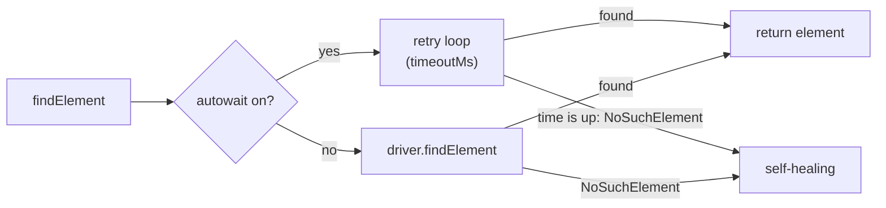

Autowait makes Xenon wait where a test would otherwise fail on the first try: it retries `findElement` and `findElements` until the element appears, and before a `click`, `setValue` or `clear` it waits for the element to be enabled. That absorbs slow screens, transitions and late-mounting elements. It is off by default.

It runs before [self-healing](./self-healing.md). Most "broken" selectors are slow screens, not wrong selectors, so a cheap retry comes first, and healing gets its turn only when the time is up.

## Turn it on

Switch autowait on for the whole server in its config file, and restart Appium:

```yaml
server:
  use-plugins: [xenon]
  plugin:
    xenon:
      autowait:
        enabled: true
        timeoutMs: 10000
        intervalBetweenAttemptsMs: 500
```

Every session on the server then retries finds for up to 10 seconds, with half a second between attempts, and waits as long for an element to be enabled. A test can also switch it on, off or change it for its own session with an [execute command](#change-it-for-one-session). There is no capability for it.

## How it works

### Finds

Xenon wraps `findElement` and `findElements` in a retry loop. It tries, waits `intervalBetweenAttemptsMs`, and tries again until the element is found or `timeoutMs` has passed. A find from inside another element (`findElementFromElement`) isn't wrapped.

- **`findElement`:** a `NoSuchElement` answer means "not yet", and Xenon retries. Any other error stops the loop and reaches your test at once. When the time is up, the test gets the last `NoSuchElement` error, and self-healing runs.
- **`findElements`:** an empty list means "not yet" too. When the time is up, Xenon returns the empty list, as Appium would, and doesn't raise an error, so healing doesn't run. A test that expects no elements still gets its empty list, after waiting the full time.


```mermaid
graph LR
    A["findElement"] --> B{"autowait on?"}
    B -->|no| D["driver.findElement"]
    B -->|yes| C["retry loop<br/>(timeoutMs)"]
    C -->|found| R["return element"]
    C -->|time is up: NoSuchElement| H["self-healing"]
    D -->|found| R
    D -->|NoSuchElement| H
```

Finds that use a visual strategy, `-custom:ai-icon` and `-custom:ai-text`, skip autowait. They go to [Omni-Vision](./omni-vision.md).

### Enabled checks

Before `click`, `setValue` and `clear`, Xenon asks the driver whether the element is enabled, again and again, within the same `timeoutMs` and `intervalBetweenAttemptsMs`. It then sends your command. If the element is still disabled when the time is up, the command fails with `Autowait timed out after <timeoutMs> ms waiting for element <id> to be enabled`, and the click or typing never happens.

That helps with a button that becomes enabled the moment a form is valid, when the test clicks it a moment too early. Elements Xenon found itself, through Omni-Vision or self-healing, have ids that start with `omni_` or `healed_`. Their commands skip the check.

To skip the check for some commands, list them in `excludeEnabledCheck`. It is worth doing for:

- **Elements that report themselves as disabled while they can still be used.**
- **Tests that expect the failure,** such as one that asserts a disabled button stays disabled. Without the exclusion, the test waits the full time before it fails.

```yaml
autowait:
  enabled: true
  excludeEnabledCheck: ['click', 'setValue']
```

Only `click`, `setValue` and `clear` have a check, so other names in the list do nothing.

## Settings

| Setting | Type | Default | What it does |
|---|---|---|---|
| `enabled` | boolean | `false` | Switches autowait on. |
| `timeoutMs` | number, milliseconds | `10000` | How long to keep retrying a find, or waiting for an element to be enabled. |
| `intervalBetweenAttemptsMs` | number, milliseconds | `500` | The pause between attempts. |
| `excludeEnabledCheck` | array of strings | `[]` | The commands, out of `click`, `setValue` and `clear`, that skip the enabled check. |

A `timeoutMs` of `0` is valid. Xenon always makes one attempt, so there is no waiting. In the server's config, a value of the wrong type is ignored and the default stays. [Configuration](./configuration.md) lists these settings with the rest.

If you turn self-healing off with `enableSelfHealing: false`, autowait still waits, and a find that stays missing fails with no healing.

## Change it for one session

A test can change autowait for its own session with `xenon: setAutowaitProperties`, and read what applies with `xenon: getAutowaitProperties`. Use it to tighten the wait on a fast screen, loosen it on a slow one, or switch autowait off for a negative test.

```js
// A fast screen: fail sooner.
await driver.executeScript('xenon: setAutowaitProperties', [{
  enabled: true,
  timeoutMs: 2000,
  intervalBetweenAttemptsMs: 100,
}]);

// A slow screen: wait longer.
await driver.executeScript('xenon: setAutowaitProperties', [{ timeoutMs: 30000 }]);

// Don't wait for the button to be enabled before a click.
await driver.executeScript('xenon: setAutowaitProperties', [{ excludeEnabledCheck: ['click'] }]);

// Switch autowait off for this session.
await driver.executeScript('xenon: setAutowaitProperties', [{ enabled: false }]);

// What applies now?
const props = await driver.executeScript('xenon: getAutowaitProperties', []);
// { enabled: false, timeoutMs: 30000, intervalBetweenAttemptsMs: 100, excludeEnabledCheck: ['click'] }
```

- The `xe:` prefix works as well as `xenon:`. [Execute commands](./execute-commands.md) shows how to call them from Python and Java.
- An override changes only the fields you send, and applies on top of the server's settings. It lasts until the session ends, and other sessions never see it. A new session starts from the server's settings again.
- `getAutowaitProperties` returns what is in force: the built-in defaults, then the server's settings, then this session's overrides. The answer to `setAutowaitProperties` isn't the same: it shows the session's overrides on top of the built-in defaults only, so it can differ from what applies when the server sets its own values. Call `getAutowaitProperties` to check.
- A negative `timeoutMs` or `intervalBetweenAttemptsMs` fails the call with `autowait.timeoutMs must be a non-negative number`, or the matching message. A field of the wrong type, and a name Xenon doesn't know, are silently left out, so a typo such as `timeOutMs` changes nothing. Read the settings back to be sure.

### Older names

Tests written for `appium-wait-plugin` keep working. Xenon still answers `plugin: setWaitPluginProperties` and `plugin: getWaitPluginProperties`, and accepts the older field names with either prefix:

| Older name | Same as |
|---|---|
| `timeout` | `timeoutMs` |
| `intervalBetweenAttempts` | `intervalBetweenAttemptsMs` |

`enabled` and `excludeEnabledCheck` keep their names. When a call sends both spellings of a field, the newer one wins. New tests should use the `xenon:` commands.

## With other features

| Feature | How it fits |
|---|---|
| [Self-healing](./self-healing.md) | Healing runs only after autowait's time is up, and only for `findElement`. With autowait off, it runs on the first `NoSuchElement`. |
| [Omni-Vision](./omni-vision.md) | Visual finds skip autowait and use Omni-Vision's own search. |
| [Selector health](./selector-health.md) | It lists selectors that needed healing. A find that autowait retried into success isn't one. |

## When not to turn it on

- **You already wait explicitly,** with `WebDriverWait` or expected conditions. Two layers of waiting make failures slower. Use one.
- **Many of your tests expect something to be missing or disabled.** Each of those waits the full timeout before it passes. Lower the timeout for them, list the commands in `excludeEnabledCheck`, or switch autowait off for those sessions.

## Troubleshooting

**A test now takes 10 seconds to fail.** That is the timeout. Lower `timeoutMs`, exclude the command from the enabled check, or change it for that session.

**Self-healing doesn't fire on a broken selector.** It does, after the timeout. A `findElement` for a selector that is really wrong waits `timeoutMs` first, so lower it if you want healing sooner. A `findElements` that finds nothing returns an empty list and doesn't trigger healing.

**`setAutowaitProperties` answers with values that aren't in effect.** Its answer leaves the server's settings out. Call `getAutowaitProperties`.

**The change is gone in the next test.** An override lasts for one session. Make it at the top of each test, or set the value in the server's config.

**An element appears after 11 seconds and the test already failed.** The default `timeoutMs` is 10 seconds. Raise it for that screen, in the server's config or for the session.

## Related

- [Self-healing](./self-healing.md): what runs after autowait gives up.
- [Execute commands](./execute-commands.md): every command a test can send to Xenon.
- [Configuration](./configuration.md): every server option, with its default.
- [Architecture](./architecture.md): where autowait sits among Xenon's other steps.
