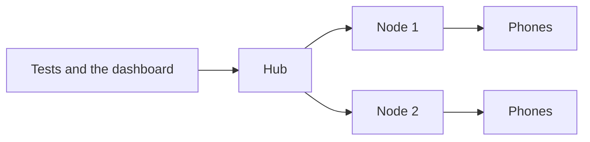

A lab can grow past one machine. A **hub** is the Xenon server that people and tests talk to, and a **node** is a Xenon server on another machine with phones plugged into it. The nodes report their phones to the hub, so the dashboard shows one lab and tests connect to one address. This page explains how to set up a hub and its nodes, what goes through the hub, and what to expect when one of them restarts.

## What a hub and a node are

Both run the same Xenon plugin under Appium. The one difference is the `hub` option: a server started without it is a hub, and a server started with `--plugin-xenon-hub=<hub address>` is a node of that hub.



- **The hub** holds the lab's users, teams, tokens, reservations and session history, serves the dashboard, and decides which phone each session gets. It can have phones of its own too.
- **A node** finds the phones plugged into its machine, reports them to the hub, and runs the sessions and device control the hub sends it. It doesn't need its dashboard turned on.
- **Tests and people use the hub only.** The hub creates a session on the node's phone, sends it each command and returns the answer. With sign-in on, a node refuses a session that was not created through its hub, saying `Create sessions through the hub`. A node with sign-in turned off accepts a direct create, so you can run a driver on one node while developing.
- **Each server has its own database,** a SQLite file. A hub and its nodes never share one.

## Set up the hub

Start the hub like any Xenon server, with its dashboard enabled:

```bash
appium server --use-plugins=xenon \
  --plugin-xenon-platform=both \
  --plugin-xenon-enable-dashboard
```

Open `http://<hub-host>:4723/xenon/` and sign in as the first super admin, as the [Quick start](./quick-start.mdx#3-open-the-dashboard-and-sign-in) describes. For anything beyond a try-out, read [Security](#security) below first, and [Production deployment](./deployment.md).

## Give each node a user and a token

A node authenticates to the hub like any script does, with an access key and a token. Make a user for the node on the hub, so that you can see, and later revoke, what it can do. A node reports its phones through calls that need the **Admin** role and a token with the `devices` scope.

1. On the hub, sign in as a super admin, open **Users** and choose **Invite user**. Give it an email such as `node-lab1@example.com`, a name such as `Node lab1`, and the role **Admin**. Xenon shows a temporary password once: copy it.
2. Sign out, and sign in as the node's user with that password.
3. Open **Profile**, then **API tokens**. The **Access Key** at the top, which starts with `xen_`, is the node's access key: copy it. Choose **Generate new token**, give it a description such as `node-lab1`, pick how long it lasts, and copy the token straight away, because Xenon shows it once. The token gets the scopes its user's role allows, which for an Admin include `devices`.

Keep the node's user at Admin, not Super admin, and let its token expire on a schedule you will remember: a node whose token has expired can't report its phones.

## Start a node

On the node's machine, put the access key and token in the environment, then start Appium with the hub's address:

```bash
export XENON_HUB_ACCESS_KEY="xen_..."
export XENON_HUB_TOKEN="..."

appium server --use-plugins=xenon \
  --plugin-xenon-platform=android \
  --plugin-xenon-hub=http://hub.internal:4723
```

The hub's address is its origin, such as `http://hub.internal:4723`, without its Appium base path. Xenon reads the two variables when it starts, so restart the node after changing them. A hub with sign-in turned off ignores them.

Once it is up the node:

1. Finds its phones, as [Devices and allocation](./devices.md#what-xenon-discovers) describes.
2. Sends the list to the hub, when a phone is plugged in or out and again every `sendNodeDevicesToHubIntervalMs`. The periodic send happens only while the hub answers `GET /xenon/api/health`.
3. Keeps a Socket.IO connection to the hub, which the hub uses to tell the dashboard when a node connects or disconnects.
4. Tries to tell the hub it is leaving when it is stopped with SIGINT or SIGTERM, and the hub drops its phones. That message can lose a race with Appium's own exit, so don't count on it: the hub also drops a node's phones when its health probe fails.

The phones show up on the hub's **Devices** page. Sessions are sent to a node at the address it files its phones under, which is `http://<bindHostOrIp>:<port>`. `bindHostOrIp` is `auto` by default, which picks the machine's LAN address, so the hub must be able to reach that address and port over HTTP.

If the hub reaches the node through a proxy or NAT, set `remoteMachineProxyIP` on the node. For Android phones give a host or an IP address, and Xenon adds `http://` and the port. For iPhones Xenon uses the value exactly as you write it, so give the full address, such as `http://203.0.113.10:4723`. iOS simulators always use `bindHostOrIp`.

### If a token or password is lost

- **A lost token:** sign in as the node's user, open **Profile**, **API tokens**, delete the token and generate a new one. Set `XENON_HUB_TOKEN` on the node to it and restart the node.
- **A lost access key:** it is shown at the top of the same tab. To change it, use the rotate button beside it: the tokens stay valid, so you only set `XENON_HUB_ACCESS_KEY` again on the node, and the old key stops working at once.
- **A lost password:** a super admin opens **Users**, chooses **Reset password** for the node's user and passes on the link.
- **A deactivated user:** a node's user whose status is Inactive can't sign in, and neither can its tokens. A super admin sets the user back to Active under **Users**, with **Edit**.

## What goes through the hub

Everything about a node's phone is done through the hub, which checks the person's team, who holds the phone and their rights, and then asks the node to act.

| What | How it works |
|---|---|
| **Sessions** | Created on the node by the hub. Every command goes through the hub. The hub ends the session when the client deletes it, and releases the phone. |
| **Device control** | Tap, swipe, typing, keys, long press, screenshots, the clipboard, lock and unlock, installed apps, uninstall, logs, shell and the inspector's snapshot are sent to the node. [Live device control](./device-control.md) describes them. |
| **Installing apps** | An app from the app library, or a file you upload, is sent on to the node and installed there. |
| **Live preview and logs** | The preview video and the live logs are relayed from the node as they stream. |
| **Omni-Vision** | The scan runs on the hub, with the hub's AI settings, on the node's screenshot. |
| **Recordings** | The hub records a node's phone from the node's preview stream. |
| **CPU and memory** | The node samples its phones for the sessions the hub creates, and the hub collects the figures every 10 seconds. |

Three things are not available for a node's phone:

- **Installing from a path on the hub.** A file path names a file on one machine, so the API answers `501` with `not_available_through_hub`. Upload the file or use the app library instead.
- **BiDi and sessions' own WebSockets.** The `webSocketUrl` a session returns points at the node.
- **Any control action that isn't on the hub's list of actions it passes on.** It is refused with the same `501` rather than run on the hub's own phones.

A cloud provider's phone is not a node: device control for it answers `501` with `not_available_for_cloud_phone`.

### Base paths may differ

The hub and each node can use different Appium base paths. A server tells anyone who asks, without sign-in, what its base path is:

```bash
curl http://node-1:4723/xenon/api/webdriver
# {"basePath":"/wd/hub"}
```

The hub asks before it creates a session on a node or sends it a command, and remembers the answer for a minute. A node that doesn't answer is taken to use the hub's own base path. Tests connect to the hub, with the hub's base path.

## Restarts and failures

- **When the hub restarts,** sessions running on its nodes' phones go on running. The hub keeps its nodes' phones in its database, finds those sessions again and routes their commands once it is back. Sessions on the hub's own phones end.
- **When a node is stopped,** its sessions end and its phones leave the hub's list, either because the node told the hub or because the hub's next health probe fails. They return when the node starts again.
- **When a node stops answering,** the hub probes each node's `GET /xenon/api/health` every `checkStaleDevicesIntervalMs` and drops the phones of a node that doesn't answer. Each session is checked every `sessionHeartbeatIntervalMs`: one whose node no longer has it is ended as failed after six failed checks, and the phone is released.
- **A node whose session creates keep failing** is left out of allocation for a minute after three failures in a row.

A phone's team, tags, maintenance flag and reservation belong to the hub, and a node's report doesn't change them. They are lost with the phone's record, though. Whenever the hub drops a node's phone, because it was unplugged or rebooted, or because the node unregistered or missed a single health probe, the phone comes back as a new one in the shared pool. See the caution in [Devices and allocation](./devices.md#what-xenon-discovers).

## Timers

| Option | Runs on | Default | What it does |
|---|---|---|---|
| `sendNodeDevicesToHubIntervalMs` | Node | `30000` | How often the node sends its list of phones to the hub. A server with no `hub` option, a hub or a standalone one, uses it for its own rescan. |
| `checkStaleDevicesIntervalMs` | Hub | `30000` | How often the hub checks that each node answers, and drops the phones of one that doesn't. |
| `checkBlockedDevicesIntervalMs` | Every server | `30000` | How often Xenon looks for sessions that have been idle past their timeout, and frees their phones. |
| `sessionHeartbeatIntervalMs` | Every server | `30000` | How often each running session is checked. A session with no heartbeat for three times this long is marked failed. |
| `tlsRejectUnauthorized` | Every server | `true` | Whether a server checks HTTPS certificates when it calls another Xenon server, such as a node calling its hub. Turn it off only for development against a self-signed certificate. |

A shorter interval spots a lost node sooner and costs more requests.

## Security

A hub and its nodes are one trust zone. These steps keep it that way:

- **Credentials are checked at the hub.** The hub checks the key and token a test presents, applies the team rules, and then sends the node a short-lived signed token that names the owner and the phone. A node with sign-in on accepts only that token, so it fetches the hub's keys from `GET /xenon/api/auth/jwks.json`: a node must be able to reach the hub over HTTP.
- **Turn on `XENON_REQUIRE_COMMAND_AUTH` on the hub,** so that every command to a session is checked against the session's owner, not only the first one. Turn on `XENON_REQUIRE_SESSION_TOKEN` there as well, so every session has an owner. [Authentication](./authentication.md) explains both.
- **Keep nodes on a trusted network.** The hub talks to a node over plain HTTP at the address the node reports, and a session's `webSocketUrl` points straight at its node. Don't expose a node to the internet.
- **Keep the node's headers intact.** If you put a reverse proxy in front of the hub, it must pass `x-xenon-access-key` and `x-xenon-token` through unchanged.
- **Keep the hub's token and access key out of config files.** Use environment variables, or Xenon Control, which stores them encrypted. See [Environment variables](./environment-variables.md).

## Upgrading

Keep a hub and its nodes on the same release. Each release's notes say whether the order matters, and what runs where: leases, the ownership checks and the session queue run on the hub, and fixes to how a phone is driven run on the node that has the phone. [Upgrading](./upgrading.md) has the steps, and says to upgrade the nodes first when moving from 1.x to 2.x.

## Related

- [Devices and allocation](./devices.md)
- [Live device control](./device-control.md)
- [Recordings](./recordings.md)
- [Production deployment](./deployment.md)
- [Upgrading](./upgrading.md)
