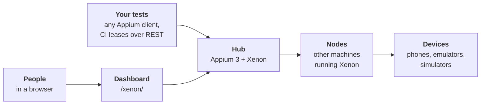

Xenon is an Appium 3 plugin that turns Android and iOS devices, real or virtual, on one machine or many, into a shared lab. Tests ask for a device with ordinary Appium capabilities. Xenon picks a free one the caller is allowed to use, records the session, heals selectors that broke, and shows everything on a live dashboard. People use the same dashboard to watch, control, record and reserve devices.

This page says what Xenon does and how the parts fit. To run it, go to the [Quick start](./quick-start.mdx).

## What Xenon does

- **[Device lab](./devices.md).** Xenon finds Android devices and emulators, iPhones and iOS simulators by itself. It allocates a free, healthy device for each session and queues requests when none is free. With a [hub and nodes](./hub-and-nodes.md), every machine's devices form one pool behind one URL and one set of rules.
- **[Live control](./device-control.md).** Preview any device in the browser, tap, swipe, type, press keys, take screenshots, install apps and read the clipboard. Android logs stream with filters, and a multi-device view records several phones side by side.
- **[Test evidence](./sessions.md).** Sessions are recorded and grouped by build: the full command log, video, screenshots and, if the test asks for them, device logs. Sessions get CPU and memory charts (on an iPhone, CPU only), and Android sessions can capture network traffic. A bug report bundles a session's evidence in one click.
- **[Self-healing](./self-healing.md).** When `findElement` can't find an element, Xenon tries six strategies in turn, cheapest first, before the test sees a failure. The [Selector health](./selector-health.md) page lists the selectors that needed healing, with a suggested fix to copy into your test.
- **[Built for teams](./authentication.md).** Users have roles, [teams](./teams.md) decide which devices someone can reach, and API tokens carry scopes. Every endpoint is in the [API reference](/api).

## How it fits

Tests keep their Appium client and connect to the hub's one URL. People use the dashboard in a browser, which the hub serves. A node is another machine with devices: it runs Xenon too and reports its devices to the hub. The hub's own machine can have devices too, so a single machine is simply a hub with no nodes.

The hub checks who is calling and which devices their team may use, picks a free healthy device and records the session. Sessions, live control and recordings on a node's device all go through the hub, which applies the team rules. [Hub and nodes](./hub-and-nodes.md) explains the setup, and [Leases for CI](./leases.md) shows how a pipeline claims a device before its tests start.

## What you need

- Appium 3, and a Node.js version Appium 3 accepts: 20.19 or later in the 20 line, 22.12 or later in the 22 line, or 24 and later.
- For Android, the Android SDK and the UiAutomator2 driver.
- For iPhones and iOS simulators, a Mac with Xcode and the XCUITest driver.

[Installation and requirements](./installation.md) lists the details, including what Xenon brings with it. An AI provider key is optional; it switches on the AI features, such as the AI healing tiers.

## Where to go next

- [Quick start](./quick-start.mdx): install Xenon, start it and run a first test.
- [Installation and requirements](./installation.md): what to install, where Xenon keeps its data, and how to check it works.
- [Xenon Control for Mac](./xenon-control.md): a desktop app that configures and starts the server.
- [Capabilities](./capabilities.mdx): everything a test can ask for.
- [Teams](./teams.md) and [Production deployment](./deployment.md): running a lab others share.
- [Configuration](./configuration.md): every option, with its flag and default.
- [Release notes](./release-notes.md): what changed in each version.
