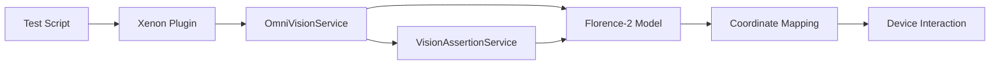

# Omni-Vision (Visual Intelligence)

Omni-Vision is Xenon's visual intelligence layer powered by Florence-2. It enables **coordinate-free element interaction** and **visual assertions** — testing your app as a human sees it, not as the DOM describes it.

For interactive exploration and code generation powered by Omni-Vision, see the [OmniInspector](omni-inspector.md).

---

## Capabilities

### Visual Element Detection

Instead of fragile XPath or accessibility selectors, describe what you want to interact with:

```javascript
// Traditional approach (breaks when DOM changes):
driver.findElement(By.xpath("//XCUIElementTypeButton[@name='Submit Order']"));

// Omni-Vision approach (resilient to UI changes):
// Xenon exposes Omni-Vision as session-scoped plugin endpoints.
// Use the AI locator test endpoint with a custom strategy:
//
// POST /session/:sessionId/xenon/test-locator
// Body: { "strategy": "-custom:ai-icon", "selector": "the green Submit Order button at the bottom of the screen" }
//
// Returns: an array of matches with rect + confidence (virtual elements).
```

The returned coordinates are mapped to the device's actual screen resolution, accounting for DPI scaling and viewport offsets.

### Visual Assertions

Verify screen state using natural language instead of element queries:

```javascript
// Assert that a success message is visible
//
// POST /session/:sessionId/xenon/assert
// Body: { "instruction": "A green success toast message is visible at the top" }
//
// Returns: { "result": true/false, "message": "..." }
```

### Smart Interaction (Enterprise)

Omni‑Vision integrates with Xenon’s Omni‑Interaction layer:

- **`smartTap`**: `POST /session/:sessionId/xenon/smart-tap` — OCR-driven tap by visible text
- **`uiInventory`**: `POST /session/:sessionId/xenon/ui-inventory` — export UI metadata derived from OCR + lightweight heuristics

These commands can also be invoked via `executeScript` from any Appium client:

```java
// Java: Smart Tap
driver.executeScript("xe:smartTap", Map.of("text", "Submit", "index", 1, "takeANewScreenShot", true));

// Java: UI Inventory
driver.executeScript("xe:uiInventory", Map.of("maxItems", 200, "takeANewScreenShot", true));
```

**Aliases**: `xe:omniClick` → `smartTap`, `xe:uiScanExport` → `uiInventory`

---

## Architecture



**OmniVisionService** handles:
- Screenshot capture and preprocessing
- Florence-2 model inference
- Coordinate mapping from model output to device screen coordinates
- DPI and viewport offset correction

**VisionAssertionService** handles:
- Natural language assertion parsing
- Confidence scoring
- Pass/fail determination with explanation

---

## Integration with Self-Healing

Omni-Vision powers **Tier 4** of the [Self-Healing Engine](self-healing.md). When structural matching (Tiers 1–3) fails to find a broken element, the healing orchestrator falls back to visual detection:

1. Captures a screenshot of the current screen
2. Generates a visual description of the target element from its attributes
3. Uses Florence-2 to locate the element visually
4. Returns coordinates for interaction

This makes Xenon's self-healing resilient even when the DOM changes completely — as long as the element is visually present on screen.

---

## Requirements

- **Florence-2 model** must be available (local or remote inference)
- Screenshot capabilities must be enabled on the session
- Works with both iOS and Android devices

:::tip
Omni-Vision works best for elements with distinctive visual characteristics (unique text, icons, colors). For visually ambiguous elements (plain list items, generic buttons), structural matching in Tiers 1–3 is more reliable.
:::
