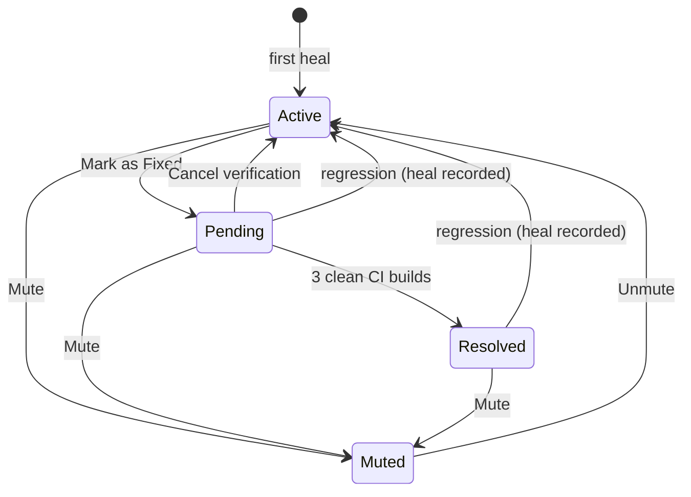

# Selector Health

Selector Health is the dashboard surface that turns Xenon's stream of self-healing events into something a team can actually act on. It tracks every selector that has ever been healed, lets you mark fixes, watches for regressions, and tells you which selectors are quietly costing you the most across CI.

If [Self-Healing](self-healing.md) is the engine that keeps tests passing through breakages, Selector Health is the cockpit that tells you which broken selectors are worth fixing in source — and proves the fixes actually held.

---

## Why it exists

Self-healing buys time. Without a feedback loop, that time turns into permanent dependency on the healer: stale selectors live forever, your codebase quietly diverges from your app, and nobody knows which heals are stable vs. which are firing every run. Selector Health closes the loop:

- **Visibility** — every healed selector is ranked by frequency. The noisiest ones surface first.
- **Verification** — when a developer fixes a selector in code, the dashboard watches subsequent CI builds and only marks it `Resolved` after multiple clean runs.
- **Regression detection** — if a "fixed" selector heals again, it flips back to `Active` automatically and the dashboard surfaces a banner.
- **Triage** — known-flaky or third-party selectors can be `Muted` so they stop polluting the hotspot list.

---

## Lifecycle

Every selector that has ever been healed has an implicit or explicit state. The state machine is small:



| State | Meaning |
|---|---|
| **Active** | The selector is being healed. This is the default for any selector with one or more heal events and no user action. |
| **Pending** | A user clicked **Mark as Fixed**. Xenon is now watching CI builds for confirmation. The dashboard shows a `1/3 → 3/3` progress indicator. |
| **Resolved** | The verifier saw at least **3 distinct CI builds** call `findElement` for this selector with no heal. Terminal state — until/unless a regression happens. |
| **Muted** | A user has silenced this selector. It won't appear in Active hotspots and won't trigger alerts. Mocks and healing still run as normal. |

### Verification rules

The verifier runs as a cron job (default: every 15 minutes) and only counts builds that:

- ran `findElement` or `findElements` on the same `(strategy, selector)` tuple,
- happened after the user clicked **Mark as Fixed** (`fixed_at`),
- belong to a session with a `build_id` set — **ad-hoc local runs do not advance verification**.

Three distinct clean `build_id`s are needed for promotion. The threshold is fixed in v1 (no capability to tune it).

### Regression detection

A regression is detected on the heal write path. Whenever a successful heal is persisted for a `(strategy, selector)` tuple already in `Pending` or `Resolved`:

1. The state flips to `Active`.
2. `regression_count` is incremented.
3. A `selector_regressed` event is emitted to the dashboard.
4. The regression banner appears at the top of the page (auto-dismisses after 30 s; multiple regressions in a 5-min window collapse into one banner).

Muted selectors do **not** generate regression events — silencing is silencing.

---

## Dashboard

Selector Health lives under the dashboard's main navigation. The page has three layers:

### KPI strip

Five tiles across the top. The hero tile is **Brittle Selectors** — a count of unique selectors that have healed at least once in the active window, weighted by frequency. The remaining tiles cover total heals, sessions touched, resolved-in-window, and pending-verification.

Each KPI tile carries an info tooltip explaining the underlying query. Hover for the long form.

### Tabs

| Tab | Shows |
|---|---|
| **Active** (default) | Selectors that are being healed and have not been fixed, resolved, or muted. The triage list. |
| **Pending** | Selectors awaiting verification — each row carries a `clean_builds_count / 3` progress chip. |
| **Resolved** | Selectors that have completed verification. Tagged with a regression badge if they have ever regressed. |
| **Muted** | Silenced selectors with `last_healed_at` and a one-click **Unmute** action. |

Tabs update live via Socket.io — fix a selector in one window, and the row moves between tabs in real time across every connected dashboard.

### Row actions

Each Active or Pending row exposes:

| Action | Effect |
|---|---|
| **Mark as Fixed** | Transitions the selector to `Pending` and starts the 3-clean-build verification clock. |
| **Mute** | Transitions to `Muted`. Stops appearing in Active. |
| **Unmute** (Muted tab) | Lifts the mute. If the selector has no other history, the row is deleted entirely. |
| **Cancel verification** (Pending tab) | Backs out of `Pending` without recording a fix. |
| **Copy snippet** | Copies a healed-selector replacement snippet in your last-used language (JavaScript, Java, Python, C#, Ruby). The chevron lets you switch language; the choice is remembered in `localStorage`. |

---

## REST API

All endpoints are mounted under `/xenon/api`. Every mutation requires the `admin` scope (the same API-key scope used elsewhere in the dashboard).

### `POST /healing/selector/state`

Drives every lifecycle transition.

**Request body:**

```json
{
  "original_strategy": "xpath",
  "original_selector": "//android.widget.Button[@text='Login']",
  "action": "mark_fixed"
}
```

`action` must be one of `mark_fixed`, `mute`, `unmute`, `cancel_verification`.

**Responses:**

- **`200`** — `{ "state": SelectorState }` or `{ "state": null }`. The row after the transition; `null` when the row was deleted (e.g. `cancel_verification` on a row with no other history).
- **`400`** — Missing field, or `action` not in the enum.
- **`409`** — State conflict (e.g. `mark_fixed` on a muted selector). Body includes `currentStatus`.

The endpoint emits a corresponding socket event so all connected dashboards update instantly:

| Action | Socket event |
|---|---|
| `mark_fixed` | `selector_fixed` |
| `mute` | `selector_muted` |
| `unmute` | `selector_unmuted` |
| `cancel_verification` | `selector_cancelled` |

The verifier emits two more events on its own schedule:

- `selector_progress` — `clean_builds_count` ticked up but threshold not yet reached.
- `selector_resolved` — promoted to `Resolved`.

And on the heal write path:

- `selector_regressed` — fired when a Pending or Resolved selector heals again.

### `GET /healing/state/muted`

```
GET /healing/state/muted?limit=50&offset=0
```

`limit` is clamped to `[1, 200]`. Returns:

```json
{
  "muted": [
    {
      "original_strategy": "xpath",
      "original_selector": "//...",
      "muted_at": "2026-04-12T08:31:00Z",
      "muted_by_api_key": "key-id-...",
      "last_healed_at": "2026-04-21T17:14:00Z",
      "regression_count": 2
    }
  ],
  "total": 17,
  "limit": 50,
  "offset": 0
}
```

### `GET /healing/state/:strategy/:value`

Single-tuple lookup. `strategy` and `value` must be URL-encoded — XPath selectors contain `/` and `[`. Returns `{ state: null }` when no row exists (which means the selector is implicitly active).

### `GET /healing/hotspots`

The Selector Health main view query.

**Query parameters:**

| Param | Default | Notes |
|---|---|---|
| `windowDays` | `30` | Look-back window. |
| `limit` | `20` | Max rows returned (clamped to `[1, 100]`). |
| `status` | `active` | One of `active`, `pending`, `resolved`, `muted`, `all`. |
| `tier` | — | Filter by healing tier (`fuzzyXml`, `ocr`, `visual`, `llm`). |
| `platform` | — | `android` or `ios`. |

`status=active` (the default) hides anything that has been fixed, muted, or resolved — so the triage view doesn't get polluted by selectors a developer has already addressed. The CI gate and the daily webhook digest both inherit this default behaviour intentionally.

### `GET /healing/summary`

KPI aggregate query. Returns total heals, distinct selectors, sessions touched, by-tier breakdown, estimated cost, plus `resolvedCount` and `pendingCount` from the lifecycle table.

### `GET /healing/events`

Paged stream of recent heal events. Useful for building custom dashboards or auditing.

### `POST /healing/digest/send`

Manually triggers the **Selector Health Digest** webhook (Slack or HTTP). The same payload is sent automatically on the configured cadence — see [Notifications](notifications.md).

---

## Webhook digest

If a Slack or HTTP webhook is registered for the `selector_health_digest` event, Xenon delivers a periodic summary including:

- Top healed selectors in the window
- Counts of newly-resolved, newly-pending, and newly-regressed
- Ungated CI builds that exceeded the brittle-selector threshold

Trigger an out-of-cycle send with `POST /healing/digest/send`. See [Notifications](notifications.md) for the registration shape.

---

## Tips & gotchas

**`Mark as Fixed` doesn't change the test code.**
It's a metadata action — Xenon assumes you've already pushed a code-side fix and just needs to verify it across enough CI builds. If you click it without actually fixing the selector, the verifier will keep ticking `clean_builds_count` based on whichever locator the test now uses. The selector won't re-enter the heal path until the next time something breaks for real.

**`Resolved` is sticky.**
A selector promoted to `Resolved` stays there until it regresses. There is no "re-verify" action — the regression detection path is what tells you something changed.

**Unmute is destructive on cold rows.**
If you mute a selector that has never been fixed, never resolved, and never regressed, then unmute it, the row is deleted entirely (lazy cleanup). The selector reverts to implicit `Active` — equivalent to a brand-new heal target. This is intentional: it keeps the table from accumulating phantom rows.

**Local runs don't count toward verification.**
A session must have a `build_id` set (typically by your CI pipeline via `xe:build`) for its findElement calls to count as a clean build. This prevents a developer's local re-run from accidentally promoting a selector to `Resolved`.

**The verifier is cron-driven.**
Default cadence is every 15 minutes. A selector may sit at `2/3` for several hours after the third clean build before promotion happens — the cron tick is the gate, not the build.
