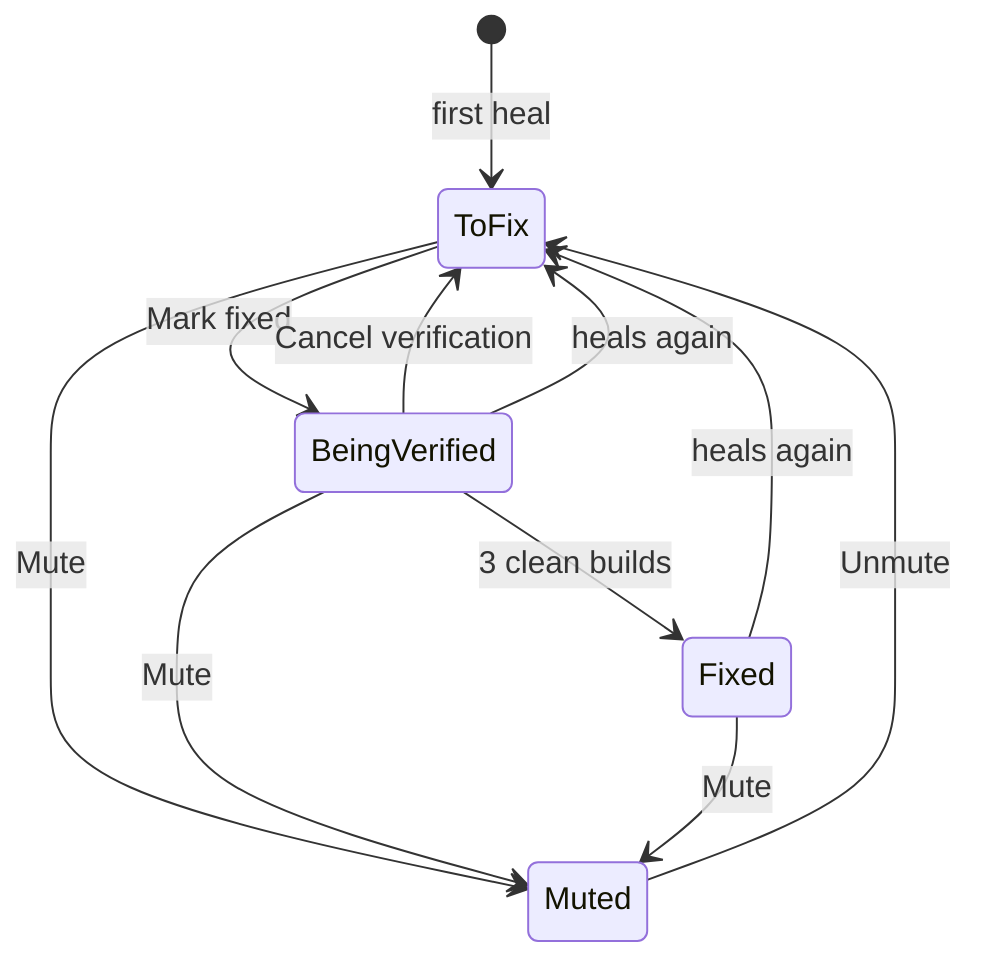

[Self-healing](./self-healing.md) keeps a test running when a selector stops finding its element, but the selector is still broken. The **Selector health** page lists every selector that needed healing in a period, how often, in which sessions, and the selector Xenon found the element with, ready to copy into your test. When you have fixed one, mark it fixed and Xenon watches later builds to confirm it: the selector moves from **To fix** to **Being verified** to **Fixed**, and back to **To fix** if it heals again.

## What you need

- **The dashboard on.** Heals are recorded with the session, and only a server with the dashboard on records sessions. See [Sessions and builds](./sessions.md#what-you-need).
- **On a hub,** the page lists the heals in sessions on the hub's own phones and on its nodes' phones. A session on a node's phone heals on the node, which hands the heal back to the hub, and the hub records it with the session. See [How healing works](./self-healing.md#on-a-hub).

Any signed-in user can open **Selector health** in the sidebar.

## Who sees what

- **Heals.** You see the heals in the sessions you can see, by the same rule as the [Sessions](./sessions.md#who-sees-which-sessions) page. Admins see every heal. A selector healed only in sessions you can't see isn't listed for you, and a link to it says it isn't available.
- **Status.** A selector's status, fixed or muted, is one for the whole lab. When someone in another team mutes a selector, it is muted for you too.
- **Actions.** Members and admins can mark fixed, mute, unmute and cancel, on the selectors they can see. Over the API that needs the `sessions` scope, which `admin` includes.

## The page

The period at the top, **7 days**, **30 days** (the default) or **90 days**, sets everything on the page. The tab, period, search, filters, sort, page and the open selector are all kept in the page's address, so you can bookmark a view or send someone a link to one selector.

The page updates by itself as heals and status changes arrive.

### The numbers at the top

Four numbers, each compared in words with the period before it, such as `2 fewer than the 30 days before`. Fewer is shown in green, more in red.

| Number | What it counts |
|---|---|
| **Selectors that needed healing** | The selectors healed at least once in the period. |
| **Heals** | The heals in the period. |
| **Sessions affected** | The sessions with at least one heal. |
| **Time spent healing** | How long the healed commands took, added up: what healing added to your runs. |

Below them, **Heals per day** draws **All heals** and **Heals that used AI**, the Visual AI and LLM tiers, day by day in your browser's time zone.

### The tabs

| Tab | Lists | Columns |
|---|---|---|
| **To fix** | Selectors healed in the period that aren't being verified, fixed or muted. | **Selector**, with **Broke again** when it healed again after being marked fixed; **Heals** and its sessions; **Last healed**; **Healed by**, the tier that healed it most; **Suggested fix**, the replacement used most and its share of the heals. |
| **Being verified** | Every selector marked fixed and not yet verified. | **Progress**, such as `2 of 3 clean builds`; **Marked fixed**, when and by whom; its heals in the period. |
| **Fixed** | Selectors verified within the period. | **Verified**, the date; its heals in the period. |
| **Muted** | Every muted selector. | **Muted**, when and by whom; **Reason**; its heals in the period. |

Each tab shows its count. The counts follow the period, not the search or the filters.

- **Search** matches text in the selector. On **To fix** it also matches the selectors it was healed to.
- **To fix** has three more controls: the platform, the healing method (the tier), and the order: **Most heals**, **Most recent** or **Most time spent healing**.
- A page holds 50 selectors. **Previous** and **Next** move between pages.

### The side panel

Click a row, or press **Enter** on it, to open the selector in a panel beside the list. **↑** and **↓** open the previous or next selector, and **Esc** closes the panel. Its header shows the selector in full, its status, buttons to copy the selector and to copy a link to it, and the actions you may take. Below:

- **Suggested fix.** Every selector the element was found with, the one used most first, each with its type, its share of the heals, the tiers that found it, and their average confidence. **Copy as** copies it as a line of code in JavaScript (WebdriverIO), Java, Python, C# or Ruby. The first time, it asks for the language, and remembers your choice in this browser. A fix found by OCR or Visual AI is a place on the screen, not a selector, so it has no code: **Copy as** gives a comment saying so.
- **In the last 7, 30 or 90 days.** Its heals, its sessions and the time spent healing it, with a chart of heals per day.
- **Where it happens.** The platforms, builds and devices it healed on, five of each at most.
- **Recent heals.** The latest 20: when, on which device, by which tier and with what confidence, what it healed to, and a link to the session.
- **Activity.** Who marked it fixed, cancelled the verification, muted it (with the reason) or unmuted it, when it was verified, and when it broke again.

## From To fix to Fixed


```mermaid
stateDiagram-v2
    [*] --> ToFix: first heal
    ToFix --> BeingVerified: Mark fixed
    BeingVerified --> Fixed: 3 clean builds
    BeingVerified --> ToFix: Cancel verification
    BeingVerified --> ToFix: heals again
    Fixed --> ToFix: heals again
    ToFix --> Muted: Mute
    BeingVerified --> Muted: Mute
    Fixed --> Muted: Mute
    Muted --> ToFix: Unmute
```

### Mark fixed

Change the selector in your test first, then click **Mark fixed** and confirm. Marking it changes nothing in your tests: it tells Xenon to start watching.

- The selector moves to **Being verified**, with no clean builds yet.
- **Mark fixed** is offered on a selector that is **To fix**. It isn't offered for a selector recorded with no type (no strategy), since Xenon can't verify one: newer runs record the type.

### Verification

Every 15 minutes, Xenon looks at each selector being verified:

- **A clean build** is a build in which a test found the selector without healing, after it was marked fixed: a `findElement` of it returned an element, or a `findElements` returned at least one, and none of its finds needed healing. A find that failed outright, or a `findElements` that found nothing, doesn't count as finding it, but doesn't make the build unclean either: a test may be checking that something is gone. Finds on a node's phone count, as the hub records them.
- **A build** is a build as the [Sessions](./sessions.md#name-and-group-sessions) page shows it. Sessions with the same build name, from `xe:build` or `Default Build` without one, belong to one build while each starts within 30 minutes of the last. Runs on your own machine count, like any other.
- **Three clean builds** move the selector to **Fixed**. Until then the progress, such as `2 of 3 clean builds`, shows on the tab and in the panel.

The check runs on a schedule, so a selector may stay at `2 of 3` for up to 15 minutes after its third clean build.

### Broke again

A selector that is being verified or fixed goes back to **To fix** as soon as it heals again. Xenon also looks on every run of the verification for a heal since the selector was marked fixed, so a heal it missed at the time still sends it back.

When that happens:

- the row shows **Broke again** on **To fix**, and **Activity** records it;
- its clean builds start again from zero, and it needs **Mark fixed** again;
- a banner appears at the top of the page for everyone who has it open: `A selector you fixed broke again`, or the number of selectors that broke in the last 5 minutes. **Show selectors to fix** opens **To fix** with no search or filter, in the period and order already chosen, and opens the selector when only one broke. The banner goes after 30 seconds.

A muted selector that heals stays muted.

### Cancel verification

**Cancel verification** takes a selector being verified back to **To fix**, and its clean builds start again from zero.

### Mute and unmute

**Mute…** asks for an optional reason, up to 500 characters, and mutes the selector. A muted selector is left out of **To fix**, the CI gate and the digest, for everyone, until someone unmutes it. Healing still runs for it. **Unmute** puts it back.

## The digest and the CI gate

- **The digest.** Admins see **Send digest** at the top of the page. It sends the webhooks that chose the selector digest a summary of the period shown: up to five of the selectors healed most, each healed at least twice. Muted selectors, and those being verified or fixed, are left out. [Notifications](./notifications.md#the-selector-digest) explains the webhooks and the message.
- **The CI gate.** `GET /xenon/api/healing/hotspots/violations` lists the selectors to fix that healed at least `minHealCount` times (5 by default) in the last `windowDays` days (7 by default), optionally in one build. It always answers `200`, and your pipeline decides what to do with `violationCount`:

  ```bash
  curl -s "http://localhost:4723/xenon/api/healing/hotspots/violations?windowDays=7&minHealCount=3" \
    -H "x-xenon-access-key: $XENON_ACCESS_KEY" -H "x-xenon-token: $XENON_TOKEN"
  ```

  Add `build=<build id>` to look at one build's sessions. It reads at most the newest 5,000 heals of the period, and counts only the heals in sessions the caller can see.

## Over the API

All routes are under `/xenon/api` and need a signed-in user (a member or above). Except for the digest, they count only the heals in sessions the caller can see. The page itself uses the first four, and `POST /healing/digest/send` for **Send digest**. The [API reference](/api) has every parameter and field.

| Route | What it answers |
|---|---|
| `GET /healing/selectors` | One tab of the list: `tab` (`fix`, `verifying`, `fixed` or `muted`), `days` (1 to 365, default 30), `q`, and on `fix` `platform`, `method` and `sort` (`heals`, `recent` or `time`), with `page` and `pageSize` (50 by default, at most 100). It answers `{ tab, days, page, pageSize, total, counts, canAct, items }`. A page past the end answers the last page. |
| `GET /healing/selectors/detail` | The side panel for one selector: `selector`, `strategy` (empty for one recorded with no strategy), `days`, and `tz`, your offset from UTC in minutes. `404` for a selector you can't see. |
| `POST /healing/selector/state` | Mark fixed, mute, unmute or cancel, below. |
| `GET /healing/summary` | The four numbers, for `windowDays` and the period before, with heals per tier, and `trend`, the heals and AI heals per day (pass `tz`). |
| `GET /healing/events` | The newest heals, at most `limit` (1 to 200, default 50), optionally of one `sessionId`, and `todayCount`. |
| `GET /healing/hotspots` | The most-healed selectors of the last `windowDays` days, by `status` (`active`, the default, `pending`, `resolved`, `muted` or `all`). It reads at most the newest 5,000 heals. |
| `GET /healing/hotspots/violations` | The CI gate, above. |
| `GET /healing/selector` | For one selector value (`value`), whatever its strategy: what it healed to, and its heals by tier, platform and build, with the newest 100. |
| `GET /healing/selector-health` | A feed for tools: the selectors healed in the last 365 days, with their status. |
| `GET /healing/state/muted` | Every muted selector, newest first, with `limit` (1 to 200, default 50) and `offset`. |
| `GET /healing/state/{strategy}/{value}` | One selector's status row, or `{ "state": null }` when it has none, which means **To fix**. URL-encode both parts: an XPath has `/` and `[` in it. |
| `POST /healing/digest/send` | Sends the digest. Admins only, with the `admin` scope. |

The filters take what Xenon records. A platform is `android`, `ios` or `tvos`. A method, or a `tier` on the hotspot routes, is a tier's name: `Resilio`, `Fuzzy XML`, `OCR`, `Visual AI` or `LLM`.

In the API, a selector's status is one of `active` (To fix), `pending` (Being verified), `resolved` (Fixed) or `muted`. A selector with no status row is `active`. A status row also carries `fixed_by_api_key` and `muted_by_api_key`, the id of the API key that acted, which is empty for a change made on the dashboard. The panel's **Activity** names the person instead.

### Mark fixed, mute, unmute and cancel

```bash
curl -X POST http://localhost:4723/xenon/api/healing/selector/state \
  -H "x-xenon-access-key: $XENON_ACCESS_KEY" -H "x-xenon-token: $XENON_TOKEN" \
  -H 'Content-Type: application/json' \
  -d '{"original_strategy":"xpath","original_selector":"//android.widget.Button[@text=\"Login\"]","action":"mute","reason":"Login screen is being redesigned"}'
```

- `action` is `mark_fixed`, `mute`, `unmute` or `cancel_verification`.
- `original_strategy` may be empty, for a selector recorded with no strategy.
- `reason` is optional, kept for `mute` only, and at most 500 characters.
- The person acting is recorded, and shows in the panel's **Activity**.

| Answer | When |
|---|---|
| `200 { "state": … }` | The status row after the change. `{ "state": null }` when the selector has no row any more: unmuting or cancelling one with no other history removes its row, and it is then **To fix** again. |
| `400` | A field is missing, `action` isn't one of the four, or `reason` is too long. |
| `403` | Your credential lacks the `sessions` scope. |
| `404 { "error": "not_found", "message": "Selector not found" }` | You can't see the selector, which answers exactly as one that doesn't exist. |
| `409` | The change doesn't fit the status: `mark_fixed` on a muted selector, or `cancel_verification` on one that isn't being verified. The body has `currentStatus`. |

Unmuting a selector that isn't muted changes nothing and answers `200`.

### Live events

Each change is also sent as a [real-time event](./real-time-events.md), to admins and to the members who may see the selector here: `selector_fixed`, `selector_muted`, `selector_unmuted` and `selector_cancelled` for the actions; `selector_progress` and `selector_resolved` from the verification; and `selector_regressed` when a selector breaks again. Each heal is also sent as `healing_event`, to those who can see its phone.

## Related

- [How healing works](./self-healing.md): the tiers that produce the heals.
- [Sessions and builds](./sessions.md): a session's own heals, and how builds are grouped.
- [Notifications](./notifications.md): the webhooks that receive the digest.
- [API reference](/api): every route, with its schemas.
