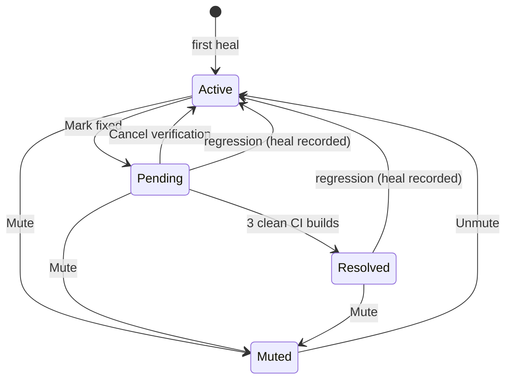

# Selector Health

Selector Health is the dashboard surface that turns Xenon's stream of self-healing events into something a team can actually act on. It tracks every selector that has ever been healed, lets you mark fixes, watches for regressions, and tells you which selectors slow your runs the most across CI.

If [Self-Healing](self-healing.md) is the engine that keeps tests passing through breakages, Selector Health is the cockpit that tells you which broken selectors are worth fixing in source — and proves the fixes actually held.

---

## Why it exists

Self-healing buys time. Without a feedback loop, that time turns into permanent dependency on the healer: stale selectors live forever, your codebase quietly diverges from your app, and nobody knows which heals are stable vs. which are firing every run. Selector Health closes the loop:

- **Visibility** — every healed selector is ranked by frequency. The noisiest ones surface first.
- **Verification** — when a developer fixes a selector in code, the dashboard watches subsequent CI builds and only marks it `Resolved` after multiple clean runs.
- **Regression detection** — if a "fixed" selector heals again, it flips back to `Active` automatically and the dashboard surfaces a banner.
- **Triage** — known-flaky or third-party selectors can be `Muted` so they stop polluting the list.
- **Accountability** — every status change is recorded with the person who made it, and a mute can say why.

---

## Lifecycle

Every selector that has ever been healed has an implicit or explicit state. The state machine is small:


```mermaid
stateDiagram-v2
    [*] --> Active: first heal
    Active --> Pending: Mark fixed
    Pending --> Resolved: 3 clean CI builds
    Pending --> Active: Cancel verification
    Pending --> Active: regression (heal recorded)
    Resolved --> Active: regression (heal recorded)
    Active --> Muted: Mute
    Pending --> Muted: Mute
    Resolved --> Muted: Mute
    Muted --> Active: Unmute
```

| State | Meaning |
|---|---|
| **Active** (tab: To fix) | The selector is being healed. This is the default for any selector with one or more heal events and no user action. |
| **Pending** (tab: Being verified) | A user clicked **Mark fixed**. Xenon is now watching CI builds for confirmation. The dashboard shows "2 of 3 clean builds". |
| **Resolved** (tab: Fixed) | The verifier saw at least **3 distinct CI builds** call `findElement` for this selector with no heal. Terminal state — until/unless a regression happens. |
| **Muted** | A user has silenced this selector, for every team. It's left out of To fix, the CI gate and the digest. Healing still runs as normal. |

### Verification rules

The verifier runs as a cron job (default: every 15 minutes) and only counts builds that:

- ran `findElement` or `findElements` on the same `(strategy, selector)` tuple,
- happened after the user clicked **Mark fixed** (`fixed_at`),
- belong to a session with a `build_id` set — **ad-hoc local runs do not advance verification**.

Three distinct clean `build_id`s are needed for promotion. The threshold is fixed in v1 (no capability to tune it). A heal since **Mark fixed** ends verification instead, however many clean builds there were: the selector goes back to To fix (see below).

### Regression detection

A regression is detected on the heal write path. Whenever a successful heal is persisted for a `(strategy, selector)` tuple already in `Pending` or `Resolved`:

1. The state flips to `Active`.
2. `regression_count` is incremented.
3. A `selector_regressed` event is emitted to the dashboard.
4. The regression banner appears at the top of the page (auto-dismisses after 30 s; multiple regressions in a 5-min window collapse into one banner). Its **Show selectors to fix** opens To fix in the period and order already chosen, without any search or filter, and opens the selector when only one broke.

The verifier checks as well, on every run: a `Pending` or `Resolved` selector with a heal since it was marked fixed goes back the same way. That covers a heal whose own check failed, for instance on a busy database.

Muted selectors do **not** generate regression events — silencing is silencing.

---

## Dashboard

Selector Health lives under the dashboard's main navigation. The period at the top (7, 30 or 90 days) sets everything on the page.

### Summary and trend

Four numbers, each compared in words with the period before ("2 fewer than the 30 days before"; fewer is green, more is red):

| Number | Meaning |
|---|---|
| **Selectors that needed healing** | Distinct selectors healed at least once in the period. |
| **Heals** | Heals in the period. |
| **Sessions affected** | Sessions with at least one heal. |
| **Time spent healing** | The total duration of the commands that needed healing: what healing added to your runs. |

Below them, **Heals per day** draws all heals and the heals that used AI (Visual AI and LLM, the slowest and least certain), day by day in your browser's time zone.

### Tabs

| Tab | State | Shows |
|---|---|---|
| **To fix** (default) | Active | Selectors healed in the period that aren't being verified, fixed or muted: the selector in full, heals and sessions, when it last healed, the healing method used most, and the suggested fix with how often it matched. A selector that broke again after being fixed says so. |
| **Being verified** | Pending | Progress ("2 of 3 clean builds"), and who marked it fixed and when. |
| **Fixed** | Resolved | Selectors verified within the period, and when. |
| **Muted** | Muted | Who muted each selector, when, and the reason they gave. |

Every tab shows its count. Search matches the selector, and on **To fix** its suggested fix too. **To fix** also filters by platform and healing method and sorts by most heals, most recent, or most time spent healing. Pages hold 50 selectors.

The tab, period, search, filters, sort, page and the open selector are kept in the page address, so a view or one selector can be bookmarked or shared. Old `/selector-health/detail?value=…&strategy=…` links open that selector's panel.

The page updates live as heals and status changes arrive.

### Side panel

Click a row (or press **Enter** on it) to open the selector in a panel beside the list. **↑** and **↓** move to the previous or next selector; **Esc** closes the panel. The panel shows:

- the selector and its status, with the actions below;
- **Suggested fix** — every replacement the healer landed on, most used first, with its share of heals, healing methods and average confidence, and **Copy as** in JavaScript, Java, Python, C# or Ruby (your last choice is remembered);
- the selector's heals, sessions and time spent healing in the period, with a heals-per-day chart;
- **Where it happens** — its platforms, builds and devices;
- **Recent heals** — the latest 20, each linking to its session;
- **Activity** — who marked it fixed, cancelled, muted (with the reason) or unmuted it, when it was verified, and when it broke again.

### Actions

| Action | Effect |
|---|---|
| **Mark fixed** | Asks for confirmation, then moves the selector to `Pending` and starts the 3-clean-build verification. Not offered for a selector recorded with no strategy (heals from before Xenon recorded one): new runs record a strategy, so it could never be verified. |
| **Mute…** | Asks for an optional reason (up to 500 characters), then moves the selector to `Muted`. A mute is lab-wide: it leaves the selector out of every team's list, CI gate and digest. |
| **Unmute** | Lifts the mute. If the selector has no other history, its row is deleted entirely. |
| **Cancel verification** | Backs out of `Pending` without recording a fix; the clean builds start again from zero. |

Members and admins can act, on selectors healed in a session they can see. Everyone sees only the selectors their teams' sessions healed; admins see all.

---

## REST API

All endpoints are mounted under `/xenon/api`. Heal data counts only sessions the caller can see. A lifecycle action needs the `sessions` scope (`admin` implies it), and a member may act only on a selector healed in a session they can see; any other answers `404 { "error": "not_found", "message": "Selector not found" }`, exactly as an unknown selector does.

### `POST /healing/selector/state`

Drives every lifecycle transition.

**Request body:**

```json
{
  "original_strategy": "xpath",
  "original_selector": "//android.widget.Button[@text='Login']",
  "action": "mute",
  "reason": "Login screen is being redesigned"
}
```

`action` must be one of `mark_fixed`, `mute`, `unmute`, `cancel_verification`. `original_strategy` may be empty for heals recorded with no strategy. `reason` is optional, kept for `mute` only, at most 500 characters. Each change is recorded with the person who made it, and shows in the selector's activity.

**Responses:**

- **`200`** — `{ "state": SelectorState }` or `{ "state": null }`. The row after the transition; `null` when the row was deleted (e.g. `cancel_verification` on a row with no other history).
- **`400`** — Missing field, `action` not in the enum, or a `reason` over 500 characters.
- **`403`** — The caller lacks the `sessions` scope.
- **`404`** — The caller can't see this selector.
- **`409`** — State conflict (e.g. `mark_fixed` on a muted selector). Body includes `currentStatus`.

The endpoint emits a corresponding socket event so all connected dashboards update instantly:

| Action | Socket event |
|---|---|
| `mark_fixed` | `selector_fixed` |
| `mute` | `selector_muted` |
| `unmute` | `selector_unmuted` |
| `cancel_verification` | `selector_cancelled` |

The verifier emits two more events on its own schedule:

- `selector_progress` — `clean_builds_count` ticked up but threshold not yet reached.
- `selector_resolved` — promoted to `Resolved`.

And on the heal write path, or on the verifier's next run when that missed it:

- `selector_regressed` — fired when a Pending or Resolved selector heals again.

### `GET /healing/selectors`

One tab of the Selector Health list, the four tab counts, and whether the caller may act.

| Param | Default | Notes |
|---|---|---|
| `tab` | `fix` | `fix`, `verifying`, `fixed` or `muted`. |
| `days` | `30` | The period, 1–365. `fixed` lists selectors verified within it. |
| `q` | — | Text in the selector, or (on `fix`) in its suggested fix. |
| `platform`, `method`, `sort` | — | `fix` only. `sort` is `heals` (default), `recent` or `time`. |
| `page`, `pageSize` | `1`, `50` | `pageSize` at most 100. A page past the end answers the last page. |

Answers `{ tab, days, page, pageSize, total, counts, canAct, items }`. Counts follow the period, not the search or filters.

### `GET /healing/selectors/detail`

Everything the side panel shows for one selector: `?selector=…&strategy=…&days=…&tz=…`. `strategy` is empty for heals recorded with no strategy; `tz` is your offset from UTC in minutes. Answers `404` for a selector the caller can't see.

### `GET /healing/state/muted`

```
GET /healing/state/muted?limit=50&offset=0
```

`limit` is clamped to `[1, 200]`. Returns:

```json
{
  "muted": [
    {
      "original_strategy": "xpath",
      "original_selector": "//...",
      "muted_at": "2026-04-12T08:31:00Z",
      "muted_by_api_key": "key-id-...",
      "last_healed_at": "2026-04-21T17:14:00Z",
      "regression_count": 2
    }
  ],
  "total": 17,
  "limit": 50,
  "offset": 0
}
```

### `GET /healing/state/:strategy/:value`

Single-tuple lookup. `strategy` and `value` must be URL-encoded — XPath selectors contain `/` and `[`. Returns `{ state: null }` when no row exists (which means the selector is implicitly active).

### `GET /healing/hotspots`

The Selector Health main view query.

**Query parameters:**

| Param | Default | Notes |
|---|---|---|
| `windowDays` | `30` | Look-back window. |
| `limit` | `20` | Max rows returned (clamped to `[1, 100]`). |
| `status` | `active` | One of `active`, `pending`, `resolved`, `muted`, `all`. |
| `tier` | — | Filter by healing tier (`fuzzyXml`, `ocr`, `visual`, `llm`). |
| `platform` | — | `android` or `ios`. |

`status=active` (the default) hides anything that has been fixed, muted, or resolved — so the triage view doesn't get polluted by selectors a developer has already addressed. The CI gate and the webhook digest both inherit this default behaviour intentionally.

### `GET /healing/summary`

Summary query. Returns total heals, distinct selectors, sessions touched, by-tier breakdown and time spent healing (`timeSpentMs`) for the period and the one before it, a day-by-day `trend` (heals and AI heals; pass `tz`, your offset from UTC in minutes), plus `resolvedCount` and `pendingCount` from the lifecycle table.

### `GET /healing/events`

Paged stream of recent heal events. Useful for building custom dashboards or auditing.

### `POST /healing/digest/send`

Sends the **Selector Health Digest** to every webhook that chose the `selector_health_digest` event (Slack or JSON). Xenon doesn't send it on a timer: an admin sends it with **Send digest** on this page, or a scheduler of yours calls this route — see [Notifications](./notifications.md#the-selector-digest).

---

## Webhook digest

If a Slack or JSON webhook is registered for the `selector_health_digest` event, an admin can send it a summary of the selectors that needed healing most. It carries:

- `windowDays`, the number of days it covers
- `totalHeals` and `distinctSelectors`, the heals in that time and the selectors that were healed
- `hotspots`, the top healed selectors, each with `healCount`, `originalSelector` and, when there is one, `suggestedRewrite`

Send it with **Send digest** on this page, which uses the period shown, or with `POST /healing/digest/send`. See [Notifications](./notifications.md) for the registration shape and the message.

---

## Tips & gotchas

**`Mark fixed` doesn't change the test code.**
It's a metadata action — Xenon assumes you've already pushed a code-side fix and just needs to verify it across enough CI builds. If you click it without actually fixing the selector, the verifier will keep ticking `clean_builds_count` based on whichever locator the test now uses. The selector won't re-enter the heal path until the next time something breaks for real.

**`Resolved` is sticky.**
A selector promoted to `Resolved` stays there until it regresses. There is no "re-verify" action — the regression detection path is what tells you something changed.

**Unmute is destructive on cold rows.**
If you mute a selector that has never been fixed, never resolved, and never regressed, then unmute it, the row is deleted entirely (lazy cleanup). The selector reverts to implicit `Active` — equivalent to a brand-new heal target. This is intentional: it keeps the table from accumulating phantom rows.

**Local runs don't count toward verification.**
A session must have a `build_id` set (typically by your CI pipeline via `xe:build`) for its findElement calls to count as a clean build. This prevents a developer's local re-run from accidentally promoting a selector to `Resolved`.

**The verifier is cron-driven.**
Default cadence is every 15 minutes. A selector may sit at `2/3` for several hours after the third clean build before promotion happens — the cron tick is the gate, not the build.
