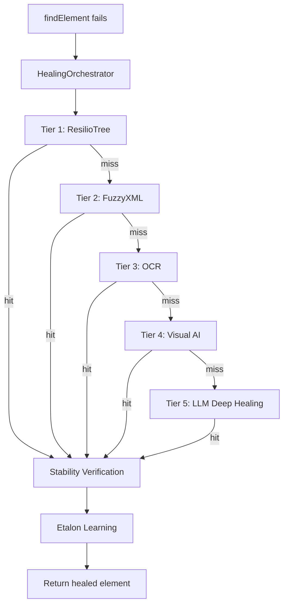

# 5-Tier Self-Healing Engine

Xenon's self-healing system automatically repairs broken element locators at runtime. When a `findElement` call fails, the **HealingOrchestrator** cascades through five increasingly powerful strategies — from instant local matching to deep AI reasoning.

---

## Architecture Overview

---

## Healing Tiers

| Tier | Provider | Method | Speed | Cost |
|:----:|----------|--------|:-----:|:----:|
| 1 | **ResilioTree** | Structural tree-diff matching against stored element signatures | ~10ms | Free |
| 2 | **FuzzyXML** | Attribute similarity scoring (text, class, resource-id, bounds) | ~20ms | Free |
| 3 | **OCR** | Text-based visual matching using screen text extraction | ~100ms | Free |
| 4 | **Visual AI** | Florence-2 element detection by visual description | ~500ms | Local GPU |
| 5 | **LLM Deep Healing** | Full page source + screenshot reasoning via GPT/Claude/Gemini | ~3s | API call |

### Tier 1: ResilioTree

Uses an enhanced tree-comparison library to structurally match elements. Compares the current page DOM tree against a stored **etalon** (baseline snapshot) of the target element. Best for layout shifts where the element structure is preserved but its position changed.

### Tier 2: FuzzyXML

Scores all elements in the page source by attribute similarity to the broken locator. Considers:
- `text` / `content-desc` / `label` similarity
- `class` / `type` matching
- `resource-id` / `name` partial matching
- Bounding box proximity

### Tier 3: OCR

Extracts visible text from the screenshot and matches it against the expected element text. Useful when the DOM changes completely but the visual text remains the same.

### Tier 4: Visual AI

Uses Florence-2 (via [Omni-Vision](omni-vision.md)) to detect elements by visual description. Falls back to coordinate-based detection when structural methods fail entirely.

### Tier 5: LLM Deep Healing

Sends the full page source and screenshot to the configured LLM provider for deep reasoning. The AI analyzes the DOM, identifies the most likely matching element, and returns a new XPath with an explanation. See [AI Features](ai-features.md) for provider configuration.

---

## Stability Verification

When a healing tier finds a match, the orchestrator runs a **Stability Verification Loop**:

1. Collects all candidate selectors from the provider
2. Tries each candidate against the live page via `findElements`
3. Selects the first candidate that matches **exactly one element** (unique and stable)
4. Falls back to the original recommendation if no unique match is found

This prevents healed locators from matching multiple elements (which would cause flaky behavior).

---

## Etalon Learning

After a successful healing with **>70% confidence**, Xenon autonomously updates the etalon (baseline signature) for the broken locator. This means:

- The **same break won't trigger healing again** — the learned locator is used directly
- Signatures are stored persistently across sessions
- The system gets smarter over time as it encounters more UI changes

:::tip
Etalon learning only activates above 70% confidence to prevent pollution from false positives. Low-confidence healings are used once but not persisted.
:::

---

## Closing the loop — Selector Health

Healing keeps tests passing through breakages, but it isn't a substitute for fixing selectors in source. Xenon tracks every healed selector in a lightweight state machine — **Active → Pending → Resolved**, with **Muted** as a sidebar — so teams can see which selectors are quietly costing them, mark fixes, and get automatic confirmation that the fixes held across CI builds.

When a heal happens:
- The `(strategy, selector)` tuple shows up in the **Selector Health** dashboard, ranked by frequency.
- A developer can click **Mark as Fixed**; Xenon then watches subsequent CI builds and promotes the selector to **Resolved** after 3 clean runs.
- If a "fixed" selector heals again, it auto-regresses to **Active** and the dashboard surfaces a banner.

→ **[Full Selector Health documentation](selector-health.md)**

---

## Requirements

- **Tiers 1–3**: Work out of the box with no configuration
- **Tier 4**: Requires the Omni-Vision service (Florence-2 model)
- **Tier 5**: Requires an AI provider API key (see [AI Features](ai-features.md))
